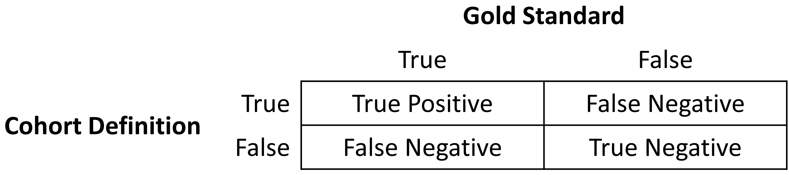
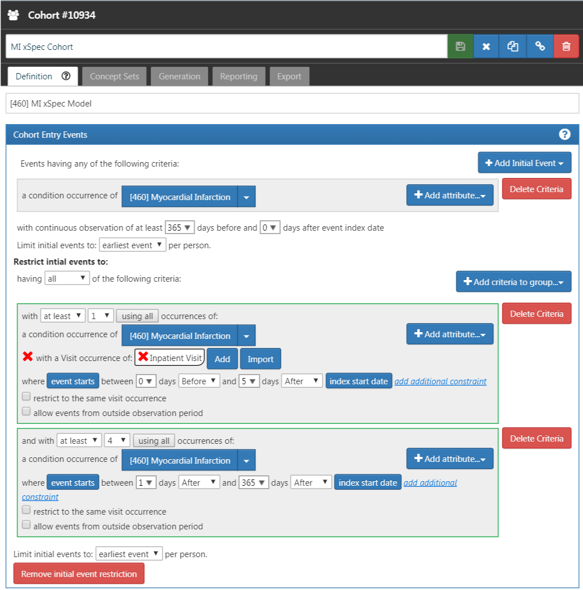
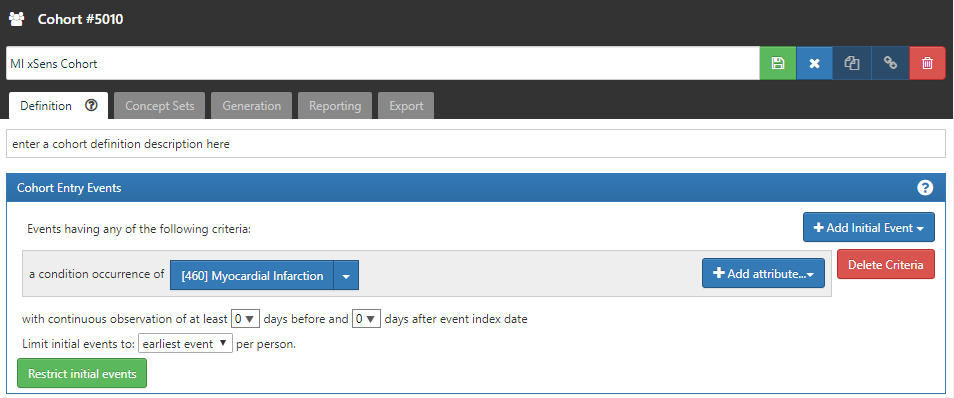
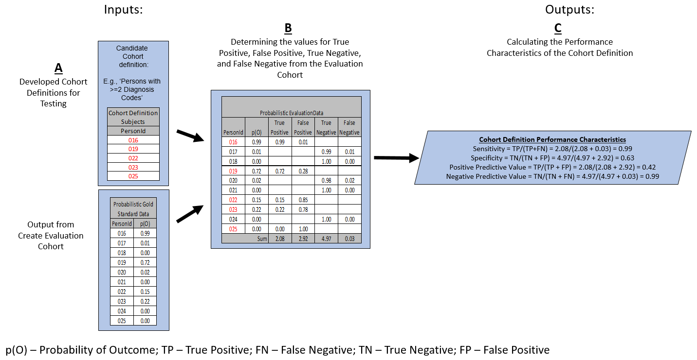
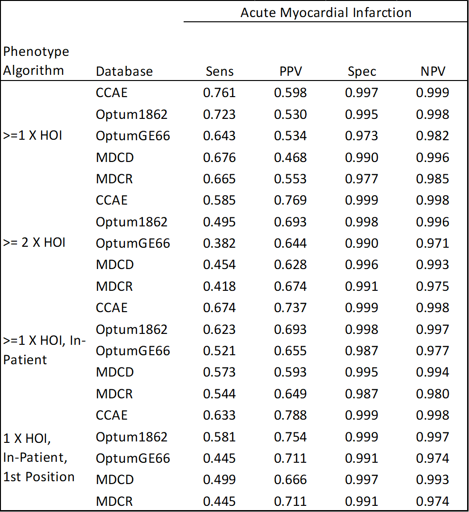

# Clinical Validity {#ClinicalValidity}

*Chapter leads: Joel Swerdel, Seng Chan You, Ray Chen, Patrick Ryan*

>The likelihood of transforming matter into energy is something akin to shooting birds in the dark in a country where there are only a few birds. *Einstein, 1935*

The vision of OHDSI is "A world in which observational research produces a comprehensive understanding of health and disease". Retrospective designs provide a vehicle for research using existing data but can be riddled with threats to various aspects of validity as discussed in the Chapter\@ref(EvidenceQuality). It is not easy to isolate clinical validity from quality of data and statistical methodology, but here we will focus on three aspects in terms of clinical validity: "Characteristics of health care databases", "Cohort validation", and "Generalizability of the evidence". Let’s go back to the example of the population-level estimation (Chapter \@ref(PopulationLevelEstimation)). We tried to answer the question "Do ACE inhibitors cause angioedema compared to thiazide or thiazide-like diuretics?" And in that example, we demonstrated that ACE inhibitors caused more angioedema than thiazide or thiazide-like diuretics. This chapter is dedicated to answer the question: "To what extent does the analysis conducted match the clinical intention?" \index{clinical validity} 

## Characteristics of health care databases {#CharacteristicsOfDatabase}

It is possible that what we found is the relationship between **prescription** of ACE inhibitor and angioedema rather than relationship between **use** of ACE inhibitor and angioedema. We’ve already discussed data quality in the previous chapter (\@ref(DataQuality)). The quality of the converted database into CDM cannot exceed the original database. Here we are addressing the characteristics of most healthcare utilization databases. Many databases used in OHDSI originated from administrative claims or electronic health records (EHR). Claims and EHR have different data capture processes, neither of which has research as a primary intention. Data elements from claims records are captured for the purpose of reimbursement, financial transactions between clinicians and payers whereby services provided to patients by providers are sufficiently justified to enable agreement on payments by the responsible parties. Data elements in EHR records are captured to support clinical care and administrative operations, and commonly only reflect the information that providers within a given health system feel are necessary to document the current service and provide necessary context for anticipated follow-up care within their health system, but may not represent a patient’s complete medical history and may not integrate data from across health systems. 

To generate reliable evidence from observational data, it is useful for a researcher to understand the journey that the data undergoes from the moment that a patient seeks care through the moment that the data reflecting that care are used in an analysis. As an example, "drug exposure" can be inferred from various sources of observational data, including prescriptions written by clinicians, pharmacy dispensing records, hospital procedural administrations, or patient self-reported medication history. The source of data can impact our level of confidence in the inference we draw about which patients did and did not use the drug, when and for how long. The data capture process can result in under-estimation of exposure, such as if free samples or over-the counter drugs are not recorded, or over-estimation of exposure, such as if a patient doesn’t fill the prescription written or doesn’t adherently consume the prescription dispensed. Understanding the potential biases in exposure and outcome ascertainment, and more ideally quantifying and adjusting for these measurement errors, can improve our confidence in the validity of the evidence we draw from the data we have available.   

## Cohort Validation {#CohortValidation}

@hripcsak_2017 described that “a phenotype is a specification of an observable, potentially changing state of an organism, as distinguished from the genotype, which is derived from an organism’s genetic makeup. The term phenotype can be applied to patient characteristics inferred from electronic health record (EHR) data. Researchers have been carrying out EHR phenotyping since the beginning of informatics, from both structured data and narrative data. The goal is to draw conclusions about a target concept based on raw EHR data, claims data, or other clinically relevant data. Phenotype algorithms – i.e., algorithms that identify or characterize phenotypes – may be generated by domain exerts and knowledge engineers, including recent research in knowledge engineering or through diverse forms of machine learning…to generate novel representations of the data.” 

This description highlights several attributes useful to reinforce when considering clinical validity: 1) it makes it clear that we are talking about something that’s observable (and therefore possible to be captured in our observational data), 2) it includes the notion of time in the phenotype specification (since a state of a person can change), 3) it draws a distinction between the phenotype as the desired intent vs. the phenotype algorithm, which is the implementation of the desired intent. 

OHDSI has adopted the term "cohort" to define the set of persons satisfying one or more inclusion criteria for a duration of time. A "cohort definition" represents the logic necessary to instantiate a cohort against an observational database. In this regard, the cohort definition (or phenotype algorithm) is used to produce a cohort, which is intended to represent the phenotype, being the persons who belong to the observable clinical state of interest. 

Most types of observational analyses, including clinical characterization, population-level effect estimation, and patient-level prediction, require one or more cohorts to be established as part of the study process. To evaluate the validity of the evidence produced by these analyses, one must consider the question for each cohort: to what extent do the persons identified in the cohort based on the cohort definition and the available observational data accurately reflect the persons who truly belong to the phenotype? 

To return to the population-level estimation example (Chapter \@ref(PopulationLevelEstimation)) "Do ACE inhibitors cause angioedema compared to thiazide or thiazide-like diuretics?", we must define three cohorts: a target cohort of persons who are new users of ACE inhibitors, a comparator cohort of persons who are new users of thiazide diuretics, and an outcome cohort of persons who develop angioedema. How confident are we that all use of ACE inhibitors or thiazide diuretics is completely captured, such that "new users" can be identified by the first observed exposure, without concern of prior (but unobserved) use? Can we comfortably infer that persons who have a drug exposure record for ACE inhibitor were in fact exposed to the drug, and those without a drug exposure were indeed unexposed? Is there uncertainty in defining the duration of time that a person is classified in the state of "ACE inhibitor use", either when inferring cohort entry at the time the drug was started or cohort exit when the drug was discontinued? Have persons with a condition occurrence record of "Angioedema" actually experienced rapid swelling beneath the skin, differentiated from other types of dermatologic allergic reactions? What proportion of patients who developed angioedema received medical attention that would give rise to the observational data used to identify these clinical cases based on the cohort definition? How well can the angioedema events which are potentially drug-induced be disambiguated from the events known to be caused by other agents, such as food allergy or viral infection? Is disease onset sufficiently well captured that we have confidence in drawing a temporal association between exposure status and outcome incidence? Answering these types of questions is at the heart of clinical validity. 

In this chapter, we will discuss the methods for validating cohort definitions. We first describe the metrics used to measure the validity of a cohort definition. Next, we describe two methods to estimate these metrics: 1) clinical adjudication through source record verification and 2) PheValuator, a semi-automated method using diagnostic predictive modeling. 

### Cohort Evaluation Metrics

Once the cohort definition for the study has been determined, the validity of the definition can be evaluated. A common approach to assess validity is by comparing some or all persons in a defined cohort to a reference ‘gold standard’, and expressing the results in a confusion matrix, a two-by-two contingency table that stratifies persons according to their gold standard classification and qualification within the cohort definition. Figure \@ref(fig:matrix) shows the elements of the confusion matrix.

```{r matrix, fig.cap='Confusion matrix', echo=FALSE, out.width='75%', fig.align='center'}

```

The true and false results from the cohort definition are determined by applying the definition to a group of persons. Those included in the definition are considered positive for the health condition and are labeled “True”. Those persons not included in the cohort definition are considered negative for the health condition and are labeled “False”. While the absolute truth of a person’s heath state considered in the cohort definition is very difficult to determine, there are multiple methods to establish a reference gold standard, two of which will be described later in the chapter. Regardless of the method used, the labeling of these persons is the same as described for the cohort definition. 

In addition to errors in the binary indication of phenotype designation, the timing of the health condition may also be incorrect. For example, while the cohort definition may correctly label a person as belonging to a phenotype, the definition may incorrectly specify the date and time when a person without the condition became a person with the condition. This error would add bias to studies using survival analysis results, e.g., hazard ratios, as an effect measure. 

The next step in the process is to assess the concordance of the gold standard with the cohort definition. Those persons that are labeled by both the gold standard method and the cohort definition as “True” are called “True Positives”. Those persons that are labeled by the gold standard method as “False” and by the cohort definition as “True” are called “False Positives”, i.e., the cohort definition misclassified these persons as having the condition when they do not. Those persons that are labeled by both the gold standard method and the cohort definition as “False” are called “True Negatives”. Those persons that are labeled by the gold standard method as “True” and by the cohort definition as “False” are called “False Negatives”, i.e., the cohort definition incorrectly classified these persons as not having the condition, when it fact they do belong to the phenotype. Using the counts from the four cells in the confusion matrix, we can quantify the accuracy of the cohort definition in classifying phenotype status in a group of persons. There are standard performance metrics for measuring cohort definition performance: 

1. Sensitivity of the cohort definition – what proportion of the persons who truly belong to the phenotype in the population were correctly identified to have the health outcome based on the cohort definition? This is determined by the following formula:

    Sensitivity = True Positives / (True Positives + False Negatives)

2.	Specificity of the cohort definition - what proportion of the persons who do not belong to the phenotype in the population were correctly identified to not have the health outcome based on the cohort definition? This is determined by the following formula:

    Specificity = True Negatives / (True Negatives + False Positives)

3. Positive predictive value (PPV) of the cohort definition - what proportion of the persons identified by the cohort definition to have the health condition actually belong to the phenotype? This is determined by the following formula:

    PPV = True Positives / (True Positives + False Positives)

4. Negative predictive value (NPV) of the cohort definition - what proportion of the persons identified by the cohort definition to not have the health condition actually did not belong to the phenotype? This is determined by the following formula:

    NPV = True Negatives / (True Negatives + False Negatives)

Perfect scores for these measures are 100%. Due to the nature of observational data, perfect scores are usually far from the norm. @Rubbo2015phenotypes reviewed studies validating cohort definitions for myocardial infarction. Of the 33 studies they examined, only one cohort definition in one dataset obtained a perfect score for PPV. Overall, 31 of the 33 studies reported PPVs ≥ 70%. They also found, however, that of the 33 studies only 11 reported sensitivity and 5 reported specificity. PPV is a function of sensitivity, specificity, and prevalence. Datasets with different values for prevalence will produce different values for PPV with sensitivity and specificity held constant. Without sensitivity and specificity, correcting for bias due to imperfect cohort definitions is not possible. Additionally, the misclassification of the health condition may be differential, meaning the cohort definition performs differently on one group of persons relative to the comparison group, or non-differentially, when the cohort definition performs similarly on both comparison groups. Prior cohort definition validation studies have not tested for potential differential misclassification, even though it can lead to strong bias in effect estimates. 

Once the performance metrics have been established for the cohort definition, these may be used to adjust the results for studies using these definitions. In theory, adjusting study results for these measurement error estimates has been well established. In practice, though, because of the difficulty in obtaining the performance characteristics, these adjustments are rarely considered. 
The methods used to determine the gold standard are described in the remainder of this section.

## Source record verification 

A common method used to validate cohort definitions has been clinical adjudication through source record verification: a thorough examination of a person’s records by one or more domain experts with sufficient knowledge to competently classify the clinical condition or characteristic of interest. Chart review generally follows the following steps:

1. Obtain permission from local institutional review board (IRB) and/or persons as needed to conduct study including chart review
2. Generate cohort using cohort definition to be evaluated. Sample a subset of the persons to manually review if there are insufficient resources to adjudicate the entire cohort.
3. Identify one or more persons with sufficient clinical expertise to review person records.
4. Determine guidelines for adjudicating whether a person is positive or negative for the desired clinical condition or characteristic
5. Clinical experts review and adjudicate all available data for the persons within the sample to classify each person as to whether they belong to the phenotype or not.
6. Tabulate persons according to the cohort definition classification and clinical adjudication classification into a confusion matrix, and calculate the performance characteristics possible from the data collected.

Results from a chart review are typically limited to the evaluation of one performance characteristic, positive predictive value (PPV). This is because the cohort definition under evaluation only generates persons that are believed to have the desired condition or characteristics. Therefore, each person in the sample of the cohort is classified as either a true positive or false positive based on the clinical adjudication. Without knowledge of all persons in the phenotype in the entire population (including those not identified by the cohort definition), it is not be possible to identify the false negatives, and thereby fill in the remainder of the confusion matrix to generate the remaining performance characteristics. Potential methods of identifying all persons in the phenotype across the population include chart review of the entire database, which is generally not feasible unless the overall population is small, or the utilization of comprehensive clinical registries in which all true cases have already been flagged and adjudicated such as tumor registries (see example below). Alternatively, one can sample persons who do not qualify for the cohort definition to produce a subset of predicted negatives, and then repeating steps 3-6 of the chart review above to check whether these patients are truly lacking the clinical condition or characteristic of interest can identify true negatives or false negatives. This would allow to estimation the negative predictive value (NPV), and if an appropriate estimate of the phenotype prevalence is available, then sensitivity and specificity can be estimated. 

There are a number of limitations to clinical adjudication through source record verification. As alluded to earlier, chart review can be a very time-consuming and resource-intensive process, even just for the evaluation of a single metric such as PPV. This limitation significantly impedes the practicality of evaluating an entire population to fill out a complete confusion matrix. In addition, multiple steps in the above process have the potential to bias the results of the study. For example, if records are not equally accessible in the EHR, if there is no EHR, or if individual patient consent is required, then the subset under evaluation may not be truly random and could introduce sampling or selection bias. In addition, manual adjudication is susceptible to human error or misclassification and thereby may not represent a perfectly accurate metric. There can often be disagreement between clinical adjudicators due to the data in the person’s record being vague, subjective, or of low quality. In many studies, the process involves a majority-rules decision for consensus which yields a binary classification for persons that does not reflect the inter-rater discordance. 

### Example of source record verification

An example of the process to conduct a cohort definition validation using chart review is provided from a study by Columbia University Irving Medical Center (CUIMC) which validated a cohort definition for multiple cancers as part of a feasibility study for the National Cancer Institute (NCI). The steps used to conduct the validation for the example of one of these cancers—prostate cancer—are as follows:

1. Submitted proposal and obtained IRB consent for OHDSI cancer phenotyping study
2. Developed a cohort definition for prostate cancer: Using ATHENA and ATLAS to explore the vocabulary, we created a cohort definition to include all patients with a condition occurrence for Malignant Tumor of Prostate (concept ID 4163261), excluding Secondary Neoplasm of Prostate (concept ID 4314337) or Non-Hodgkin’s Lymphoma of Prostate (concept ID 4048666).
3. Generated cohort using ATLAS and randomly selected 100 patients for manual review, mapping each OMOP person_id back to patient MRN using mapping tables. 100 patients were selected in order to achieve our desired level of statistical precision for the performance metric of PPV.
4. Manually reviewed records in the various EHRs—both inpatient and outpatient—in order to determine whether each person in the random subset was a true or false positive
5. Manual review and clinical adjudication was performed by one physician (although ideally in future, more rigorous validation studies, this would be done by a higher number of reviewers to assess for consensus and inter-rater reliability)
6. Determination of a reference standard was based on clinical documentation, pathology reports, labs, medications and procedures as documented in the entirety of the available electronic patient record 
7. Patients were labeled as 1) prostate cancer 2) no prostate cancer or 3) unable to determine
8. A conservative estimate of PPV was calculated using the following: prostate cancer/ (no prostate cancer + unable to determine)
9. Then, using the tumor registry as an additional gold standard to identify a reference standard across the entire CUIMC population, we counted the number of persons in the tumor registry which were and were not accurately identified by the cohort definition, which allowed us to estimate sensitivity using these values as true positives and false negatives.
10. Using the estimated sensitivity, PPV, and prevalence, we could then estimate specificity for this cohort definition
As noted previously, this process was time consuming and labor-intensive, as each cohort definition had to be individually evaluated through manual chart review as well as correlated with the CUIMC tumor registry in order to identify all performance metrics. The IRB approval process itself took weeks despite an expedited review while obtaining access to the tumor registry and the process of manual chart review itself took a few weeks longer.

A review of validation efforts for myocardial infarction (MI) cohort definitions by Rubbo et al.[2] found that there was significant heterogeneity in the cohort definitions used in the studies as well as in the validation methods and the results reported. The authors concluded that for acute myocardial infarction there is no gold standard cohort definition available. They noted that the process was both costly and time consuming. Due to that limitation, most studies had small sample sizes in their validation leading to wide variations in the estimates for the performance characteristics. They also noted that in the 33 studies, while all the studies reported positive predictive value, only 11 studies reported sensitivity and only five studies reported specificity. As mentioned previously, without estimates of sensitivity and specificity, statistical correction for misclassification bias cannot be performed. 

## PheValuator

The OHDSI community has developed a different approach to constructing a gold standard, using diagnostic predictive models [@Swerdel2019phevaluator]. The general idea is to emulate the ascertainment of the health outcome similar to the way clinicians would in a source record validation but in an automated way that can be applied at scale. The tool has been developed as an open-source R package called PheValuator[^phevaluatorUrl]. PheValuator uses functions from the Patient Level Prediction package.

[^phevaluatorUrl]: https://github.com/OHDSI/PheValuator

The process is as follows:

1. Create an extremely specific (“**xSpec**”) cohort: Determine a set of persons with a very high likelihood of having the outcome of interest to be used as noisy positive labels when training a diagnostic predictive model.
2. Create an extremely sensitive (“**xSens**”) cohort: Determine a set of persons that should include anyone who could possible have the outcome. This cohort will be used to identify its inverse: the set of people we are confident do not have the outcome, to be used as noisy negative labels when training a diagnostic predictive model.
3. Fit a predictive model using the xSpec and xSens cohort: As described in Chapter \@ref(PatientLevelPredicition), we fit a model using a wide array of patient features as predictors, and aim to predict whether a person belongs to the xSpec cohort (those we believe have the outcome) or the inverse of the xSens cohort (those we believe do not have the outcome).
4. Apply the fitted model to estimate the probability of the outcome for a hold-out set of persons who will be used to evaluate cohort definition performance: The set of predictors from the model can be applied to a person’s data to estimate the predicted probability that the person belongs to the phenotype. We use these predictions as a **probabilistic gold standard**. 
5. Evaluate the performance characteristics of the cohort definitions: We compare the predicted probability to the binary classification of a cohort definition (the test conditions for the confusion matrix). Using the test conditions and the estimates for the true conditions, we can fully populate the confusion matrix and estimate the entire set of performance characteristics, i.e., sensitivity, specificity, and predictive values. 

The primary limitation to using this approach is that the estimation of the probability of a person having the health outcome is limited by the data in the database. Depending on the database, important information, such as clinician notes, may not be available. 

In diagnostic predictive modeling we create a model that discriminates between those with the disease and those without the disease. As described in the Patient-Level Prediction chapter (Chapter \@ref(PatientLevelPrediction)), prediction models are developed using a *target cohort* and an *outcome cohort*. The target cohort includes persons with and without the health outcome; the outcome cohort identifies those persons in the target cohort with the health outcome. For the PheValuator process, we use an extremely specific cohort definition, the “xSpec” cohort, to determine the outcome cohort for the prediction model. The xSpec cohort uses a definition to find those with a very high probability of having the disease of interest. The xSpec cohort may be defined as those persons who have multiple condition occurrence records for the health outcome of interest. For example, for atrial fibrillation, we may have persons who have 10 or more records with the atrial fibrillation diagnosis code. For MI, an acute outcome, we may use 5 occurrences of MI and include the requirement of having at least two occurrences from an inpatient setting. The target cohort for the predictive model is constructed from the union of persons with a low likelihood of having the health outcome of interest and those persons in the xSpec cohort. To determine those persons with a low likelihood of having the health outcome of interest, we sample from the entire database and exclude persons who have some evidence suggestive of belonging to the phenotype, typically by removing persons with any records containing the concepts used to define the xSpec cohort. There are limitations to this method. It is possible that these xSpec cohort persons may have different characteristics than others with the disease. It may also be that these persons had longer observation time after initial diagnosis than the average patient. We use LASSO logistic regression to create the prediction model used to generate the probabilistic gold standard. [@suchard_2013] This algorithm produces a parsimonious model and typically removes many of the collinear covariates which may be present across the dataset. In the current version of the PheValuator software, outcome status (yes/no) is evaluated based on all data for a person (all observation time), and does not evaluate the accuracy of the cohort start date. 

### Example validation by PheValuator

We may use PheValuator to assess the complete performance characteristics for a cohort definition to be used in a study where it is necessary to determine those persons who have had an acute myocardial infarction. 

The following are the steps for testing cohort definitions for MI using PheValuator:

#### Step 1: Define the xSpec cohort {-}

To determine those with MI with a high probability. We required a condition occurrence record with a concept for myocardial infarction or any of its descendants, with one or more occurrences of MI recorded from a hospital in-patient visit within 5 days, and 4 or more occurrences of MI in the patient record within 365 days. Figure \@ref(fig:xSpec) illustrates this cohort definition for MI in ATLAS.

```{r xSpec, fig.cap='An extremely specific cohort definition (xSpec) for myocardial infarction.', echo=FALSE, out.width='100%', fig.align='center'}

``` 
 
#### Step 2: Define the xSens cohort {-}
 
We then develop an extremely sensitive cohort (xSens). This cohort may be defined for MI as those persons with at least one condition occurrence record containing a myocardial infarction concept at any time in their medical history. Figure \@ref(fig:xSens) illustrates the xSens cohort definition for MI in ATLAS.

```{r xSens, fig.cap='An extremely sensitive cohort definition (xSens) for myocardial infarction.', echo=FALSE, out.width='75%', fig.align='center'}

```
 
#### Step 3: Fit the predictive model {-}

The function *createPhenoModel* develops the diagnostic predictive model for assessing the probability of having the health outcome of interest in the evaluation cohort. To use this function, we utilize the xSpec and xSens cohorts developed in Steps 1 and 2. The xSpec cohort will be entered as the *xSpecCohort* parameter in the function. The xSens cohort will be entered as the *exclCohort* parameter in the function to indicate that those in the xSens cohort should be excluded from the target cohort used in the modeling process. Using this exclusion method, we can determine persons with a low likelihood of having the health outcome. We may think of this group as “noisy negative” persons, i.e., a group of persons likely negative for the health outcome but allowing for a small possibility of including some persons positive for the health outcome. We may also use the xSens cohort as the *prevCohort* parameter in the function. This parameter is used in the process to determine an approximate prevalence of the health outcome in the population. Normally, a large random sample of persons from a database should produce a population of persons where the persons with the outcome of interest are about in proportion to the prevalence of the outcome in the database. Using the method we described, we no longer have a random sample of persons and need to re-calibrate the predictive model based on resetting the proportion of persons with the outcome to those without the outcome. 

All concepts used to define the xSpec cohort must be excluded from the modeling process. To do this we set the *excludedConcepts* parameter to the list of concepts used in the xSpec definition. For example, for MI we created a concept set in ATLAS using the concept for Myocardial infarction plus all its descendants. For this example, we would set the excludedConcepts parameter to 4329847, the concept Id for Myocardial infarction, and we would also set the addDescendantsToExclude parameter to TRUE, indicating that any descendants of the excluded concepts should also be excluded.

There are several parameters that may be used to specify the characteristics of the persons included in the modeling process. We can set the ages of the persons included in the modeling process by setting the *lowerAgeLimit* to the lower bounds of age desired in the model and the *upperAgeLimit* to the upper bounds. We may wish to do this if the cohort definitions for a planned study will be created for a certain age group. For example, if the cohort definition to be used in a study is for Type 1 diabetes mellitus in children, you may want to limit the ages used to develop the diagnostic predictive model to ages, say, 5 to 17 years old. In doing so, we will produce a model with features that are likely more closely related to the persons selected by the cohort definitions to be tested. We can also specify which sex is included in the model by setting the *gender* parameter to the concept ID for either male or female. By default, the parameter is set to include both males and females. This feature may be useful in sex-specific health outcomes such as prostate cancer. We can set the time frame for person inclusion based on the first visit in the person’s record by setting the *startDate* and *endDate* parameters to the lower and upper bounds of the date range, respectively. Finally, the *mainPopnCohort* parameter may be used to specify a large population cohort from which all persons in the target and outcome cohorts will be selected. In most instances this will be set to 0, indicating no limitation on selecting persons for the target and outcome cohorts. There may be times, however, when this parameter is useful for building a better model, possibly in cases where the prevalence of the health outcome is extremely low, perhaps 0.01% or lower. For example:

```{r tidy=FALSE, eval=FALSE}
setwd("c:/phenotyping")
library(PheValuator)
connectionDetails <- createConnectionDetails(
  dbms = "postgresql",
  server = "localhost/ohdsi",
  user = "joe",
  password = "supersecret")

phenoTest <- createPhenoModel(
  connectionDetails = connectionDetails,
  xSpecCohort = 10934,
  cdmDatabaseSchema = "my_cdm_data",
  cohortDatabaseSchema = "my_results",
  cohortDatabaseTable = "cohort",
  outDatabaseSchema = "scratch.dbo", #should have write access
  trainOutFile = "PheVal_5XMI_train",
  exclCohort = 1770120, #the xSens cohort
  prevCohort = 1770119, #the cohort for prevalence determination
  modelAnalysisId = "20181206V1",
  excludedConcepts = c(312327, 314666),
  addDescendantsToExclude = TRUE,
  cdmShortName = "myCDM",
  mainPopnCohort = 0, #use the entire person population
  lowerAgeLimit = 18,
  upperAgeLimit = 90,
  gender = c(8507, 8532),
  startDate = "20100101",
  endDate = "20171231")
```

In this example, we used the cohorts defined in the “my_results” database, specifying the location of the cohort table (cohortDatabaseSchema, cohortDatabaseTable - “my_results.cohort”) and where the model will find the conditions, drug exposures, etc. to inform the model (cdmDatabaseSchema - “my_cdm_data”). The persons included in the model will be those whose first visit in the CDM is between January 1, 2010 and December 31, 2017. We are also specifically excluding the concept IDs 312327, 314666, and their descendants which was used to create the xSpec cohort. Their ages at the time of first visit will be between 18 and 90. With the parameters above, the name of the predictive model output from this step will be: “c:/phenotyping/lr_results_PheVal_5XMI_train_myCDM_ePPV0.75_20181206V1.rds”

#### Step 4: Creating the evaluation cohort {-}

The function *createEvalCohort* uses the PatientLevelPrediction package function *applyModel* to produce a large cohort of persons, each with a predicted probability for the health outcome of interest. The function requires specifying the xSpec cohort (by setting the *xSpecCohort* parameter to the xSpec cohort ID). We may also specify the characteristics of the persons included in the evaluation cohort as we did in the previous step. This could include specifying the lower and upper ages limits (by setting, as ages, the *lowerAgeLimit* and *upperAgeLimit* arguments, respectively), the sex (by setting the *gender* parameter to the concept IDs for male and/or female), the starting and ending dates (by setting, as dates, the *startDate* and *endDate* arguments, respectively), and designating a large population from which to select the persons by setting the *mainPopnCohort* to the cohort Id for the population to use.

For example:

```{r tidy=FALSE, eval=FALSE}
setwd("c:/phenotyping")
connectionDetails <- createConnectionDetails(
  dbms = "postgresql",
  server = "localhost/ohdsi",
  user = "joe",
  password = "supersecret")

evalCohort <- createEvalCohort(
  connectionDetails = connectionDetails,
  xSpecCohort = 10934,
  cdmDatabaseSchema = "my_cdm_data",
  cohortDatabaseSchema = "my_results",
  cohortDatabaseTable = "cohort",
  outDatabaseSchema = "scratch.dbo",
  testOutFile = "PheVal_5XMI_eval",
  trainOutFile = "PheVal_5XMI_train",
  modelAnalysisId = "20181206V1",
  evalAnalysisId = "20181206V1",
  cdmShortName = "myCDM",
  mainPopnCohort = 0,
  lowerAgeLimit = 18,
  upperAgeLimit = 90, 
  gender = c(8507, 8532),
  startDate = "20100101",
  endDate = "20171231")
```

In this example, the parameters specify that the function should use the model file: “c:/phenotyping/lr_results_PheVal_5XMI_train_myCDM_ePPV0.75_20181206V1.rds”
to produce the evaluation cohort file: “c:/phenotyping/lr_results_PheVal_5XMI_eval_myCDM_ePPV0.75_20181206V1.rds”
The model and the evaluation cohort files created in this step will be used in the evaluation of the cohort definitions provided in the next step.

#### Step 5: Creating and testing cohort definitions {-}

The next step is to create and test the cohort definitions to be evaluated. The desired performance characteristics may depend on the intended use of the cohort to address the research question of interest. For certain questions, a very sensitive algorithm may be required; others may require a more specific algorithm. The process for determining the performance characteristics for a cohort definition using PheValuator is shown in Figure \@ref(fig:phevaluatorDiagram).

```{r phevaluatorDiagram, fig.cap='Determining the Performance Characteristics of a Cohort Definition using PheValuator ', echo=FALSE, out.width='100%', fig.align='center'}

```

In part A of Figure \@ref(fig:phevaluatorDiagram), we examined the persons from the cohort definition to be tested and found those persons from the evaluation cohort (created in the previous step) who were included in the cohort definition (Person IDs 016, 019, 022, 023, and 025) and those from the evaluation cohort who were not included (PersonIds 017, 018, 020, 021, and 024). For each of these included/excluded persons, we had previously determined the probability of the health outcome using the predictive model (p(O) in Figure 1B).

We estimated the values for True Positives, True Negatives, False Positives, and False Negatives as follows (Part B of Figure \@ref(fig:phevaluatorDiagram)):

1. If the cohort definition included a person from the evaluation cohort, i.e., the cohort definition considered the person a “positive”, the predicted probability for the health outcome indicated the expected value of the number of counts contributed by that person to the True Positives and one minus the probability indicated the expected value of the number of counts contributed by that person to the False Positives for that person. We summed all the expected values of counts across persons to get the total expected value. For example, PersonId 016 had a predicted probability of 99% for the presence of the health outcome, 0.99 was added to the True Positives (expected value of counts added 0.99) and 1.00–0.99 = 0.01 was added to the False Positives (0.01 expected value). This was repeated for all the persons from the evaluation cohort included in the cohort definition (i.e., PersonIds 019, 022, 023, and 025).

2. Similarly, if the cohort definition did not include a person from the evaluation cohort, i.e., the cohort definition considered the person a “negative”, one minus the predicted probability for the phenotype for that person was the expected value of counts contributed to True Negatives and was added to it, and the predicted probability for the phenotype was the expected value of counts contributed to the False Negatives and was added to it. For example, PersonId 017 had a predicted probability of 1% for the presence of the health outcome (and, correspondingly, 99% for the absence of the health outcome) and 1.00 – 0.01 = 0.99 was added to the True Negatives and 0.01 was added to the False Negatives. This was repeated for all the persons from the evaluation cohort not included in the cohort definition (i.e., PersonIds 018, 020, 021, and 024).

After summing these values over the full set of persons in the evaluation cohort, we filled the four cells of the confusion matrix with the expected values of counts for each cell, and we were able to create point estimates of the PA performance characteristics like sensitivity, specificity, and positive predictive value (Figure 1C). We emphasize that these expected cell counts cannot be used to assess the variance of the estimates, only the point estimates. In the example, the sensitivity, specificity, PPV, and NPV were 0.99, 0.63, 0.42, and 0.99, respectively.

Determining the performance characteristics of the cohort definition uses the function testPhenotype. This function uses the output from the prior two steps where we created the model and evaluation cohorts. We would set the modelFileName parameter to the RDS file output from createPhenoModel function, in this example, “c:/phenotyping/lr_results_PheVal_5XMI_train_myCDM_ePPV0.75_20181206V1.rds”. We would set the resultsFileName parameter to the RDS file output from createEvalCohort function, in this example, “c:/phenotyping/lr_results_PheVal_5XMI_eval_myCDM_ePPV0.75_20181206V1.rds”. To test the cohort definition we wish to use in our study, we set the cohortPheno to the cohort Id for that cohort definition. We can set the phenText parameter to some human readable description for the cohort definition, such as “MI Occurrence, Hospital In-Patient Setting”. We will set the testText parameter to some human readable description for the xSpec definition, such as “5 X MI”. The output from this step is a data frame that contains the performance characteristics for the cohort definition tested. The settings for the cutPoints parameter is a list of values that will be used to develop the performance characteristics results. The performance characteristics are usually calculated using the “expected values” as described in Figure 1. To retrieve the performance characteristics based on the expected values, we include “EV” in the list for the cutPoints parameter. We may also want to see the performance characteristics based on specific predicted probabilities, i.e., cut points. For example, if wanted to see the performance characteristics if all those at or above a predicted probability of 0.5 were considered positive for the health outcome and all those under a predicted probability of 0.5 were considered negative, we would add “0.5” to the cutPoints parameter List.

The function testPhenotype has the following inputs:

-	connectionDetails - ConnectionDetails created using the function createConnectionDetails in the DatabaseConnector package.
-	cutPoints - A list of threshold predictions for the evaluations. Include "EV" for the expected value
-	resultsFileName - The full file name with path for the evaluation file
-	modelFileName - The full file name with path for the model file
-	cohortPheno - The number of the cohort of the cohort definition to test
-	phenText - A string to identify the cohort definition in the output file
-	order - The order of this algorithm for sorting in the output file (used when there are multiple cohort definitions to test)
-	testText - Descriptive name for the model
-	cohortDatabaseSchema - The name of the database schema that is the location where the cohort data used to define the at risk cohort is available. Requires read permissions to this database.
-	cohortTable - The tablename that contains the at risk cohort. The expectation is cohortTable has format of COHORT table: cohort_concept_id, SUBJECT_ID, COHORT_START_DATE, COHORT_END_DATE.
-	cdmShortName - A short name for the current database (CDM)

For example:

```{r tidy=FALSE, eval=FALSE}
setwd("c:/phenotyping")
connectionDetails <- createConnectionDetails(
  dbms = "postgresql",
  server = "localhost/ohdsi",
  user = "joe",
  password = "supersecret")
phenoResult <- testPhenotype(
  connectionDetails = connectionDetails,
  cutPoints = c(0.1, 0.2, 0.3, 0.4, 0.5, "EV", 0.6, 0.7, 0.8, 0.9),
  resultsFileName = "c:/phenotyping/lr_results_PheVal_5XMI_eval_myCDM_ePPV0.75_20181206V1.rds",
  modelFileName = "c:/phenotyping/lr_results_PheVal_5XMI_train_myCDM_ePPV0.75_20181206V1.rds",
  cohortPheno = 1769702,
  phenText = "All MI by Phenotype 1 X In-patient, 1st Position",
  order = 1,
  testText = "MI xSpec Model - 5 X MI",
  cohortDatabaseSchema = "my_results",
  cohortTable = "cohort",
  cdmShortName = "myCDM")
```

In this example, a wide range of prediction thresholds are provided (cutPoints) including the expected value (“EV”). Given that parameter setting, the output from this step will provide performance characteristics (i.e, sensitivity, specificity, etc.) at each prediction threshold as well as those using the expected value calculations. The evaluation uses the prediction information for the evaluation cohort developed in the prior step. The data frames produced from this step may be saved to a csv file for detailed examination.

Using this process, Figure \@ref(fig:figure5) displays the performance characteristics for four cohort definitions for MI across five datasets. For a cohort definition similar to the one evaluated by Cutrona and colleagues, “>=1 X HOI, In-Patient”, we found a mean PPV of 67% (range: 59%-74%).

```{r figure5, fig.cap='Performance characteristics of four cohort definitions using diagnostic condition codes to determine myocardial infarction on multiple datasets using pheValuator. Sens – Sensitivity ; PPV – Positive Predictive Value ; Spec – Specificity; NPV – Negative Predictive Value; Dx Code – Diagnosis code for the cohort; CCAE - IBM® MarketScan® Commercial Claims and Encounters Database, ages 18-62 years; MDCR - IBM® MarketScan® Medicare Supplemental and Coordination of Benefits Database, ages 66 years and greater; MDCD - IBM® MarketScan® Multi-State Medicaid, ages 18-62 years; Optum1862 - Optum© De-Identified Clinformatics® Data Mart Database – Date of Death, ages 18-62 years; OptumGE66 - ages 66 years and greater', echo=FALSE, out.width='75%', fig.align='center'}

```

## Generalizability of the evidence {#GeneralizabilityOfEvidence}

While a cohort can be well-defined and fully evaluated within the context of a given observational database, the clinical validity of the limited by the extent to which the results are considered generalizable to the target population of interest. Multiple observational studies on the same topic can yield different results, which can be caused by not only in their designs and analytic methods, but also in their choice of data source. Madigan et al demonstrated that choice of database affects the result of observational study [@madigan_2013]. They systematically investigated heterogeneity in the results for 53 drug-outcome pairs and two study designs (cohort studies and self-controlled case series) across the 10 observational databases. Even though they held study design constant, substantial heterogeneity in effect estimates was observed. 

Across the OHDSI network, observational databases vary considerably in the populations they represent (e.g. pediatric vs. elderly, privately-insured employees vs. publicly-insured unemployed), the care settings where data are captured (e.g. inpatient vs. outpatient, primary vs. secondary/specialty care), the data capture processes (e.g. administrative claims, EHRs, clinical registries), and the national and regional health system from which care is based. These differences can manifest as heterogeneity observed when studying disease and the effects of medical interventions and can also influence the confidence we have in the quality of each data source that may contribute evidence within a network study. While all databases within the OHDSI network are standardized to the OMOP common data model, it is important to reinforce that standardization does not reduce the true inherent heterogeneity that is present across populations, but simply provides a consistent framework to investigate and better understand the heterogeneity across the network. The OHDSI research network provides the environment to apply the same analytic process on various databases across the world, so that researchers can interpret results across multiple data sources while holding other methodological aspects constant. OHDSI’s collaborative approach to open science in network research, where researchers across participating data partners work together alongside those with clinical domain knowledge and methodologists with analytical expertise, is one way of reaching a collective level of understanding of the clinical validity of data across a network that should serve as a foundation for building confidence in the evidence generated using these data.

## Summary

```{block2, type='rmdsummary'}
-	Clinical validity can be established by understanding the characteristics of the underlying data source, evaluating the performance characteristics of the cohorts within an analysis, and assessing the generalizability of the study to the target population of interest.
-	 A cohort definition can be evaluated on the extent to which persons identified in the cohort based on the cohort definition and the available observational data accurately reflect the persons who truly belong to the phenotype.
-	Cohort definition validation requires estimating multiple performance characteristics, including sensitivity, specificity, and positive predictive value, to fully summarize and enable adjustment for measurement error.
-	Clinical adjudication through source record verification and PheValuator represent two alternative approaches to estimating cohort definition validation.
-	OHDSI network studies provide a mechanism to examine data source heterogeneity and expand the generalizability of findings to improve clinical validity of real-world evidence.

```
