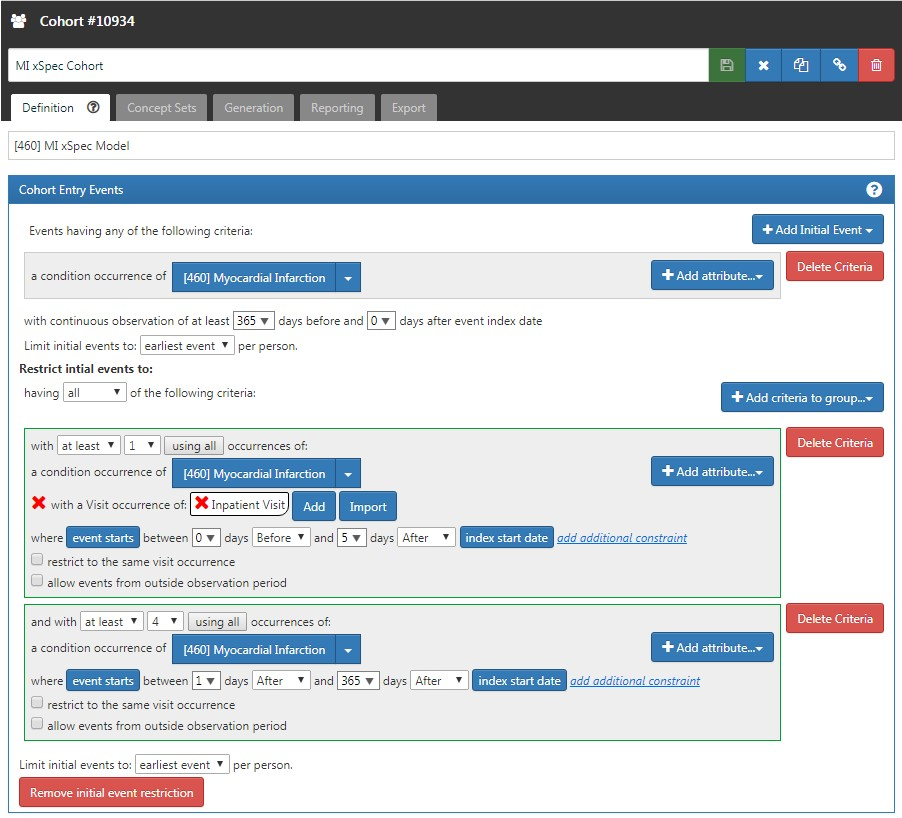
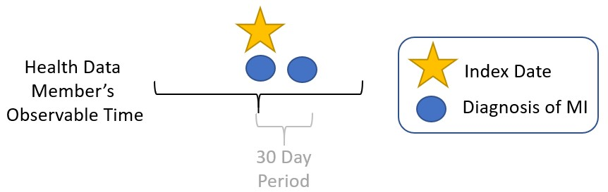
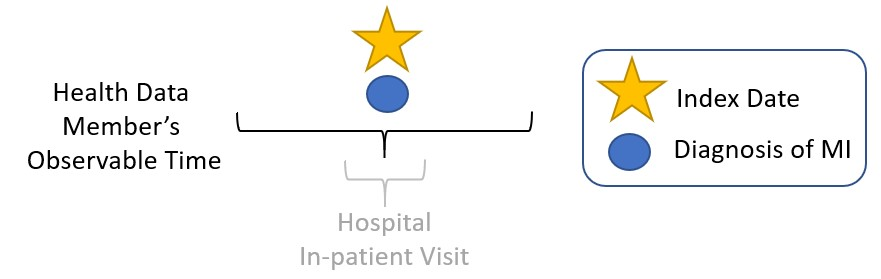

# Clinical Validity {#ClinicalValidity}

*Chapter leads: Joel N. Swerdel, Seng Chan You*

>The likelihood of transforming matter into energey is something akin to shooting birds in the dark in a country where there are only a few birds. *Einstein, 1935*

The goal of the Research Network is to lower the barrier to performing large-scale collaborative research using observational data to generate high-quality evidence through peer review across study design, execution, and data analysis [@Hripcsak2015]. Patient care and policy decisions demand high-quality evidence. Some have hypothesized that the volume, velocity, and veracity of observational data from electronic health records, administrative claims, and investment in data networks can be positioned to meet this demand. Analyses in large data sets are not necessarily correct simply because they are larger. Deficient studies may lead to misuse of resources and result in poor health care oucomes for patients (Morton et al). This chapter will focus on the question: 'To what extent does the analysis conducted match the clinical intention?'

Studies using observational data usually begin by developing cohorts of subjects to compare for determining some effect estimate.  During the development of these cohorts certain assumptions are made concerning the validity of the created cohorts, the most important of which is that the subjects in the cohorts have the characteristic that is the basis of the study.  For example, if the study involves subjects with myocardial infarction (MI) each of the subjects in the cohort must have had an MI.  Ideally, we would definitive evidence of the diagnosis of MI.  However, with observational data, we use subject records derived from limited data collected for a specific purpose.  In some cases, the data may be derived from data sets specifically collected from subjects with the health condition of interest such as disease registries.  While this is high quality data, it is usually a subset of all the subject’s data.  For example, the data for subjects with MI may include the interpretation of the electrocardiogram (ECG) and not the actual data from the ECG.  Subjects are included in these registries based on a clinical review of each subject’s health record.  In other cases, the data is derived from administrative datasets from insurance claims.  These data are usually much more limited than data from health registries but have the advantage of usually including a larger number of subjects from a broader population which may be more generalizable to the overall population.  In the case of administrative data, determination of the health claim for a subject is based on administrative codes for the health condition.  In the US, for example, these codes are from the International Classification of Diseases (ICD).  Regardless of the origin of the data, the validity of the health conditions based on this data need to be validated.
An example of a typical epidemiological study is shown in the diagram below:

In this example, we are comparing the rates of the occurrence of MI in one year in cohorts of subjects who initiated either Drug A or Drug B.  In this example, it is critical for the validity of the study to have valid measures of the rate of MI occurrence.  For studies where administrative data is used, the determination of MI is typically from the use of a phenotype algorithm (PA).  A PA is a heuristic-based set of rules used to determine the health condition with good precision.  These algorithms are often derived from prior research some of which may have been validated.  Examples of typical PAs for MI are illustrated below:

1)	One or more occurrences of MI in the subject’s record

2)	One occurrence of MI in the subject’s record followed by a second occurrence within 30 days

3)	One or more occurrences of MI in the subject’s record from a hospital in-patient setting

Once the PA for the study has been determined, the validity of the definition needs to be determined.  To determine the validity of the different algorithms, we need to examine several performance characteristics of the PA including:

1)	Sensitivity of the PA – what proportion of the subjects with the health condition in the whole cohort were determined to have the health outcome based on the PA?

2)	Specificity of the PA - what proportion of the subjects without the health condition in the whole cohort were determined to not have the health outcome based on the PA?

3)	Positive predictive value of the PA - what proportion of the subjects determined by the PA to have the health condition actually had the health condition?

4)	Negative predictive value of the PA - what proportion of the subjects determined by the PA to not have the health condition actually did not have the health condition?

The methods used to determine these performance characteristics are described in the remainder of this section.
Validation Methods for Phenotype Algorithms
The traditional method that has been used to validate PAs has been through a thorough examination of subject records by one or more people with sufficient clinical knowledge to accurately determine the health condition of interest.  The method generally follows these steps:

1)	Select a random subset of subjects from the overall cohort.

2)	Obtain permission from these subjects to receive health records.

3)	Obtain the health records from those subjects who have granted permission to do so from their physicians.

4)	Select one or more persons with sufficient clinical expertise to review subject records.

5)	Determine the guidelines for adjudicating whether a subject is positive or negative for the health condition.

6)	Use the results from the clinical adjudication to calculate the performance characteristics of the PA used in the study.

Each step in the above process has the potential to bias the results of the study.  For example, obtaining permission from subjects may be difficult and may introduce selection bias if those subjects who provide permission differ from those who do not.  In addition, obtaining the patient records and conducting a clinical review of those records is a time consuming and costly process.  In order to complete this process, many studies only examine the records of those subjects the PA identified as cases for the health conditions.  Under those conditions, the only performance characteristic that can be calculated is positive predictive value.
In the OHDSI community, we were in the process of developing a different approach.  We are attempting to use diagnostic predictive models as an alternative method for cohort validation. The general idea is to simulate the ascertainment of the health outcome similar to the way clinicians would in a traditional phenotype algorithm validation but at scale.  In this process we develop a diagnostic predictive model for a health outcome and then use that model to determine the probability of a health outcome in a large set of subjects, the “evaluation” cohort, within the data set. We then use that evaluation cohort to test our phenotype algorithms. Using this method, we are able to determine the full set of performance characteristics (i.e., sensitivity, specificity, and positive and negative predictive value) at scale. The tool is being developed as an open-source R package called [**PheValuator**](https://github.com/OHDSI/PheValuator).  

The process is as follows:

1)	Develop a diagnostic predictive model for a phenotype: Diagnostic predictive models are used to estimate the probability that a specific outcome or disease is present in an individual.[@moons_transparent_2015] The output of the model is a set of weighted predictors for diagnosing a phenotype. 

2)	Determine the probability of a phenotype for each individual in a large group of subjects: The set of predictors from the model can be used to estimate the probability of the presence of a phenotype in an individual. We use these predictions as a ‘probabilistic gold standard’.

3)	Evaluate the performance characteristics of the PAs: We compare the predicted probability to the binary classification of a PA (the test conditions for the confusion matrix). Using the test conditions and the estimates for the true conditions, we can fully populate the confusion matrix and determine the full set of performance characteristics, i.e., sensitivity, specific, and predictive values.
There are limitations using this approach. First, we can only use data that is in dataset; we are limited to diagnoses, procedures, observations, measurements, and drug exposures.  Moreover, measurements are usually incomplete in administrative datasets as these do not include the actual values for the measures and, as such, we are limited to the existence or absence of the measurements as part of the model. Clinical notes are also not usually present in our data sets.  Patient complaints or symptoms may not be recorded in administrative data sets.  These may include things like lethargy and acute pain. 
In diagnostic predictive modeling we create a model that discriminates between those with the disease and those without the disease.  For the PheValuator process, we use an extremely specific cohort definition, the “xSpec” cohort, to determine the cases for the models. The xSpec cohort uses a definition to find those with the disease with a very high probability of having the disease of interest.  The xSpec cohort is may be defined as those subjects who have multiple condition code codes in their record for the health outcome of interest.  For example, for atrial fibrillation, we may have subjects who have 10 or more codes for atrial fibrillation in their record.  For MI, an acute outcome, we may use 5 occurrences of MI and include the requirement of having at least two occurrences from a hospital inpatient setting. For our non-cases, we exclude anybody from the data set who have any of the condition occurrences for the health outcome of interest. There are limitations to this method.  It is possible that these xSpec cohort subjects may have may be more severe than other cases of the disease.  It may also be that these subjects had longer observation time after initial diagnosis than the average patient. We use logistic regression to create these models, using the LASSO method.[@tibshirani_regression_1996]  This method produces a parsimonious model. In so doing it removes many of the collinear covariates which may be present in many subjects. In the current version of our software we also do not include the temporality of events in the patient's record. 

**Practice of Phenotype Algorithm Validation**

An example of the process to conduct a PA validation using chart review is provided by Cutrona and colleagues who validated their PA for MI for the US Food and Drug Administration’s (FDA) Sentinel program.[@cutrona_validation_2013]  The steps this group used to conduct the validation were as follows:

1)	Develop a PA for MI:  They used the PA “those with an ICD-9-CM code for AMI (410.x0, 410.x1) in the principal or primary position on facility claims for hospitalizations.”

2)	Randomly select enough cases to be requested from the primary health care providers in order to achieve a sufficient successful return of records to achieve appropriate statistical precision for their performance measure, in this case PPV.  

3)	Request approximately an equal number of patient records from each of their four data providers.

4)	Receive records from data providers redacted to ensure patient confidentiality.

5)	Abstract the data from the records using the clinical expertise of two nurses.  Abstracted information included EKG images, cardiac biomarkers, information on ischemic symptoms and results of cardiac diagnostic tests.

6)	Test inter-rater reliability of the two data abstractors.

7)	Develop an adjudication protocol based on standardized criteria from the joint European Society of Cardiology and American College of Cardiology Global Task Force 

8)	Review abstracted records using the clinical expertise of two cardiologists.  The cardiologists were provided with all abstracted information listed above and an abstracted case summary.  Detailed discharge information was not provided to the reviewers.

9)	Classify each subject as: (1) definite MI; (2) probable MI; (3) no MI; or (4) unable to determine.  Distinguishing between definite and probable was not defined for the clinicians but was to based on their own clinical judgement.  Subjects were considered cases if the clinicians determined the subject to be definite or probable for MI.

10)	Disagreement between the two clinicians, i.e., one clinician determining the subject to be definite or probable and the other either not an MI or unable to determine, was settled through a joint discussion between the clinicians until agreement could be reached.

It appears evident that the above process is both very thorough as well as very time consuming and costly.  In this example neither sensitivity nor specificity of the PA was determined likely owing to the cost of including records from a random selection of patients not determined to have an MI based on the PA.  Overall the process examined the records of 143 of the 153 records requested.  One advantage this group had was that patient permission was not required as the FDA Sentinel Initiative activities did not require institutional review board (IRB) approval.  At the end of this process the researchers determined the PPV for this algorithm to be 86.0% (95% confidence interval; 79.2%, 91.2%).
The above study was included in a review of validation efforts for MI PAs by Rubbo et al.[@rubbo_use_2015]  In this review, the authors examined 33 studies involving validation of phenotype algorithms for acute myocardial infarction.  They found that there was significant heterogeneity in the phenotype algorithms used in the studies as well as in the validation methods and the results reported. The authors concluded that for acute myocardial infarction there is no gold standard phenotype algorithm available. They noted that the process was both costly and time consuming. Due to that limitation most studies had small sample sizes in their validation leading to wide variations in the estimates for the performance characteristics. They also noted that in the 33 studies, while all the studies reported positive predictive value, only 11 studies reported sensitivity and only five studies reported specificity. The question then needs to be asked is this really validation of the phenotype algorithm? 
As discussed previously an alternative approach currently being developed in the OHDSI community is through the use of diagnostic predictive modeling tool using a tool called PheValuator.  The following are the steps for testing PAs for MI using PheValuator:

1)	Develop an extremely specific, xSpec, cohort to determine those with MI with a high probability.  For MI, we used an occurrence of MI with one or more occurrences of MI recorded from a hospital in-patient visit within 5 days, and 4 or more occurrences of MI in the patient record within 365 days.  The following illustrates this PA for MI:   

2)	Develop the diagnostic predictive model for MI

  *	Create a sample of subjects labeled as cases (from the xSpec cohort for MI) or non-cases in approximate proportion to the prevalence of MI in the population.

  *	Use the OHDSI Patient Level Prediction package to develop a LASSO logistic regression model using all available data in the subject record.

3)	Randomly select 2M subjects from the database, the evaluation cohort, and apply the model to this cohort to determine the probability of MI in each subject.

4)	Test possible algorithms for MI, e.g., 1 occurrence of MI in the patient record, using the evaluation cohort.

5)	Compare performance characteristics for the various algorithms to determine the PA for MI for use within a study.

Using this process, Table 1 displays the performance characteristics for four PAs for MI across five datasets.  For a PA similar to the one evaluated by Cutrona and colleagues, “>=1 X HOI, In-Patient”, we found a mean PPV of 67% (range: 59%-74%).

Table 1: Performance Characteristics of Four Phenotype Algorithms using Diagnostic Condition Codes to Determine Myocardial Infarction on Multiple Datasets using PheValuator. The continuous 3-color heat map for the data in the table was defined as Red (value = 0), Yellow (value = 0.5), and Green (value = 1).

Sens – Sensitivity ; PPV – Positive Predictive Value ; Spec – Specificity; NPV – Negative Predictive Value; Dx Code – Diagnosis code for the phenotype; CCAE - IBM® MarketScan® Commercial Claims and Encounters Database, ages 18-62 years; MDCR - IBM® MarketScan® Medicare Supplemental and Coordination of Benefits Database, ages 66 years and greater; MDCD - IBM® MarketScan® Multi-State Medicaid, ages 18-62 years; Optum1862 - Optum© De-Identified Clinformatics® Data Mart Database – Date of Death, ages 18-62 years; OptumGE66 - ages 66 years and greater

1.	Collins GS, Reitsma JB, Altman DG, Moons KM. Transparent reporting of a multivariable prediction model for individual prognosis or diagnosis (tripod): The tripod statement. Ann Intern Med. 2015;162(1):55-63.
2.	Tibshirani R. Regression shrinkage and selection via the lasso. Journal of the Royal Statistical Society Series B (Methodological). 1996;58(1):267-88.
3.	Cutrona SL, Toh S, Iyer A, Foy S, Daniel GW, Nair VP, et al. Validation of Acute Myocardial Infarction in the Food and Drug Administration’s Mini-Sentinel program. Pharmacoepidemiol Drug Saf. 2013 06/29;22(1):40-54.
4.	Rubbo B, Fitzpatrick NK, Denaxas S, Daskalopoulou M, Yu N, Patel RS, et al. Use of electronic health records to ascertain, validate and phenotype acute myocardial infarction: A systematic review and recommendations. Int J Cardiol. 2015;187:705-11.
