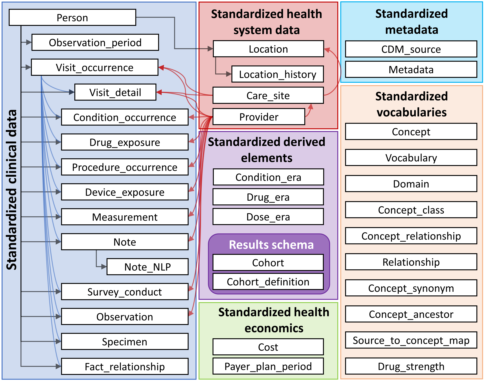
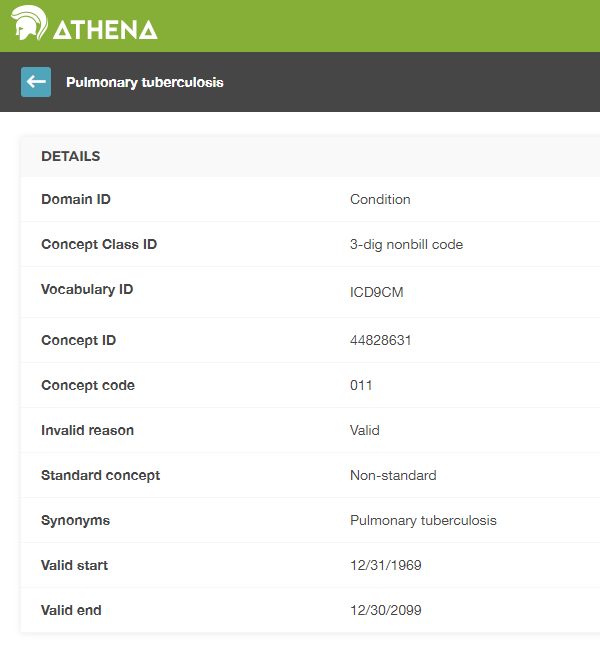
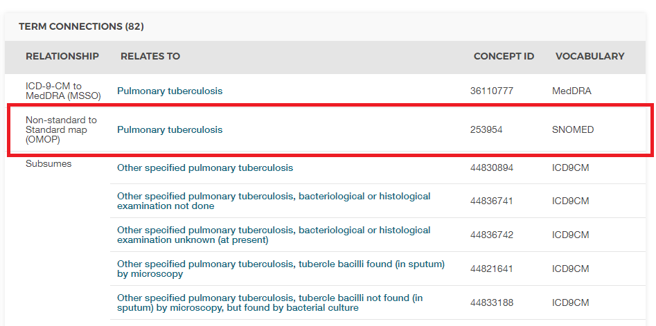

# (PART) Uniform Data Representation {-} 

# The Common Data Model {#CommonDataModel}

*Chapter lead: Clair Blacketer*

Observational data provides a view of what happens to a patient while receiving healthcare. Data are collected and stored for increasingly large numbers of patients all over the world creating what is often called Big Health Data. The purpose of these collections are threefold: (i) directly to facilitate research (often in the form of survey or registry data), or (ii) to support the conduct of healthcare (usually called EHR - Electronic Health Records) or (iii) to manage the payment for healthcare (usually called claims data). All three are routinely used for clinical research, the latter two as secondary use data, and all three typically have their unique formating and encoding of the content. \index{Common Data Model} \index{CDM |see {Common Data Model}} \index{relational data model|see {Common Data Model}}

Why do we need a Common Data Model for observational healthcare data? 

Depending on their primary needs none of the observational databases capture all clinical events equally well. Therefore, research results must be drawn from many disparate data sources and compared and contrasted to understand the effect of potential capture bias. In addition, in order to draw conclusions with statistical power we need large numbers of observed patients. That explains the need for assessing and analyzing multiple data sources concurrently. In order to do that, data need to be harmonized into a common data standard. In addition, patient data require a high level of protection. To extract data for analysis purposes as it is done traditionally requires strict data use agreements and complex access control. A common data standard can eleviate this need by omitting the extraction step and allowing a standardized analytic to be executed on the data in it's native environment - the analytic comes to the data instead of the data to the analytic.

This standard is provided by the Common Data Model (CDM). The CDM, combined with its standardized content (see chapter \@ref(StandardizedVocabularies)), will ensure that research methods can be systematically applied to produce meaningfully comparable and reproducible results. In this chapter we provide an overview of the data model itself, design, conventions, and discussion of select tables. 

An overview of all the tables in the CDM is provided in Figure \@ref(fig:cdmDiagram). \index{Common Data Model!data model diagram}

<div class="figure">

<p class="caption">(\#fig:cdmDiagram)Overview of all tables in the CDM version 6.0. Note that not all relationships between tables are shown.</p>
</div>
## Design Principles

The CDM is optimized for typical observational research purposes of \index{Common Data Model!design principles}

* Identifying patient populations with certain healthcare interventions (drug exposure, procedures, healthcare policy changes etc.) and outcomes (conditions, procedures, other drug exposures etc.),
* Characterization of these patient populations for various parameters like demographic information, disease natural history, healthcare delivery, utilization and cost, morbidities, treatments and sequence of treatment etc.,
* Predicting the occurrence of these outcomes in individual patients - see chapter \@ref(PatientLevelPrediction),
* Estimating the effect these interventions have a population - see chapter \@ref(PopulationLevelEstimation),

To achieve this goal, the development of the CDM follows the following design elements:
 
  - **Suitability for purpose**: The CDM aims to provide data organized in a way optimal for analysis, rather than for the purpose of addressing the operational needs of health care providers or payers. \index{Common Data Model!suitability for purpose}
  - **Data protection**: All data that might jeopardize the identity and protection of patients, such as names, precise birthdays etc. are limited. Exceptions are possible when the research expressly requires more detailed information, such as precise birth dates for the study of infants.\index{Common Data Model!data protection}
  - **Design of domains**: The domains are modeled in a person-centric relational data model, where for each record the identity of the person and a date is captured as a minimum. Here, a relational data model is one where the data is represented as a collection of tables linked by primary and foreign keys.
  - **Rationale for domains**: Domains are identified and separately defined in an entity-relationship model if they have an analysis use case (conditions, for example) and the domain has specific attributes that are not otherwise applicable.  All other data can be preserved as an observation in the observation table in an entity-attribute-value structure. \index{Common Data Model!domains}
  - **Standardized Vocabularies**: To standardize the content of those records, the CDM relies on the Standardized Vocabularies containing all necessary and appropriate corresponding standard healthcare concepts.
  - **Reuse of existing vocabularies**: If possible, these concepts are leveraged from national or industry standardization or vocabulary definition organizations or initiatives, such as the National Library of Medicine, the Department of Veterans' Affairs, the Center of Disease Control and Prevention, etc.
  - **Maintaining source codes**: Even though all codes are mapped to the Standardized Vocabularies, the model also stores the original source code to ensure no information is lost. \index{Common Data Model!Source Codes} \index{Common Data Model!data loss prevention}
  - **Technology neutrality**: The CDM does not require a specific technology. It can be realized in any relational database, such as Oracle, SQL Server etc., or as SAS analytical datasets.\index{Common Data Model!technology neutrality}
  - **Scalability**: The CDM is optimized for data processing and computational analysis to accommodate data sources that vary in size, including databases with up to hundreds of millions of persons and billions of clinical observations. \index{Common Data Model!scalability}
  - **Backwards compatibility**: All changes from previous CDMs are clearly delineated in the github repository  [(https://github.com/OHDSI/CommonDataModel)](https://github.com/OHDSI/CommonDataModel). Older versions of the CDM can be easily created from the current version, and no information is lost that was present previously. \index{Common Data Model!backwards compatibility}
  
## Data Model Conventions

There are a number of implicit and explicit conventions that have been adopted in the CDM. Developers of methods that run against the CDM need to understand these conventions. \index{Common Data Model!conventions}

### General Conventions of the Model{#model-Conv}

The CDM is considered a "person-centric" model, meaning that all clinical Event tables are linked to the PERSON table. Together with the date or start date this allows for a longitudinal view on all healthcare-relevant Events by person. The exceptions from this rule are the standardized health system data tables, which are linked directly to Events of the various domains.

### General Conventions of Schemas

Schemas, or database users in some systems, allow for separation between read-only and read-write tables. The clinical Event and vocabulary tables are in the "CDM" schema and are considered read-only to the end user or analytic tool. Tables that need to be manipulated by web-based tools or end users are stored in the "Results" schema. The two tables in the "Results" schema are COHORT and COHORT_DEFINITON. These tables are meant to describe groups of interest that the user might define, as detailed in chapter \@ref(Cohorts). These tables can be written to, meaning that a cohort can be stored in the COHORT table at run time. Since there is only one read-write schema for all users it is up to the implementation of the CDM how multiple user access is organized and controlled.

### General Conventions of Data Tables

The CDM is platform-independent. Data types are defined generically using ANSI SQL data types (VARCHAR, INTEGER, FLOAT, DATE, DATETIME, CLOB). Precision is provided only for VARCHAR. It reflects the minimal required string length, but can be expanded within a concrete CDM instantiation. The CDM does not prescribe the date and datetime format. Standard queries against CDM may vary for local instances and date/datetime configurations. 

*Note*: While the data model itself is platform-independent, many of the tools that have been built to work with it require certain specifications. For more about this please see chapter \@ref(OhdsiAnalyticsTools).

### General Conventions of Domains{#domains}

Events of different nature are organized into Domains. These Events are stored in tables and fields which are Domain-specific, and represented by Standard Concepts that are also Domain-specific as defined in the Standardized Vocabularies (see section \@ref(conceptDomains)). Each Standard Concept has a unique Domain assignment, which defines which table they are recorded in. Even though the correct Domain assignment is subject for debate in the community, this strict Domain-table-field correspondence rule assures that there is always an unambiguous location for any code or concept. For example, signs, symptoms and diagnosis Concepts are of the Condition Domain, and are recorded in the CONDITION_CONCEPT_ID of the CONDITION_OCCURRENCE table. So-called Procedure Drugs are typically recorded as procedure codes in a procedure table in the source data. In an CDM, these records are found in the DRUG_EXPOSURE table because the mapped Standard Concepts have the Domain assignment Drug. There is a total of 30 Domains, as shown in table \@ref(tab:domains). 

Table: (\#tab:domains) Number of standard concepts belonging to each domain.

Concept Count|Domain ID|Concept Count|Domain ID
:---------- |:---------------------------- |:---------- |:----------------------------
1731378|Drug|183|Route
477597|Device|180|Currency
257000|Procedure|158|Payer
163807|Condition|123|Visit
145898|Observation|51|Cost
89645|Measurement|50|Race
33759|Spec Anatomic Site|13|Plan Stop Reason
17302|Meas Value|11|Plan
1799|Specimen|6|Episode
1215|Provider Specialty|6|Sponsor
1046|Unit|5|Meas Value Operator
944|Metadata|3|Spec Disease Status
538|Revenue Code|2|Gender
336|Type Concept|2|Ethnicity
194|Relationship|1|Observation Type

### Representation of Content Through Concepts 

In CDM data tables the content of each record is fully normalized and represented through Concepts. Concepts are stored in Event tables with their CONCEPT_ID values, which are foreign keys to the CONCEPT table, which serves as the general reference table. All CDM instances use the same CONCEPT table as a reference of  the Concepts, which together with the Common Data Model is a key mechanism of interoperability and the foundation of the OHDSI research network. If a Standard Concept does not exist or cannot be identified, the value of the CONCEPT_ID is set to 0, representing a non-existing concept, an unknown or un-mappable value.

Records in the CONCEPT table contain detailed information about each concept (name, domain, class etc.). Concepts, Concept Relationships, Concept Ancestors and other information relating to Concepts is contained in the tables of the Standardized Vocabularies (see chapter \@ref(StandardizedVocabularies)).

### General Naming Conventions of Fields

Variable names across all tables follow one convention:

Table: (\#tab:fieldConventions) Field name conventions.

|Notation|Description|
|:------------------------------|:-------------------------------------------------------|
|[Event]_ID|Unique identifier for each record, which serves as a foreign keys establishing relationships across Event tables. For example, PERSON_ID	uniquely identifies each individual. VISIT_OCCURRENCE_ID uniquely identifies a Visit.|
|[Event]_CONCEPT_ID|Foreign key to a Standard Concept record in the CONCEPT reference table. This is the main representation of the Event, serving as the primary basis for all standardized analytics. For example, CONDITION_CONCEPT_ID = [31967](http://athena.ohdsi.org/search-terms/terms/31967) contains the reference value for the SNOMED concept of "Nausea".|
|[Event]_SOURCE _CONCEPT_ID|Foreign key to a record in the CONCEPT reference table. This Concept is the equivalent of the Source Value (below), and it may happen to be a Standard Concept, at which point it would be identical to the [Event]_CONCEPT_ID, or another non-standard concept. For example, CONDITION_SOURCE_CONCEPT_ID = [45431665](http://athena.ohdsi.org/search-terms/terms/45431665) denotes the concept of "Nausea" in the Read terminology, and the analogous CONDITION_CONCEPT_ID is the Standard SNOMED-CT Concept [31967](http://athena.ohdsi.org/search-terms/terms/31967). The use of Source Concepts for standard analytics applications is discouraged since only Standard Concepts represent the semantic content of an Event in a unambiguous way and therefore Source Concepts are not interoperable.|
|[Event]_TYPE_CONCEPT_ID|Foreign key to a record in the CONCEPT reference table, representing the origin of the source information, standardized within the Standardized Vocabularies. Note that despite the field name this is not a type of an Event, or type of a Concept, but declares the capture mechanism that created this record. For example, DRUG_TYPE_CONCEPT_ID discriminates if a Drug record was derived from a dispensing Event in the pharmacy ("Pharmacy dispensing") or from an e-prescribing application ("Prescription written")|
|[Event]_SOURCE_VALUE|Verbatim code or free text string reflecting how this Event was represented in the source data. Its use is discouraged for standard analytics applications, as these Source Values are not harmonized across data sources. For example, CONDITION_SOURCE_VALUE might contain a record of "78702", corresponding to ICD-9 code 787.02 written in a notation omitting the dot.|

### Difference Between Concepts and Source Values{#concepts-Sources}

Many tables contain equivalent information in multiple places: as a Source Value, a Source Concept and as a Standard Concept.

* **Source Values** are the original representation of an Event record in the source data. They can be codes from widely used coding systems, which are often public domain, such as ICD9CM, NDC or Read, proprietary coding systems like CPT4, GPI or MedDRA, or controlled vocabularies used only in the source data, such as F for female and M for male. They can also be short free text phrases that are not standardized and controlled. Source Values are stored in the [Event]_SOURCE_VALUE fields in the data tables.
* **Concepts** are CDM-specific entities that normalize the meaning of a clinical fact. Most Concepts are based on existing public or proprietary coding systems in healthcare, while others were created de-novo (CONCEPT_CODE starts with "OMOP"). Concepts have unique IDs across all domains. 
* **Source Concepts** are the Concepts that represent the code used in the source. Source Concepts are only used for existing public or proprietary coding systems, not for OMOP-generated Concepts. Source Concepts are stored in the [Event]_SOURCE_CONCEPT_ID field in the data tables.
* **Standard Concepts** are those Concepts that are used to define the meaning of a clinical entity uniquely across all databases and independent from the coding system used in the sources. Standard Concepts are typically drawn from existing public or proprietary vocabulary sources. Non-standard Concepts that have the equivalent meaning to a Standard Concept have a mapping to the Standard Concept in the Standardized Vocabularies. Standard Concepts are referred to in the [Event]_CONCEPT_ID field of the data tables. 

Source Values are only provided for convenience and quality assurance (QA) purposes. They may contain information that is only meaningful in the context of a specific data source. The use of Source Values and Source Concepts is optional, even though **strongly recommended** if the source data make use of coding systems. Standard Concepts **are mandatory** however. This mandatory use of Standard Concepts is what allows all CDM instances to speak the same language. For example, the condition "Pulmonary Tuberculosis" (TB, Figure \@ref(fig:pulmTubICD9)) shows that the ICD9CM code for TB is 011. 

<div class="figure" style="text-align: center">

<p class="caption">(\#fig:pulmTubICD9)ICD9CM code for Pulmonary Tuberculosis</p>
</div>

Without context, the code 011 could be interpreted as "Hospital Inpatient (Including Medicare Part A)" from the UB04 vocabulary, or as "Nervous System Neoplasms without Complications, Comorbidities" from the DRG vocabulary. This is where Concept IDs, both Source and Standard, are valuable. The CONCEPT_ID value that represents the 011 ICD9CM code is [44828631](http://athena.ohdsi.org/search-terms/terms/44828631). This differentiates the ICD9CM from the UBO4 and DRG. The ICD9CM TB Source Concept maps to Standard Concept [253954](http://athena.ohdsi.org/search-terms/terms/253954) from the SNOMED vocabulary through the relationship "Non-standard to Standard map (OMOP)" as shown in figure \@ref(fig:pulmTubMap). This same mapping relationships exists for Read, ICD10, CIEL, and MeSH codes, among others, so that any research that references the standard SNOMED concept is sure to include all supported source codes. 

<div class="figure">

<p class="caption">(\#fig:pulmTubMap)SNOMED code for Pulmonary Tuberculosis</p>
</div>

An example of how the Standard Concept to Source Concept relationship is depicted is shown in Table \@ref(tab:conditionOccurrence).

## CDM Standardized Tables

\index{Common Data Model!standardized tables}

The CDM contains 16 Clinical Event tables, 10 Vocabulary tables, 2 metadata tables, 4 health system data tables, 2 health economics data tables, 3 standardized derived elements, and 2 Results schema tables. These tables are fully specified in the CDM Wiki.[^cdmWikiUrl1]

[^cdmWikiUrl1]: https://github.com/OHDSI/CommonDataModel/wiki

To illustrate how these tables are used in practice, the data of one person will be used as a common thread throughout the rest of the chapter. 

### Running Example: Endometriosis 

Endometriosis is a painful condition whereby cells normally found in the lining of a woman's uterus occur elsewhere in the body. Severe cases can lead to infertility, bowel, and bladder problems. The following sections will detail one patient's experience with this disease and how it might be represented in the Common Data Model. 


> Every step of this painful journey I had to convince everyone how much pain I was in.

Lauren had been experiencing endometriosis symptoms for many years; however, it took a ruptured cyst in her ovary before she was diagnosed. You can read more about Lauren at [https://www.endometriosis-uk.org/laurens-story](https://www.endometriosis-uk.org/laurens-story).

### PERSON Table{#person}

#### What Do We Know About Lauren?  {-}

* She is a 36-year-old woman
* Her birthday is 12-March-1982
* She is white
* She is English

With that in mind, her PERSON table might look something like this: 

Table: (\#tab:person) The PERSON table.

Column name|Value|Explanation
:---------------------|:-----------|:--------------------------------------
|PERSON_ID|1|The PERSON_ID should be an integer, either directly from the source or generated as part of the build process.|
|GENDER_CONCEPT_ID|8532|The concept ID referring to female gender is [8532](http://athena.ohdsi.org/search-terms/terms/8532).|
|YEAR_OF_BIRTH|1982||
|MONTH_OF_BIRTH|3||
|DAY_OF_BIRTH|12||
|BIRTH_DATETIME|1982-03-12 00:00:00|When the time is not known midnight is used.|
|DEATH_DATETIME|||
|RACE_CONCEPT_ID|8527|The concept ID referring to white race is [8527](http://athena.ohdsi.org/search-terms/terms/8527). English ethnicity is [4093769](http://athena.ohdsi.org/search-terms/terms/4093769). Either one is correct, the latter will roll up to the former. Notice that ethnicities are stored here as part of Races, not in the ETHNICITY_CONCEPT_ID|
|ETHNICITY_CONCEPT_ ID|38003564|This is a US-typical notation to distinguish Hispanics from the rest. Ethnicities, in this case English, is stored in the RACE_CONCEPT_ID. Outside the US this is not used. [38003564](http://athena.ohdsi.org/search-terms/terms/38003564) refers to "Not hispanic".|
|LOCATION_ID||Her address is not known.|
|PROVIDER_ID||Her primary care Provider is not known.|
|CARE_SITE||Her primary Care Site is not known.|
|PERSON_SOURCE_ VALUE|1|Typically this would be her identifier in the source data, though often it is the same as the PERSON_ID.|
|GENDER_SOURCE_ VALUE|F|The gender value as it appears in the source is stored here.|
|GENDER_SOURCE_ CONCEPT_ID|0|If the gender value in the source was coded using a coding scheme supported by OHDSI that Concept would go here. For example, if her gender was "sex-F" in the source and it was stated to be in the PCORNet vocabulary concept [44814665](http://athena.ohdsi.org/search-terms/terms/44814665) would go in this field.|
|RACE_SOURCE_ VALUE|white|The race value as it appears in the source is stored here.|
|RACE_SOURCE_ CONCEPT_ID|0|Same principle as GENDER_CONCEPT_ID.|
|ETHNICITY_SOURCE_ VALUE|english|The ethnicity value as it appears in the source is stored here.|
|ETHNICITY_SOURCE_ CONCEPT_ID|0|Same principle as GENDER_SOURCE_CONCEPT_ID.|

### OBSERVATION_PERIOD Table{#observationPeriod}

The OBSERVATION_PERIOD table is designed to define the amount of time for which at least a patient's demographics, conditions, procedures and drugs are recorded in the source system with the expection of a reasonable sensitivity and specificity. For insurance data this is typically the enrollment period of the patient. It's trickier in electronic health records (EHR), as most healthcare systems do not determine which healthcare institution or provider is visited. As a next best solution, often the first record in the system is considered the Start Date of the Observation Period and the latest record is considered the End Date.

#### How Is Lauren's Observation Period Defined? {-}

Let's say Lauren's information as shown in Table \@ref(tab:encounters) is recorded like in an EHR system. Her encounters from which the Observation Period was derived are:

Table: (\#tab:encounters) Lauren's healthcare encounters.

Encounter ID|Start date|Stop date|Type|
:--------|:-----|:------|:-----------
|70|2010-01-06|2010-01-06|outpatient|
|80|2011-01-06|2011-01-06|outpatient|
|90|2012-01-06|2012-01-06|outpatient|
|100|2013-01-07|2013-01-07|outpatient|
|101|2013-01-14|2013-01-14|ambulatory|
|102|2013-01-17|2013-01-24|inpatient|

Based on the encounter records her OBSERVATION_PERIOD table might look something like this:

Table: (\#tab:observationPeriod) The OBSERVATION_PERIOD table.

Column name|Value|Explanation
:----------------------|:----------|:--------------------------------------
|OBSERVATION_ PERIOD_ID|1|This is typically an autogenerated value creating a unique identifier for each record in the table.|
|PERSON_ID|1|This is a foreign key to Laura's record in the PERSON table and links PERSON to OBSERVATION_PERIOD table.|
|OBSERVATION_PERIOD_ START_DATE|2010-01-06|This is the start date of her earliest encounter on record.|
|OBSERVATION_PERIOD_ END_DATE|2013-01-24|This is the end date of her latest encounter on record.|
|PERIOD_TYPE_ CONCEPT_ID|44814725|The best option in the Vocabulary with the concept class "Obs Period Type" is [44814724](http://athena.ohdsi.org/search-terms/terms/44814724), which stands for "Period covering healthcare encounters".|

### VISIT_OCCURRENCE{#visitOccurrence}

the VISIT_OCCURRENCE table houses information about a patient's encounters with the health care system. Within the OHDSI vernacular these are referred to as Visits and are considered to be discreet events. There are 12 top categories of Visits with an extensive hierarchy, depicting the many different circumstances healthcare might be delivered. The most common Visits recorded are inpatient, outpatient, emergency department and non-medical institution Visits. 

#### How Are Lauren's Encounters Represented As Visits?  {-}

As an example let's represent the inpatient encounter in Table \@ref(tab:encounters) in the VISIT_OCCURRENCE table.

Table: (\#tab:visitOccurrence) the VISIT_OCCURRENCE table.

Column name|Value|Explanation
:---------------------|:-----------|:--------------------------------------
|VISIT_OCCURRENCE_ ID|514|This is typically an autogenerated value creating a unique identifier for each record.|
|PERSON_ID|1|This is a foreign key to Laura's record in the PERSON table and links PERSON to VISIT_OCCURRENCE.|
|VISIT_CONCEPT_ID|9201|A foreign key referring to an Inpatient Visit is [9201](http://athena.ohdsi.org/search-terms/terms/9201).|
|VISIT_START_DATE|2013-01-17|The start date of the Visit.|
|VISIT_START_ DATETIME|2013-01-17 00:00:00|The date and time of the Visit. The time is unknown, so midnight is used.|
|VISIT_END_DATE|2013-01-24|The end date of the Visit. If this is a one-day Visit the end date should match the start date.|
|VISIT_END_DATETIME|2013-01-24 00:00:00|The date and time of the Visit end. The time is unknown, so midnight is used.|
|VISIT_TYPE_ CONCEPT_ID|32034|This provides information about the provenance of the Visit record, i.e. does it come from an insurance claim, hospital billing, EHR record, etc. For this example the concept ID [32035](http://athena.ohdsi.org/search-terms/terms/32035) ("Visit derived from EHR encounter record") is used as the encounters are similar to Electronic Health Records|
|PROVIDER_ID*|NULL|If the encounter record has a provider associated the ID for that provider goes into this field. This should be the content of the PROVIDER_ID field from the PROVIDER table.|
|CARE_SITE_ID|NULL|If the encounter record has a Care Site associated, the ID for that Care Site goes into this field. This should be the CARE_SITE_ID from the CARE_SITE table.|
|VISIT_SOURCE_ VALUE|inpatient|The Visit value as it appears in the source goes here. Lauren's data do not have that.|
|VISIT_SOURCE_ CONCEPT_ID|0|If the Visit value from the source is coded using a vocabulary that is recognized by OHDSI the CONCEPT_ID value representing the source code would be found here. Lauren's data do not have that.|
|ADMITTED_FROM_ CONCEPT_ID|0|If known, this is contains a Concept representing where the patient was admitted from. This concept should have the domain "Visit". For example, if the patient were admitted to the hospital from home it would contain [8536](http://athena.ohdsi.org/search-terms/terms/8536) ("Home").|
|ADMITTED_FROM_ SOURCE_CONCEPT_ID|NULL|This is the value from the source that represents where the patient was admitted from. Using the above example, this would be "home".|
|DISCHARGE_TO_ CONCEPT_ID|0|If known, this refers to a Concept representing where the patient was discharged to. This concept should have domain "Visit". For example, if a patient was released to an assisted living facility, the concept ID would be [8615](http://athena.ohdsi.org/search-terms/terms/8615) ("Assisted Living Facility").|
|DISCHARGE_TO_ SOURCE_VALUE|0|This is the value from the source that represents where the patient was discharged to. Using the above example, this would be "Assisted living facility".|
|PRECEDING_VISIT_ OCCURRENCE_ID|NULL|This denotes the Visit immediately preceding the current one. In contrast to ADMITTED_FROM_CONCEPT_ID this links to the actual Visit Occurrence record rather than a Visit Concept. Also, note there is no record for the following Visit Occurrence, Visit Occurrences are only linked through this field.|

* A patient may interact with multiple health care Providers during one visit, as is often the case with inpatient stays. These interactions can be recorded in the VISIT_DETAIL table. While not covered in depth in this chapter, you can read more about the VISIT_DETAIL table in the [CDM wiki](https://github.com/OHDSI/CommonDataModel/wiki/VISIT_DETAIL).

### CONDITION_OCCURRENCE{#conditionOccurrence}

Records in the CONDITION_OCCURRENCE table are diagnoses, signs, or symptoms of a condition either observed by a Provider or reported by the patient.

#### What Are Lauren's Conditions? {-}

Revisiting her account she says:

> About 3 years ago I noticed my periods, which had also been painful, were getting increasingly more painful. I started becoming aware of a sharp jabbing pain right by my colon and feeling tender and bloated around my tailbone and lower pelvis area. My periods had become so painful that I was missing 1-2 days of work a month. Painkillers sometimes dulled the pain, but usually they didn’t do much.

The SNOMED code for painful menstruation cramps, otherwise known as dysmenorrhea, is 266599000. Table \@ref(tab:conditionOccurrence) shows how that would be represented in the CONDITION_OCCURRENCE table: 

Table: (\#tab:conditionOccurrence) The CONDITION_OCCURRENCE table.

Column name|Value|Explanation
:---------------------|:-----------|:--------------------------------------
|CONDITION_ OCCURRENCE_ID|964|This is typically an autogenerated value creating a unique identifier for each record.|
|PERSON_ID|1|This is a foreign key to Laura's record in the PERSON table and links PERSON to CONDITION_OCCURRENCE.|
|CONDITION_ CONCEPT_ID|194696|A foreign key referring to the SNOMED code 266599000: [194696](http://athena.ohdsi.org/search-terms/terms/194696).|
|CONDITION_START_ DATE|2010-01-06|The date when the instance of the Condition is recorded.|
|CONDITION_START_ DATETIME|2010-01-06 00:00:00|The date and time when the instance of the Condition is recorded. Midnight is used since the time is unknown.|
|CONDITION_END_ DATE|NULL|This is the date when the instance of the Condition is considered to have ended, but this is rarely recorded.|
|CONDITION_END_ DATETIME|NULL|If known, this is the date and time when the instance of the Condition is considered to have ended.|
|CONDITION_TYPE_ CONCEPT_ID|32020|This column is intended to provide information about the provenance of the record, i.e. that it comes from an insurance claim, hospital billing record, EHR record, etc. For this example the concept [32020](http://athena.ohdsi.org/search-terms/terms/32020) ("EHR encounter diagnosis") is used as the encounters are similar to electronic health records. Concepts in this field should be in the "Condition Type" vocabulary.|
|CONDITION_STATUS_ CONCEPT_ID|0|If known, the this tells the circumstance and . For example, a condition could be an admitting diagnosis, in which case the concept ID [4203942](http://athena.ohdsi.org/search-terms/terms/4203942) was used.|
|STOP_REASON|NULL|If known, the reason that the Condition was no longer present, as indicated in the source data.|
|PROVIDER_ID|NULL|If the condition record has a diagnosing provider listed, the ID for that provider goes in this field. This should be the provider_id from the PROVIDER table that represents the provider on the encounter.|
|VISIT_OCCURRENCE_ ID|509|The Visit (foreign key to the VISIT_OCCURRENCE_ID in the VISIT_OCCURRENCE table) during which the Condition was diagnosed.|
|CONDITION_SOURCE_ VALUE|266599000|This is the original source value representing the Condition. In Lauren's case of dysmenorrhea the SNOMED code for that Condition is stored here, while the Concept representing the code went to the CONDITION_SOURCE_CONCEPT_ID and the Standard Concept mapped from that is stored in the CONDITION_CONCEPT_ID field.|
|CONDITION_SOURCE_ CONCEPT_ID|194696|If the condition value from the source is coded using a vocabulary that is recognized by OHDSI, the concept ID that represents that value would go here. In the example of dysmennorhea the source value is a SNOMED code so the Concept representing that code is 194696. In this case it has the same value as the CONDITION_CONCEPT_ID field.|
|CONDITION_STATUS_ SOURCE_VALUE|0|If the Condition Status value from the source is coded using a coding scheme supported by OHDSI that concept would go here.|

### DRUG_EXPOSURE{#drugExposure}

The DRUG_EXPOSURE table captures records about the intent or actual introduction of a drug into the body of the patient. Drugs include prescription and over-the-counter medicines, vaccines, and large-molecule biologic therapies. Drug exposures are inferred from clinical events associated with orders, prescriptions written, pharmacy dispensings, procedural administrations, and other patient-reported information. 

#### How Are Lauren's Drug Exposures Represented?  {-}

To help with her dysmenorrhea pain, Lauren was given 60 oral tablets with 375 mg Acetaminophen (aka Paracetamol, e.g. sold in the US under NDC code 69842087651) each for 30 days at her Visit on 2010-01-06. Here's how that might look in the DRUG_EXPOSURE table: 

Table: (\#tab:drugExposure) The DRUG_EXPOSURE table.

Column name|Value|Explanation
:---------------------|:-----------|:--------------------------------------
|DRUG_EXPOSURE_ID|1001|This is typically an autogenerated value creating a unique identifier for each record.|
|PERSON_ID|1|This is a foreign key to Laura's record in the PERSON table and links PERSON to DRUG_EXPOSURE.|
|DRUG_CONCEPT_ID|1127433|The Concept for the Drug product. The NDC code for acetaminophen maps to the RxNorm code 313782 which is represented by the Concept [1127433](http://athena.ohdsi.org/search-terms/terms/1127433).|
|DRUG_EXPOSURE_ START_DATE|2010-01-06|The start date of the exposure to the Drug.|
|DRUG_EXPOSURE_ START_DATETIME|2010-01-06 00:00:00|The start date and time of the drug exposure. Midnight is used as the time is not known.|
|DRUG_EXPOSURE_ END_DATE|2010-02-05|The end date of the Drug Exposure. Depending on different sources, it could be a known or an inferred date and denotes the last day at which the patient was still exposed to the drug. In this case this date is inferred since we know Lauren had a 30 days supply.|
|DRUG_EXPOSURE_ END_DATETIME|2010-02-05 00:00:00|The end date and time of the drug exposure. Similar rules apply as to DRUG_EXPOSURE_END_DATE. Midnight is used as time is unknown.|
|VERBATIM_END_DATE|NULL|If the source recorded an explicit actual end date. The inferred end date banks on the assumption that the full range of days supply was utilized by the patient.|
|DRUG_TYPE_ CONCEPT_ID|38000177|This column is intended to provide information about the provenance of the record, i.e. does it come from an insurance claim, prescription record, etc. For this example the concept [38000177](http://athena.ohdsi.org/search-terms/terms/38000177) ("Prescription written") is used.|
|STOP_REASON|NULL|The reason the administration of the Drug was stopped. Reasons include regimen completed, changed, removed, etc. This information is very rarely captured.|
|REFILLS|NULL|The number of automatic refills after the initial prescription that are part of the prescription system in many countries. The initial prescription is not counted, values start with NULL. In the case of Lauren's acetaminophen she did not have any refills so the value is NULL.|
|QUANTITY|60|The quantity of drug as recorded in the original prescription or dispensing record.|
|DAYS_SUPPLY|30|The number of days of supply of the medication as prescribed.|
|SIG|NULL|The directions ("signetur") on the Drug prescription as recorded in the original prescription or dispensing record (and printed on the container in the US drug prescription system). Signeturs are not yet standardized in the CDM, and provided verbatim.|
|ROUTE_CONCEPT_ID|4132161|This concept is meant to represent the route of administration  of the Drug the patient was was exposed to. Lauren took her acetaminophen orally so the concept ID [4132161](http://athena.ohdsi.org/search-terms/terms/4132161) ("Oral") is used.|
|LOT_NUMBER|NULL|An identifier assigned to a particular quantity or lot of Drug product from the manufacturer. This information is rarely captured.|
|PROVIDER_ID|NULL|If the drug record has a prescribing Provider listed, the ID for that Provider goes in this field. In that case this contains the PROVIDER_ID from the PROVIDER table.|
|VISIT_OCCURRENCE_ ID|509|A foreign key to the VISIT_OCCURRENCE table during which the Drug was prescribed.|
|VISIT_DETAIL_ID|NULL|A foreign key to the VISIT_DETAIL table during which the Drug was prescribed.|
|DRUG_SOURCE_ VALUE|69842087651|This is the source code for the Drug as it appears in the source data. In Lauren's case the NDC code is stored here.|
|DRUG_SOURCE_ CONCEPT_ID|750264|This is the Concept that represents the drug source value. The Concept [750264](http://athena.ohdsi.org/search-terms/terms/750264) standing for the NDC code for "Acetaminophen 325 MG Oral Tablet".|
|ROUTE_SOURCE_ VALUE|NULL|The verbatim information about the route of administration as detailed in the source.|

### PROCEDURE_OCCURRENCE{#procedureOccurrence}

The PROCEDURE_OCCURRENCE table contains records of activities or processes ordered or carried out by a healthcare Provider on the patient with a diagnostic or therapeutic purpose. Procedures are present in various data sources in different forms with varying levels of standardization. For example:

 * Medical Claims include procedure codes that are submitted as part of a claim for health services rendered, including procedures performed.
 * Electronic Health Records that capture procedures as orders.
 
#### What Procedures Did Lauren Have?  {-}

From her description we know she had an ultrasound of her left ovary on 2013-01-14 that showed a 4x5cm cyst. Here's how that would look in the PROCEDURE_OCCURRENCE table:

Table: (\#tab:procedureOccurrence) The PROCEDURE_OCCURRENCE table.

Column name|Value|Explanation
:---------------------|:-----------|:--------------------------------------
|PROCEDURE_ OCCURRENCE_ID|1277|This is typically an autogenerated value creating a unique identifier for each record.|
|PERSON_ID|1|This is a foreign key to Laura's record in the PERSON table and links PERSON to PROCEDURE_OCCURRENCE|
|PROCEDURE_ CONCEPT_ID|4127451|The SNOMED procedure code for a pelvic ultrasound is 304435002 which is represented by Concept [4127451](http://athena.ohdsi.org/search-terms/terms/4127451).|
|PROCEDURE_DATE|2013-01-14|The date on which the Procedure was performed.|
|PROCEDURE_ DATETIME|2013-01-14 00:00:00|The date and time on which the procedure was performed. Midnight is used as time is unknown.|
|PROCEDURE_TYPE_ CONCEPT_ID|38000275|This column is intended to provide information about the provenance of the procedure record, i.e. does it come from an insurance claim, EHR order, etc. For this example the concept ID [38000275](http://athena.ohdsi.org/search-terms/terms/38000275) ("EHR order list entry") is used as the procedure record is from an EHR record.|
|MODIFIER_CONCEPT_ ID|0|This is meant for a concept ID representing the modifier on the procedure. For example, if the record indicated that a CPT4 procedure was performed bilaterally then the concept ID [42739579](http://athena.ohdsi.org/search-terms/terms/42739579) ("Bilateral procedure") would be used.|
|QUANTITY|0|The quantity of Procedures ordered or administered. A missing Quantity, the numbers 0 and 1 all mean the same thing.|
|PROVIDER_ID|NULL|If the Procedure record has a Provider listed, the ID for that Provider goes in this field. This should be a foreign key to the PROVIDER_ID from the PROVIDER table.|
|VISIT_OCCURRENCE_ ID|740|If known, this is the Visit (represented as VISIT_occurrence_id taken from the VISIT_OCCURRENCE table) during which the procedure was performed.|
|VISIT_DETAIL_ID|NULL|If known, this is the Visit detail (represented as VISIT_detail_id taken from the VISIT_DETAIL table) during which the procedure was performed.|
|PROCEDURE_SOURCE_ VALUE|304435002|The code or information for the Procedure as it appears in the source data.|
|PROCEDURE_SOURCE_ CONCEPT_ID|4127451|This is the Concept that represents the procedure source value.|
|MODIFIER_SOURCE_ VALUE|NULL|The source code for the modifier as it appears in the source data.|

## Additional Information

This chapter covers only a portion of the tables available in the CDM as examples of how data is represented. You are encouraged to visit the wiki site[^cdmWikiUrl] for more information.

[^cdmWikiUrl]: https://github.com/OHDSI/CommonDataModel/wiki

## Summary

\BeginKnitrBlock{rmdsummary}<div class="rmdsummary">- The CDM is designed to support a wide range of observational research activities.

- The CDM is a person-centric model.

- The CDM not only standardizes the structure of the data, but through the Standardized Vocabularies it also standardizes the representation of the content.

- Source codes are maintained in the CDM for full traceability.
</div>\EndKnitrBlock{rmdsummary}

## Exercises

#### Prerequisites {-}

For these first exercises you will need to review the CDM tables discussed earlier, and you will have to look up concepts in the Vocabulary, which can be done through ATHENA[^athenaCdmUrl] or ATLAS.[^atlasCdmUrl]

[^athenaCdmUrl]: http://athena.ohdsi.org/
[^atlasCdmUrl]: http://atlas-demo.ohdsi.org

\BeginKnitrBlock{exercise}<div class="exercise"><span class="exercise" id="exr:exerciseJohnPerson"><strong>(\#exr:exerciseJohnPerson) </strong></span>John is an African American man born on August 4, 1974.  Define an entry in the PERSON table that encodes this information.
</div>\EndKnitrBlock{exercise}

\BeginKnitrBlock{exercise}<div class="exercise"><span class="exercise" id="exr:exerciseJohnOp"><strong>(\#exr:exerciseJohnOp) </strong></span>John enrolled in his current insurance on January 1st, 2015. The data from his insurance database were extracted on July 1st, 2019. Define an entry in the OBSERVATION_PERIOD table that encodes this information.
</div>\EndKnitrBlock{exercise}

\BeginKnitrBlock{exercise}<div class="exercise"><span class="exercise" id="exr:exerciseJohnDrug"><strong>(\#exr:exerciseJohnDrug) </strong></span>John was prescribed a 30-day supply of Ibuprofen 200 MG Oral tablets (NDC code: 76168009520) on May 1st, 2019. Define an entry in the DRUG_EXPOSURE table that encodes this information.
</div>\EndKnitrBlock{exercise}

#### Prerequisites {-}

For these last two exercises we assume R, R-Studio and Java have been installed as described in Section \@ref(installR). Also required are the [SqlRender](https://ohdsi.github.io/SqlRender/), [DatabaseConnector](https://ohdsi.github.io/DatabaseConnector/), and [Eunomia](https://ohdsi.github.io/Eunomia/) packages, which can be installed using:


```r
install.packages(c("SqlRender", "DatabaseConnector", "devtools"))
devtools::install_github("ohdsi/Eunomia", ref = "v1.0.0")
```

The Eunomia package provides a simulated dataset in the CDM that will run inside your local R session. The connection details can be obtained using:


```r
connectionDetails <- Eunomia::getEunomiaConnectionDetails()
```

The CDM database schema is "main".

\BeginKnitrBlock{exercise}<div class="exercise"><span class="exercise" id="exr:exerciseGiBleedRecords"><strong>(\#exr:exerciseGiBleedRecords) </strong></span>Using SQL and R, retrieve all records of the condition "Gastrointestinal hemorrhage" (with concept ID [192671](http://athena.ohdsi.org/search-terms/terms/192671)).
</div>\EndKnitrBlock{exercise}

\BeginKnitrBlock{exercise}<div class="exercise"><span class="exercise" id="exr:exercisePersonSource"><strong>(\#exr:exercisePersonSource) </strong></span>Using SQL and R, retrieve all records of the condition "Gastrointestinal hemorrhage" using source codes. This database uses ICD-10, and the relevant ICD-10 code is "K92.2". 
</div>\EndKnitrBlock{exercise}

\BeginKnitrBlock{exercise}<div class="exercise"><span class="exercise" id="exr:exercisePerson61Records"><strong>(\#exr:exercisePerson61Records) </strong></span>Using SQL and R, retrieve the observation period of the person with PERSON_ID 61.
</div>\EndKnitrBlock{exercise}


Suggested answers can be found in Appendix \@ref(Cdmanswers).
