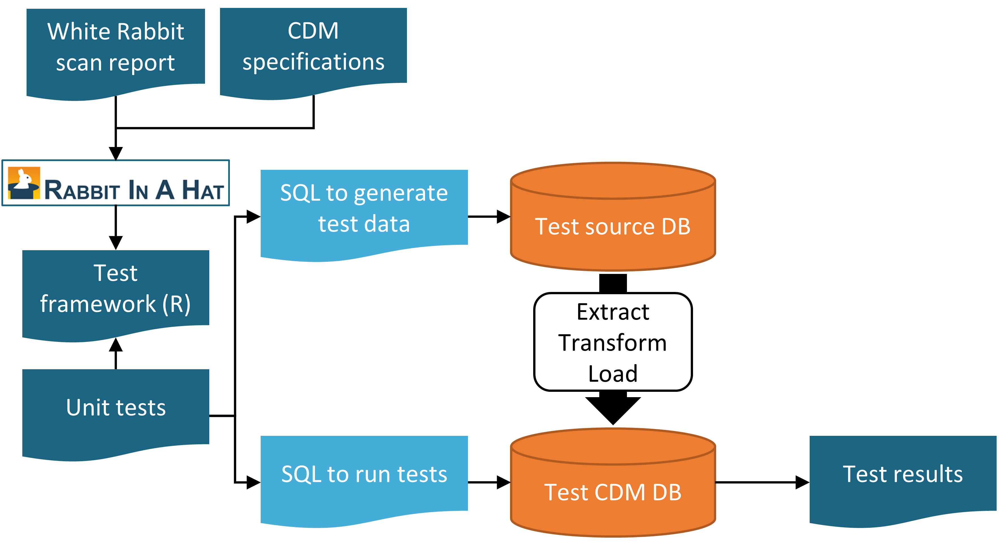
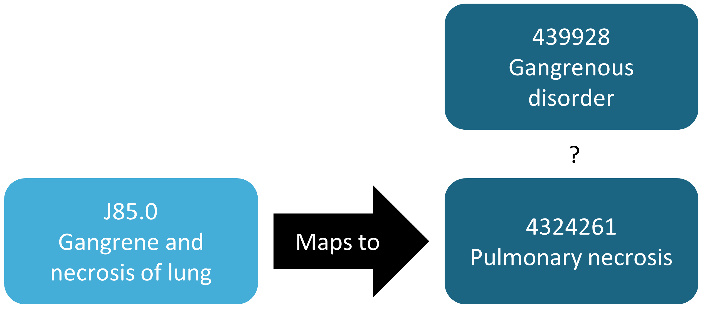
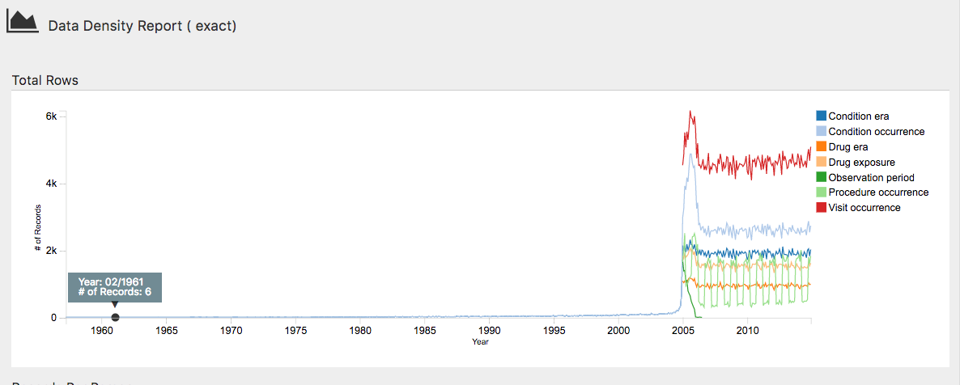
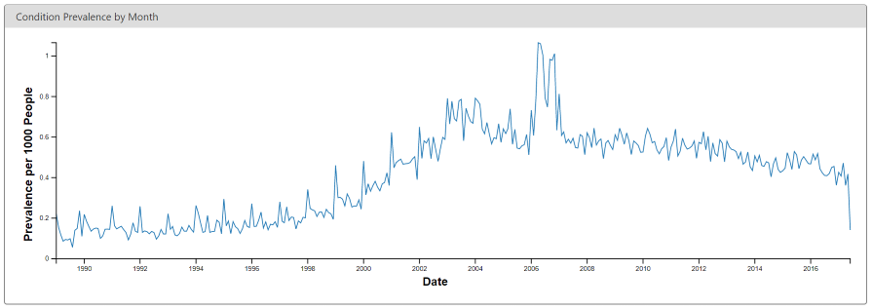
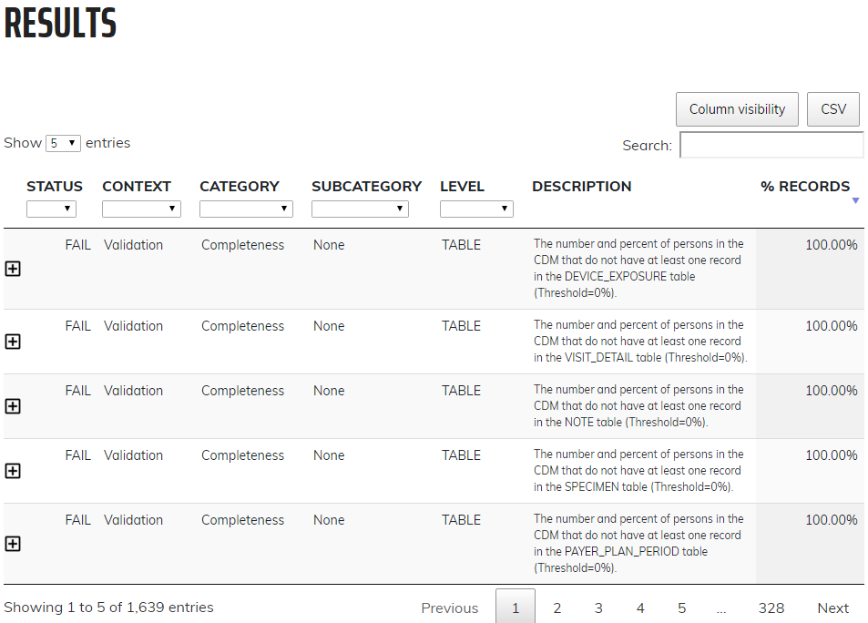
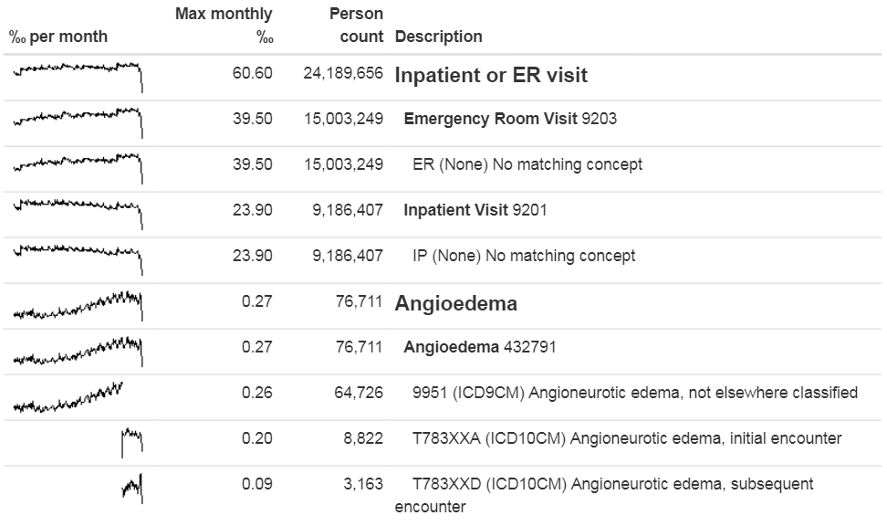

# Data Quality {#DataQuality}


*Chapter leads: Martijn Schuemie, Vojtech Huser & Clair Blacketer* 

Most of the data used for observational healthcare research were not collected for research purposes. For example, electronic health records (EHRs) aim to capture the information needed to support the care of patients, and administrative claims are collected to provide a grounds for allocating costs to payers. Many have questioned whether it is appropriate to use such data for clinical research, with @vanDerLei_1991 even stating that "Data shall be used only for the purpose for which they were collected". The concern is that because the data was not collected for the research that we would like to do, it is not guaranteed to have sufficient quality. If the quality of the data is poor (garbage in), then the quality of the result of research using that data must be poor as well (garbage out). An important aspect of observational healthcare research therefore deals with assessing data quality, aiming to answer the question:

> Are the data of sufficient quality for our research purposes?

We can define data quality (DQ) as [@roebuck_2012]: \index{data quality}

> The state of completeness, validity, consistency, timeliness and accuracy that makes data appropriate for a specific use.

Note that it is unlikely that our data are perfect, but they may be good enough for our purposes. 

DQ cannot be observed directly, but methodology has been developed to assess it. Two types of DQ assessments can be distinguished [@weiskopf_2013]: assessments to evaluate DQ in general, and assessments to evaluate DQ in the context of a specific study.

In this chapter we will first review possible sources of DQ problems, after which we'll discuss the theory of general and study-specific DQ assessments, followed by a step-by-step description of how these assessments can be performed using the OHDSI tools.

## Sources of Data Quality Problems

There are many threats to the quality of the data, starting as noted in Chapter \@ref(EvidenceQuality) when the doctor records her or his thoughts. @dasu_2003 distinguish the following steps in the life cycle of data, recommending DQ be integrated in each step. They refer to this as the DQ continuum:

1. **Data gathering and integration**. Possible problems include fallible manual entry, biases (e.g. upcoding in claims), erroneous joining of tables in an EHR, and replacing missing values with default ones. 
2. **Data storage and knowledge sharing**. Potential problems are lack of documentation of the data model, and lack of meta-data.
3. **Data analysis**. Problems can include incorrect data transformations, incorrect data interpretation, and use of inappropriate methodology. 
4. **Data publishing**. When publishing data for downstream use.

Often the data we use has already been collected and integrated, so there is little we can do to improve step 1. We do have ways to check the DQ produced by this step as will be discussed in subsequent sections in this chapter. 

Similarly, we often receive the data in a specific form, so we have little influence over part of step 2. However, in OHDSI we convert all our observational data to the Common Data Model (CDM), and we do have ownership over this process. Some have expressed concerns that this specific step can degrade DQ. But because we control this process, we can build stringent safeguards to preserve DQ as discussed later in Section \@ref(etlUnitTests). Several investigations [@defalco_2013;@makadia_2014;@matcho_2014;@voss_2015;@voss_2015b;@hripcsak_2018] have shown that when properly executed, little to no error is introduced when converting to the CDM. In fact, having a well-documented data model that is shared by a large community facilitates data storage in unambiguous and clear manner.

Step 3 (data analysis) also falls under our control. In OHDSI, we tend to not use the term DQ for the quality issues during this step, but rather the terms *clinical validity*, *software validity* and *method validity*, which are discussed at length in Chapters \@ref(ClinicalValidity), \@ref(SoftwareValidity), and \@ref(MethodValidity), respectively.

## Data Quality in General

We can ask the question whether our data is fit for the general purpose of observational research. @kahn_harmonized_2016 define such generic DQ as consisting of three components: 

1. **Conformance**: Do data values adhere to specified standards and formats? Three sub-types are identified:
   - **Value**: Are recorded data elements in agreement with the specified formats? For example, are all provider medical specialties valid specialties? 
   - **Relational**: Is the recorded data in agreement with specified relational constraints? For example, does the PROVIDER_ID in a DRUG_EXPOSURE data have a corresponding record in the PROVIDER table?
   - **Computation**: Do computations on the data yield the intended results? For example, is BMI computed from height and weight equal to the verbatim BMI recorded in the data?
2. **Completeness**: Refers to whether a particular variable is present (e.g. is weight as measured in the doctor's office recorded?) as well as whether variables contain all recorded values (e.g. do all persons have a known gender?)
3. **Plausibility**: Are data values believable? Three sub-types are defined:
    - **Uniqueness**: For example, does each PERSON_ID occur only once in the PERSON table?
    - **Atemporal**: Do values, distributions, or densities agree with expected values? For example, is the prevalence of diabetes implied by the data in line with the known prevalence?
    - **Temporal**: Are changes in values in line with expectations? For example, are immunization sequences in line with recommendations?
    
    \index{data quality!conformance} \index{data quality!completeness} \index{data quality!plausibility}

Each component can be evaluated in two ways:

* **Verification** focuses on model and metadata data constraints, system assumptions, and local knowledge. It does not rely on an external reference.  The key feature with verification is the ability to determine expected values and distributions using resources within the local environment.
* **Validation** focuses on the alignment of data values with respect to relevant external benchmarks. One possible source of an external benchmark can be to combine results across multiple data sites. 

\index{data quality!verification} \index{data quality!validation}

### Data Quality Checks

\index{ACHILLES} \index{data quality!checks}

Kahn introduces the term *data quality check* (sometimes referred to as a *data quality rule*) that tests whether data conform to a given requirement (e.g., flagging an implausible age of 141 of a patient, potentially due to incorrect birth year or missing death event). We can implement such checks in software, creating automated DQ tools. One such tool is [ACHILLES](https://github.com/OHDSI/Achilles) (Automated Characterization of Health Information at Large-scale Longitudinal Evidence Systems). [@huser_methods_2018] ACHILLES is a software tool that provides characterization and visualization of a database conforming to the CDM. As such, it can be used to evaluate DQ in a network of databases. [@huser_multisite_2016] ACHILLES is available as a stand-alone tool, and is also integrated into ATLAS as the "Data Sources" function. \index{data quality!data quality check} \index{ACHILLES}

ACHILLES pre-computes over 170 data characterization analyses, with each analysis having an analysis ID and a short description of the analysis, for example, “715: Distribution of DAYS_SUPPLY by DRUG_CONCEPT_ID” or “506: Distribution of age at death by gender”. The results of these analyses are stored in a database, and can be accessed by a web viewer or by ATLAS. 

\index{Data Quality Dashboard}

Another tool created by the community to assess DQ is the [Data Quality Dashboard (DQD)](https://github.com/OHDSI/DataQualityDashboard). Where ACHILLES runs characterization analyses to provide an overall visual understanding of a CDM instance, the DQD goes table by table and field by field to quantify the number of records in a CDM that do not conform to the given specifications. In all, over 1,500 checks are performed, each one organized into the Kahn framework. For each check the result is compared to a threshold whereby a FAIL is considered to be any percentage of violating rows falling above that value. Table \@ref(tab:dqdExamples) shows some example checks.  

Table: (\#tab:dqdExamples) Example data quality rules in the Data Quality Dashboard.

| Fraction violated rows  | Check description | Threshold | Status |
|:-------- |:------------------------------------ |:------ |:---- |
| 0.34|A yes or no value indicating if the provider_id in the VISIT_OCCURRENCE is the expected data type based on the specification. | 0.05 | FAIL|
| 0.99| The number and percent of distinct source values in the measurement_source_value field of the MEASUREMENT table mapped to 0. | 0.30 | FAIL|
| 0.09| The number and percent of records that have a value in the drug_concept_id field in the DRUG_ERA table that do not conform to the ingredient class. | 0.10 | PASS|
| 0.02| The number and percent of records with a value in the verbatim_end_date field of the DRUG_EXPOSURE that occurs prior to the date in the DRUG_EXPOSURE_START_DATE field of the DRUG_EXPOSURE table.|0.05|PASS|
| 0.00| The number and percent of records that have a duplicate value in the procedure_occurrence_id field of the PROCEDURE_OCCURRENCE. | 0.00 | PASS|

Within the tool the checks are organized in multiple ways, one being into table, field, and concept level checks. Table checks are those done at a high-level within the CDM, for example determining if all required tables are present. The field level checks are carried out in such a way to evaluate every field within every table for conformance to CDM specifications. These include making sure all primary keys are truly unique and all standard concept fields contain concepts ids in the proper domain, among many others. Concept level checks go a little deeper to examine individual concept ids. Many of these fall into the plausibility category of the Kahn framework such as ensuring that gender-specific concepts are not attributed to persons of incorrect gender (i.e. prostate cancer in a female patient).

```{block2, type='rmdimportant'}
ACHILLES and DQD are executed against the data in the CDM. DQ issues identified this way may be due to the conversion to the CDM, but may also reflect DQ issues already present in the source data. If the conversion is at fault, it is usually within our control to remedy the problem, but if the underlying data is at fault the only course of action may be to delete the offending records.

```

### ETL Unit Tests {#etlUnitTests}

\index{ETL!unit tests}

In addition to high level data quality checks individual level data checks should be performed. The ETL (Extract-Transform-Load) process by which data is converted to the CDM is often quite complex, and with that complexity comes the danger of making mistakes that may go unnoticed. Moreover, as time goes by the source data model may change, or the CDM may be updated, making it necessary to modify the ETL process. Changes to a process as complicated as an ETL can have unintended consequences, requiring all aspects of the ETL to be reconsidered and reviewed. 

To make sure the ETL does what it is supposed to do, and continues to do so, it is highly recommended to construct a set of unit tests. A unit test is a small piece of code that automatically checks a single aspect. The Rabbit-in-a-Hat tool described in Chapter \@ref(ExtractTransformLoad) can create a unit test framework that makes writing such unit tests easier. This framework is a collection of R functions created specifically for the source database and target CDM version of the ETL. Some of these functions are for creating fake data entries that adhere to the source data schema, while other functions can be used to specify expectations on the data in the CDM format. Here is an example unit test:


```{r eval=FALSE}
source("Framework.R")
declareTest(101, "Person gender mappings")
add_enrollment(member_id = "M000000102", gender_of_member = "male")
add_enrollment(member_id = "M000000103", gender_of_member = "female")
expect_person(PERSON_ID = 102, GENDER_CONCEPT_ID = 8507
expect_person(PERSON_ID = 103, GENDER_CONCEPT_ID = 8532)
```

In this example, the framework generated by Rabbit-in-a-Hat is sourced, loading the functions that are used in the remainder of the code. We then declare we will start testing person gender mappings. The source schema has an ENROLLMENT table, and we use the add_enrollment function created by Rabbit-in-a-Hat to create two entries with different values for the MEMBER_ID and GENDER_OF_MEMBER fields. Finally, we specify the expectation that after the ETL two entries should exist in the PERSON table, with various expected values.

Note that the ENROLLMENT table has many other fields, but we do not care much about what values these other fields have in the context of this test. However, leaving those values (e.g. date of birth) empty might cause the ETL to discard the record or throw an error. To overcome this problem while keeping the test code easy to read, the `add_enrollment` function will assign default values (the most prevalent values as observed in the White Rabbit scan report) to field values that are not explicitly specified by the user.

Similar unit tests can be created for all other logic in an ETL, typically resulting in hundreds of tests. When we are done defining the test, we can use the framework to generate two sets of SQL statements, one to create the fake source data, and one to create the tests on the ETL-ed data:


```{r eval=FALSE}
insertSql <- generateInsertSql(databaseSchema = "source_schema")
testSql <- generateTestSql(databaseSchema = "cdm_test_schema")
```

The overall process is depicted in Figure \@ref(fig:testFramework).

```{r testFramework, fig.cap='Unit testing an ETL (Extract-Transform-Load) process using the Rabbit-in-a-Hat testing framework.',echo=FALSE, out.width='90%', fig.align='center'}

```

The test SQL returns a table that will look like Table \@ref(tab:exampleTestResults). In this table we see that we passed the two tests we defined earlier.

Table: (\#tab:exampleTestResults) Example ETL unit test results.

| ID    | Description            | Status |
|:-----:|:---------------------- |:------:|
| 101   | Person gender mappings | PASS   |
| 101   | Person gender mappings | PASS   |

The power of these unit tests is that we can easily rerun them any time the ETL process is changed. 

## Study-Specific Checks

\index{data quality!study-specific checks}

The chapter has so far focused on general DQ checks. Such checks should be executed prior to using the data for research. Since these checks are done regardless of the research question we recommend performing study-specific DQ assessments.

Some of these assessments can take the form of DQ rules that are specifically relevant for the study. For example, we may want to impose a rule that at least 90% of the records for our exposure of interest specify the length of exposure. 

A standard assessment is to review the concepts that are most relevant for the study in ACHILLES, for example those specified in the study cohort definitions. Sudden changes over time in the rate with which a code is observed may hint at DQ problems. Some examples will be discussed later in this chapter.

Another assessment is to review the prevalence and changes in prevalence over time of the resulting cohorts generated using the cohort definitions developed for the study, and see whether these agree with expectations based on external clinical knowledge. For example, exposure of a new drug should be absent before introduction to the market, and will likely increase over time after introduction. Similarly, the prevalence of outcomes should be in line with what is know of the prevalence of the condition in the population. If a study is executed across a network of databases, we can compare the prevalences of cohorts across databases. If a cohort is highly prevalent in one database, but is missing in another database, there might be a DQ issue. Note  that such an assessment overlaps with the notion of *clinical validity*, as discussed in Chapter \@ref(ClinicalValidity); We may find unexpected prevalences in some databases not because of DQ issues, but because our cohort definition is not truly capturing the health state we are interested in, or because these health state rightly vary over databases that capture different patient populations.

### Checking Mappings

One possible source of error that firmly falls under our control is the mapping of source codes to Standard Concepts. The mappings in the Vocabulary are meticulously crafted, and errors in the mapping that are noted by members of the community are reported in the Vocabulary issue tracker[^vocabIssueTrackerUrl] and fixed in future releases. Nevertheless, it is impossible to completely check all mappings by hand, and errors likely still exist. When performing a study, we therefore recommend reviewing the mappings for those concepts most relevant to the study. Fortunately, this can be achieved quite easily because in the CDM we store not only the Standard concepts, but also the source codes. We can review both the source codes that do map to the concepts used in the study, as well as those that do not.

[^vocabIssueTrackerUrl]: https://github.com/OHDSI/Vocabulary-v5.0/issues

One way to review the source codes that do map is to use the `checkCohortSourceCodes` function in the [MethodEvaluation](https://ohdsi.github.io/MethodEvaluation/) R package. This function uses a cohort definition as created by ATLAS as input, and for each concept set used in the cohort definition it checks which source codes map to the concepts in the set. It also computes the prevalences of these codes over time to help identify temporal issues associated with specific source codes. The example output in Figure \@ref(fig:sourceCodes) shows a (partial) breakdown of a concept set called 'Depressive disorder'. The most prevalent concept in this concept set in the database of interest is concept  [440383](http://athena.ohdsi.org/search-terms/terms/440383) ("Depressive disorder"). We see that three source codes in the database map to this concept: ICD-9 code 3.11, and ICD-10 codes F32.8 and F32.89. On the left we see that the concept as a whole first shows a gradual increase over time, but then shows a sharp drop. If we look at the individual codes, we see that this drop can be explained by the fact that the ICD-9 code stops being used at the time of the drop. Even though this is the same time the ICD-10 codes start being used, the combined prevalence of the ICD-10 codes is much smaller than that of the ICD-9 code. This specific example was due to the fact that the ICD-10 code F32.9 ("Major depressive disorder, single episode, unspecified") should also have mapped to the concept. This problem has since been resolved in the Vocabulary.

```{r sourceCodes, fig.cap='Example output of the checkCohortSourceCodes function. ',echo=FALSE, out.width='100%', fig.align='center'}
knitr::include_graphics("images/DataQuality/sourceCodes.png")
```

Even though the previous example demonstrates a chance finding of a source code that was not mapped, in general identifying missing mappings is more difficult than checking mappings that are present. It requires knowing which source codes should map but don't. A semi-automated way to perform this assessment is to use the `findOrphanSourceCodes` function in the [MethodEvaluation](https://ohdsi.github.io/MethodEvaluation/) R package. This function allows one to search the vocabulary for source codes using a simple text search, and it checks whether these source codes map to a specific concept, or to one of the descendants of that concept. The resulting set of source codes is subsequently restricted to only those that appear in the CDM database at hand. For example, in a study the concept "Gangrenous disorder" ([439928](http://athena.ohdsi.org/search-terms/terms/439928)) and all of its descendants was used to find all occurrences of gangrene. To evaluate whether this truly includes all source codes indicate gangrene, several terms (e.g. "gangrene") were used to search the descriptions in the CONCEPT and SOURCE_TO_CONCEPT_MAP tables to identify source codes. An automated search is then used to evaluate whether each gangrene source code appearing in the data indeed directly or indirectly (through ancestry) maps to the concept "Gangrenous disorder".  The result of this evaluation is shown in Figure \@ref(fig:missingMapping), revealing that the ICD-10 code J85.0 ("Gangrene and necrosis of lung") was only mapped to concept [4324261](http://athena.ohdsi.org/search-terms/terms/4324261) ("Pulmonary necrosis"), which is not a descendant of "Gangrenous disorder".  \index{orphan codes}

```{r missingMapping, fig.cap='Example orphan source code. ',echo=FALSE, out.width='70%', fig.align='center'}

```

## ACHILLES in Practice {#achillesInPractice}

Here we will demonstrate how to run ACHILLES against a database in the CDM format. 

We first need to tell R how to connect to the server. ACHILLES uses the [DatabaseConnector](https://ohdsi.github.io/DatabaseConnector/) package, which provides a function called `createConnectionDetails`. Type `?createConnectionDetails` for the specific settings required for the various database management systems (DBMS). For example, one might connect to a PostgreSQL database using this code:


```{r tidy=FALSE, eval=FALSE}
library(Achilles)
connDetails <- createConnectionDetails(dbms = "postgresql",
                                       server = "localhost/ohdsi",
                                       user = "joe",
                                       password = "supersecret")

cdmDbSchema <- "my_cdm_data"
cdmVersion <- "5.3.0"
```

The last two lines define the `cdmDbSchema` variable, as well as the CDM version. We will use these later to tell R where the data in the CDM format live, and what version CDM is used. Note that for Microsoft SQL Server, database schemas need to specify both the database and the schema, so for example `cdmDbSchema <- "my_cdm_data.dbo"`.

Next, we run ACHILLES:


```{r tidy=FALSE, eval=FALSE}
result <- achilles(connectionDetails,
                   cdmDatabaseSchema = cdmDbSchema,
                   resultsDatabaseSchema = cdmDbSchema,
                   sourceName = "My database",
                   cdmVersion = cdmVersion)
```

This function will create several tables in the `resultsDatabaseSchema`, which we've set here to the same database schema as the CDM data. 

We can view the ACHILLES database characterization. This can be done by pointing ATLAS to the ACHILLES results databases, or by exporting the ACHILLES results to a set of JSON files:


```{r eval=FALSE}
exportToJson(connectionDetails,
             cdmDatabaseSchema = cdmDatabaseSchema,
             resultsDatabaseSchema = cdmDatabaseSchema,
             outputPath = "achillesOut")
```

The JSON files will be written to the achillesOut sub-folder, and can be used together with the AchillesWeb web application to explore the results. For example, Figure \@ref(fig:achillesDataDensity) shows the ACHILLES data density plot. This plot shows that the bulk of the data starts in 2005. However, there also appear to be a few records from around 1961, which is likely an error in the data.

```{r achillesDataDensity, fig.cap='The data density plot in the ACHILLES web viewer.',echo=FALSE, out.width='100%', fig.align='center'}

```

Another example is shown in Figure \@ref(fig:achillesCodeChange), revealing a sudden change in the prevalence of a diabetes diagnosis code. This change coincides with changes in the reimbursement rules in this specific country, leading to more diagnoses but probably not a true increase in prevalence in the underlying population. 

```{r achillesCodeChange, fig.cap='Monthly rate of diabetes coded in the ACHILLES web viewer.',echo=FALSE, out.width='100%', fig.align='center'}

```
## Data Quality Dashboard in Practice {#dqdInPractice}

Here we will demonstrate how to run the Data Quality Dashboard against a database in the CDM format. We do this by executing a large set of checks against the CDM connection described in Section \@ref(achillesInPractice). For now the DQD supports only CDM v5.3.1 so before connecting be sure your database is in the correct version. As with ACHILLES we need to create the variable `cdmDbSchema` to tell R where to look for the data.

```{r eval=FALSE}
cdmDbSchema <- "my_cdm_data.dbo"
```

Next, we run the Dashboard...

```{r eval=FALSE}
DataQualityDashboard::executeDqChecks(connectionDetails = connectionDetails, 
                                      cdmDatabaseSchema = cdmDbSchema, 
                                      resultsDatabaseSchema = cdmDbSchema,
                                      cdmSourceName = "My database",
                                      outputFolder = "My output")
```

The above function will execute all available data quality checks on the schema specified. It will then write a table to the `resultsDatabaseSchema` which we have here set to the same schema as the CDM. This table will include all information about each check run including the CDM table, CDM field, check name, check description, Kahn category and subcategory, number of violating rows, the threshold level, and whether the check passes or fails, among others. In addition to a table this function also writes a JSON file to the location specified as the `outputFolder`. Using this JSON file we can launch a web viewer to inspect the results.

```{r eval=FALSE}
viewDqDashboard(jsonPath)
```

The variable `jsonPath` should be the path to the JSON file containing the results of the Dashboard, located in the  `outputFolder` specified when calling the `executeDqChecks` function above. 

When you first open the Dashboard you will be presented with the overview table, as seen in Figure \@ref(fig:dqdOverview). This will show you the total number of checks run in each Kahn category broken out by context, the number and percent that pass in each, as well as the overall pass rate. 

```{r dqdOverview, fig.cap='Overview of Data Quality Checks in the Data Quality Dashboard.',echo=FALSE, out.width='100%', fig.align='center'}
knitr::include_graphics("images/DataQuality/dqdOverview.png")
```

Clicking on *Results* in the left-hand menu will take you to the drilldown results for each check that was run (Figure \@ref(fig:dqdResults)). In this example, the table showing a check run to determine the completeness of individual CDM tables, or, the number and percent of persons in the CDM that have at least one record in the specified table. In this case the five tables listed are all empty which the Dashboard counts as a fail. Clicking on the  icon will open a window that displays the exact query that was run on your data to produce the results listed. This allows for easy identification of the rows that were considered failures by the Dashboard.

```{r dqdResults, fig.cap='Drilldown into Data Quality Checks in the Data Quality Dashboard.',echo=FALSE, out.width='100%', fig.align='center'}

```

## Study-Specific Checks in Practice

Next, we will execute several checks specifically for the angioedema cohort definition provided in Appendix \@ref(Angioedema). We will assume the connection details have been set as described in Section \@ref(achillesInPractice), and that the cohort definition JSON and SQL of the cohort definition have been saved in the files "cohort.json" and "cohort.sql", respectively. The JSON and SQL can be obtained from the Export tab in the ATLAS cohort definition function.


```{r eval=FALSE}
library(MethodEvaluation)
json <- readChar("cohort.json", file.info("cohort.json")$size)
sql <- readChar("cohort.sql", file.info("cohort.sql")$size)
checkCohortSourceCodes(connectionDetails,
                       cdmDatabaseSchema = cdmDbSchema,
                       cohortJson = json,
                       cohortSql = sql,
                       outputFile = "output.html")
```


We can open the output file in a web browser as shown in Figure \@ref(fig:sourceCodesAngioedema). Here we see that the angioedema cohort definition has two concept sets: "Inpatient or ER visit", and "Angioedema". In this example database the visits were found through database-specific source codes "ER" and "IP", that are not in the Vocabulary, although they were mapped during the ETL to standard concepts. We also see that angioedema is found through one ICD-9 and two ICD-10 codes. We clearly see the point in time of the cut-over between the two coding systems when we look at the spark-lines for the individual codes, but for the concept set as a whole there is no discontinuity at that time.

```{r sourceCodesAngioedema, fig.cap='Source codes used in the angioedema cohort definition.',echo=FALSE, out.width='100%', fig.align='center'}

```

Next, we can search for orphan source codes, that is source codes that do not map to standard concept codes. Here we look for the Standard Concept "Angioedema", and look for any codes and concepts that have "Angioedema" or any of the synonyms we provide as part of their name:

```{r eval=FALSE}
orphans <- findOrphanSourceCodes(connectionDetails,
                                 cdmDatabaseSchema = cdmDbSchema,
                                 conceptName = "Angioedema",
                                 conceptSynonyms = c("Angioneurotic edema",
                                                     "Giant hives",
                                                     "Giant urticaria",
                                                     "Periodic edema"))
View(orphans)
```
|code              |description                                                            |vocabularyId | overallCount|
|:-----------------|:----------------------------------------------------------------------|:------------|------------:|
|T78.3XXS          |Angioneurotic edema, sequela                                           |ICD10CM      |          508|
|10002425          |Angioedemas                                                            |MedDRA       |            0|
|148774            |Angioneurotic Edema of Larynx                                          |CIEL         |            0|
|402383003         |Idiopathic urticaria and/or angioedema                                 |SNOMED       |            0|
|232437009         |Angioneurotic edema of larynx                                          |SNOMED       |            0|
|10002472          |Angioneurotic edema, not elsewhere classified                          |MedDRA       |            0|

The only potential orphan found that is actually used in the data is "Angioneurotic edema, sequela", which should not be mapped to angioedema. This analysis therefore did not reveal any missing codes.

## Summary

```{block2, type='rmdsummary'}
- Most observational healthcare data were not collected for research.

- Data quality checks are an integral part of research. Data quality must be assessed to determine whether the data are of sufficient quality for research purposes

- We should assess data quality for the purpose of research in general, and critically in the context of a specific study.

- Some aspects of data quality can be assessed automatically through large sets of predefined rules, for example those in the Data Quality Dashboard.

- Other tools exist to evaluate the mapping of codes relevant for a particular study.

```

## Exercises

#### Prerequisites {-}

For these exercises we assume R, R-Studio and Java have been installed as described in Section \@ref(installR). Also required are the [SqlRender](https://ohdsi.github.io/SqlRender/), [DatabaseConnector](https://ohdsi.github.io/DatabaseConnector/), [ACHILLES](https://github.com/OHDSI/Achilles),  and [Eunomia](https://ohdsi.github.io/Eunomia/) packages, which can be installed using:


```{r eval=FALSE}
install.packages(c("SqlRender", "DatabaseConnector", "devtools"))
devtools::install_github("ohdsi/Achilles")
devtools:install_github("ohdsi/DataQualityDashboard")
devtools::install_github("ohdsi/Eunomia", ref = "v1.0.0")
```

The Eunomia package provides a simulated dataset in the CDM that will run inside your local R session. The connection details can be obtained using:


```{r eval=FALSE}
connectionDetails <- Eunomia::getEunomiaConnectionDetails()
```

The CDM database schema is "main".

```{exercise, exerciseRunAchilles}
Execute ACHILLES against the Eunomia database.

```

```{exercise, exerciseRunDQD}
Execute the DataQualityDashboard against the Eunomia database.

```

```{exercise, exerciseViewDQD}
Extract the DQD list of checks.

```

Suggested answers can be found in Appendix \@ref(DataQualityanswers).

