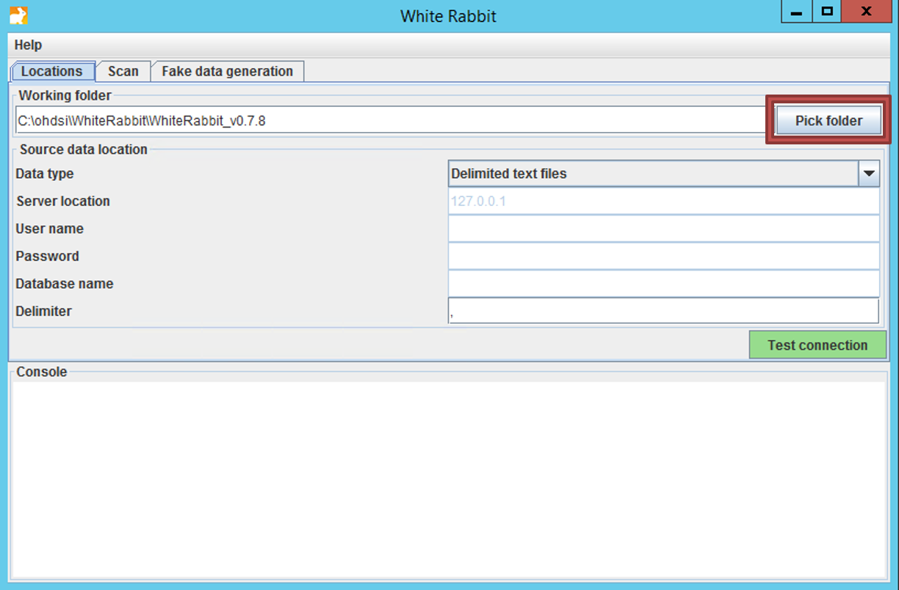
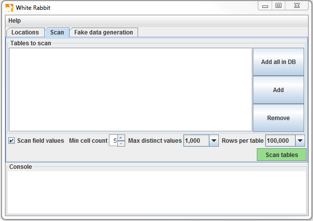
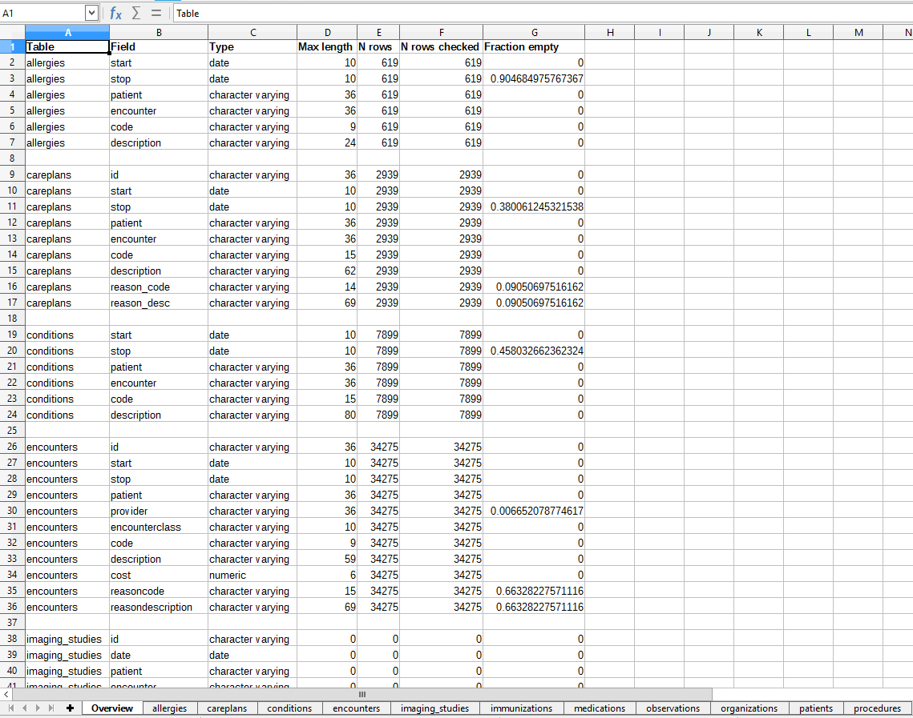
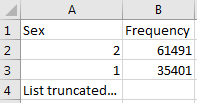
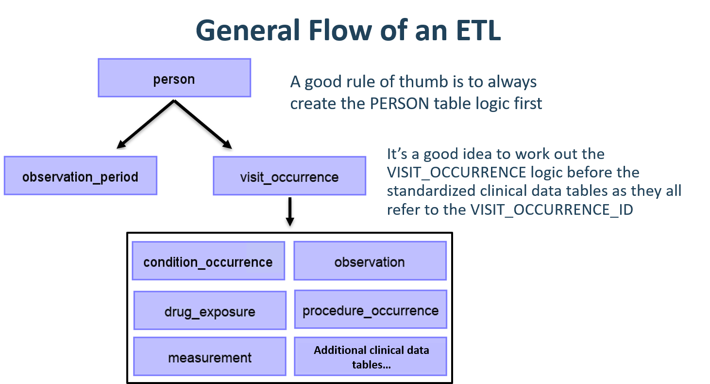
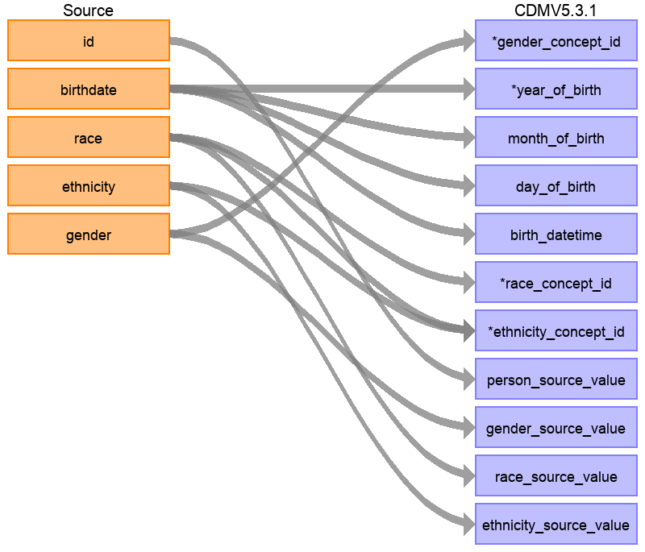
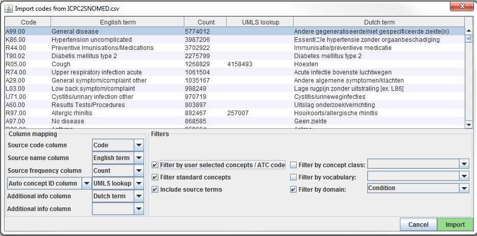
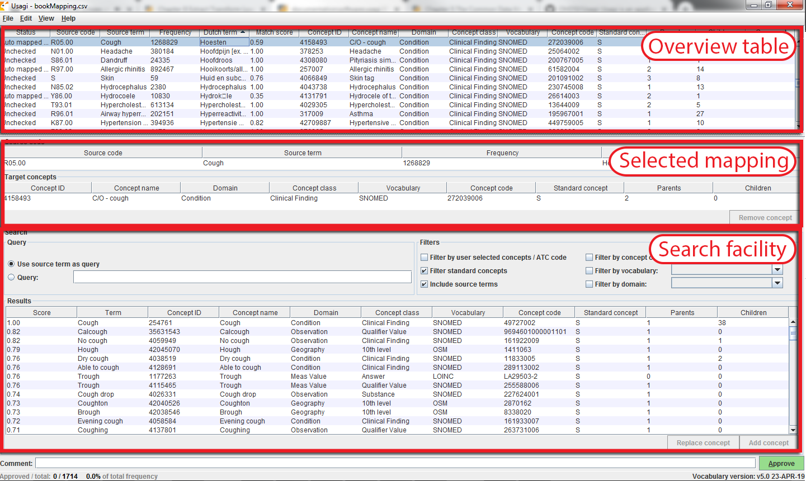
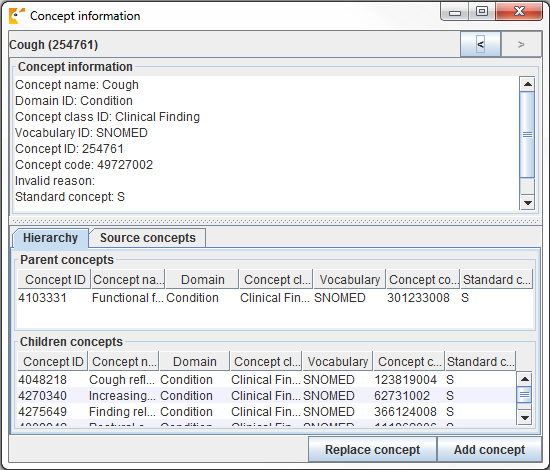

# Extract Transform Load {#ExtractTransformLoad}

*Chapter leads: Clair Blacketer & Erica Voss*

## Introduction

In order to get from the native/raw data to the OMOP Common Data Model (CDM) we have to create an extract, transform, and load (ETL) process. This process should restructure the data to the CDM, and add mappings to the Standardized Vocabularies, and is typically implemented as a set of automated scripts, for example SQL scripts. It is important that this ETL process is repeatable, so that it can be rerun whenever the source data is refreshed. \index{Extract, Transform and Load (ETL)} \index{ETL|see {Extract, Transform and Load (ETL)}} \index{Raw data} \index{Native data|see {Raw data}} \index{Source data|see{Raw data}}

Creating an ETL is usually a large undertaking. Over the years, we have developed best practices, consisting of of four major steps:

1. Data experts and CDM experts together design the ETL.
2. People with medical knowledge create the code mappings.
3. A technical person implements the ETL.
4. All are involved in quality control.

In this chapter we will discuss each of these steps in detail. Several tools have been developed by the OHDSI community to support some of these steps, and these will be discussed as well. We close this chapter with a discussion of CDM and ETL maintenance.

## Step 1: Design the ETL

It is important to clearly separate the design of the ETL from the implementation of the ETL. Designing the ETL requires extensive knowledge of both the source data, as well as the CDM. Implementing the ETL on the other hand typically relies mostly on technical expertise on how to make the ETL computationally efficient. If we try to do both at once, we are likely to get stuck in nitty-gritty details, while we should be focusing on the overall picture.

Two closely-integrated tools have been developed to support the ETL design process: White Rabbit, and Rabbit-in-a-Hat.

### White Rabbit

To initiate an ETL process on a database you need to understand your data, including the tables, fields, and content. This is where the [White Rabbit](https://github.com/OHDSI/WhiteRabbit) tool comes in; it scans your data and creates a report containing all the information necessary to begin designing the ETL. All source code and installation instructions, as well as a link to the manual, are available on GitHub [^whiteRabbitGithubUrl]. \index{White Rabbit} \index{Data profiling|see {White Rabbit}}

[^whiteRabbitGithubUrl]: https://github.com/OHDSI/WhiteRabbit].

**Scope and Purpose**

White Rabbit’s main function is to perform a scan of the source data, providing detailed information on the tables, fields, and values that appear in a field. The source data can be in comma-separated text files, or in a database (MySQL, SQL Server, Oracle, PostgreSQL, Microsoft APS, Microsoft Access, Amazon RedShift). The scan will generate a report that can be used as a reference when designing the ETL, for instance by using it in conjunction with the Rabbit-In-a-Hat tool. White Rabbit differs from standard data profiling tools in that it attempts to prevent the display of personally identifiable information (PII) data values in the generated output data file.

**Process Overview**

The typical sequence for using the software to scan source data:

1. Set working folder, the location on the local desktop computer where results will be exported.
2. Connect to the source database or CSV text file and test connection.
3. Select the tables of interest for the scan and scan the tables.
4. White Rabbit creates an export of information about the source data.

**Setting a Working Folder**

After downloading and installing the White Rabbit application, the first thing you need to do is set a working folder. Any files that White Rabbit creates will be exported to this local folder. Use the "Pick Folder" button shown in Figure \@ref(fig:WhiteRabbitLocation) to navigate in your local environment where you would like the scan document to go. 

```{r WhiteRabbitLocation, fig.cap='The "Pick Folder" button allows the specification of a working folder for the White Rabbit application.',echo=FALSE, out.width='100%'}

```

**Connection to a Database**

White Rabbit supports delimited text files and various database platforms. Hover the mouse over the various fields to get a description of what is required. More detailed information can be found in the manual.

**Scanning the Tables in a Database**

After connecting to a database, you can scan the tables contained therein. A scan generates a report containing information on the source data that can be used to help design the ETL. Using the Scan tab shown in Figure \@ref(fig:WhiteRabbitAddTables) you can either select individual tables in the selected source database by clicking on "Add" (Ctrl + mouse click), or automatically select all tables in the database by clicking on "Add all in DB".

```{r WhiteRabbitAddTables, fig.cap='White Rabbit Scan tab.', echo=FALSE, out.width='100%'}

```

There are a few setting options as well with the scan:

* Checking the “Scan field values” tells WhiteRabbit that you would like to investigate which values appear in the columns. 
* “Min cell count” is an option when scanning field values. By default this is set to 5, meaning values in the source data that appear less than 5 times will not appear in the report.
* “Rows per table” is an option when scanning field values. By default, White Rabbit will scan 100,000 randomly selected rows in the table. 

Once all settings are completed, press the “Scan tables” button. After the scan is completed the report will be written to the working folder.

**Interpreting the Scan Report**

Once the scan is complete, an Excel file is generated in the selected folder with one tab present for each table scanned as well as an overview tab. The overview tab lists all tables scanned, each field in each table, the data type of each field, the maximum length of the field, the number of rows in the table, the number of rows scanned, and how often each field was found to be empty. Figure \@ref(fig:ScanOverviewTab). shows an example overview tab.

```{r ScanOverviewTab, fig.cap="Example overview tab from a scan report.", echo=FALSE, out.width='100%'}

```

The tabs for each of the tables show each field, the values in each field, and the frequency of each value. Each source table column will generate two columns in the Excel. One column will list all distinct values that have a “Min cell count” greater than what was set at time of the scan. If a list of unique values was truncated, the last value in the list will be “List truncated”; this indicates that there are one or more additional unique source values that appear less than the number entered in the “Min cell count”. Next to each distinct value will be a second column that contains the frequency (the number of times that value occurs in the sample). These two columns (distinct values and frequency) will repeat for all the source columns in the table profiled in the workbook.

```{r scanSex, fig.cap="Example values for a single column.", echo=FALSE, out.width='30%'}

```

The report is powerful in understanding your source data by highlighting what exists. For example, if the results shown in Figure \@ref(fig:scanSex) were given back on the “Sex” column within one of the tables scanned, we can see that there were two common values (1 and 2) that appeared 61,491 and 35,401 times respectively. WhiteRabbit will not define 1 as male and 2 as female; the data holder will typically need to define source codes unique to the source system. However these two values (1 & 2) are not the only values present in the data because we see this list was truncated. These other values appear with very low frequency (defined by “Min cell count”) and often represent incorrect or highly suspicious values. When generating an ETL we should not only plan to handle the high-frequency gender concepts 1 and 2 but the other low-frequency values that exist within this column.

### Rabbit-In-a-Hat

With the White Rabbit scan in hand, we have a clear picture of the source data. We also know the full specification of the CDM. Now we need to define the logic to go from one to the other. This design activity requires thorough knowledge of both the source data and the CDM. The Rabbit-in-a-Hat tools is specifically designed to support a team having these expertises. In a typical setting, the ETL design team sits together in a room, while Rabbit-in-a-Hat is projected on a screen. In a first round, the table-to-table mappings can be collaboratively decided, after which field-to-field mappings can be designed, while defining the logic by which values will be transformed. Rabbit-In-a-Hat comes with the White Rabbit software. \index{Rabbit-In-A-Hat} \index{ETL Design|see {Rabbit-In-A-Hat}}

**Scope and purpose**

Rabbit-In-a-Hat is designed to read and display a White Rabbit scan document. White Rabbit generates information about the source data while Rabbit-In-a-Hat uses that information and through a graphical user interface to allow a user to connect source data to tables and columns within the CDM. Rabbit-In-a-Hat generates documentation for the ETL process, it does not generate code to create an ETL. 

**Process Overview**

The typical sequence for using this software to generate documentation of an ETL:

1. Scanned results from WhiteRabbit completed.
2. Open scanned results; interface displays source tables and CDM tables.
3. Connect source tables to CDM tables where the source table provides information for that corresponding CDM table.
4. For each source table to CDM table connection, further define the connection with source column to CDM column detail.
5. Save Rabbit-In-a-Hat work and export to a MS Word document.

**Writing ETL Logic**

Once you have opened your White Rabbit scan report in Rabbit-In-a-Hat you are ready to begin designing and writing the logic for how to convert the source data to the OMOP CDM. As an example, the next few sections will depict how some of the tables in the Synthea[^syntheaWiki] database might look during conversion. 

[^syntheaWiki]: Synthea^TM^ is a patient generator that aims to model real patients. Data are created based on parameters passed to the application.The structure of the data can be found here: https://github.com/synthetichealth/synthea/wiki.

**General Flow of an ETL**

Since the CDM is a person-centric model it is always a good idea to start mapping the PERSON table first. Every clinical event table (CONDITION_OCCURRENCE, DRUG_EXPOSURE, PROCEDURE_OCCURRENCE, etc.) refers back to the PERSON table by way of the person_id so working out the logic for the PERSON table first makes it easier later on. After the PERSON table a good rule of thumb is to convert the OBSERVATION_PERIOD table next. Each person in a CDM database should have at least one OBSERVATION_PERIOD and, generally, most events for a person fall within this timeframe. Once the PERSON and OBSERVATION_PERIOD tables are done the dimensional tables like PROVIDER, CARE_SITE, and LOCATION are typically next. The final table logic that should be worked out prior to the clincal tables is VISIT_OCCURRENCE. Often this is the most complicated logic in the entire ETL and it is some of the most crucial since most events that occur during the course of a person's patient journey will happen during visits. Once those tables are finished it is your choice which CDM tables to map and in which order. 

```{r etlFlow, fig.cap="General flow of an ETL and which tables to map first.", echo=FALSE, out.width='100%'}

```

It is often the case that, during CDM conversion, you will need to make provisions for intermediate tables. This could be for assigning the correct visit_occurrence_ids to events, or for mapping source codes to standard concepts (doing this step on the fly is often very slow). This is 100% allowed and encouraged. What is discouraged is the persistence and reliance on these tables once the conversion is complete. 

#### Mapping Example: Person table

The Synthea data structure contains 20 columns in the patients table but not all were needed to populate the PERSON table, as seen in Figure \@ref(fig:syntheaPerson). This is very common and should not be cause for alarm. In this example many of the data points in the Synthea patients table that were not used in the CDM PERSON table were additional identifiers like patient name, driver's license number, and passport number. 

```{r syntheaPerson, fig.cap='Mapping of Synthea Patients table to CDM PERSON table.',echo=FALSE, out.width='100%'}

```

The table below shows the logic that was imposed on the Synthea patients table to convert it to the CDM PERSON table. The 'Comment field' column gives explanations for why the logic was chosen. 

Table: (\#tab:syntheaEtlPerson) ETL logic to convert the Synthea Patients table to CDM PERSON table.

| Destination Field | Source field | Logic & comments |
| :---------------------- | :--------- | :---------------------------------------- |
| person_id                   |             |  Autogenerate. The person_id will be generated at the time of implementation. This is because the id value from the source is a varchar value while the person_id is an integer. The id field from the source is set as the person_source_value to preserve that value and allow for error-checking if necessary. |
| gender_concept_id           | gender      | When gender = 'M' then set gender_concept_id to 8507, when gender = 'F' then set to 8532. Drop any rows with missing/unknown gender. These two concepts were chosen as they are the only two standard concepts in the gender domain. The choice to drop patients with unknown genders tends to be site-based, though it is recommended they are removed as people without a gender are excluded from analyses. |
| year_of_birth               | birthdate   | Take year from birthdate |
| month_of_birth              | birthdate   | Take month from birthdate |
| day_of_birth                | birthdate   | Take day from birthdate |
| birth_datetime              | birthdate   | With midnight as time 00:00:00. Here, the source did not supply a time of birth so the choice was made to set it at midnight.  |
| race_concept_id             | race        | When race = 'WHITE' then set as 8527, when race = 'BLACK' then set as 8516, when race = 'ASIAN' then set as 8515, otherwise set as 0. These concepts were chosen because they are the standard concepts belonging to the race domain that most closely align with the race categories in the source.  |
| ethnicity_concept_id        | race  ethnicity | When race = 'HISPANIC', or when ethnicity in ('CENTRAL_AMERICAN',   'DOMINICAN', 'MEXICAN', 'PUERTO_RICAN', 'SOUTH_AMERICAN') then set as 38003563, otherwise set as 0. This is a good example of how multiple source columns can contribute to one CDM column. In the CDM ethnicity is represented as either hispanic or not hispanice so values from both the source column race and source column ethnicity will determine this value. |
| location_id                 |             |   |
| provider_id                 |             |   |
| care_site_id                |             |   |
| person_source_value         | id          |   |
| gender_source_value         | gender      |   |
| gender_source_concept_id    |             |   |
| race_source_value           | race        |   |
| race_source_concept_id      |             |   |
| ethnicity_source_value      | ethnicity   |  In this case the ethnicity_source_value will have more granularity than the ethnicity_concept_id.  |
| ethnicity_source_concept_id |             |   |

For more examples on how the Synthea dataset was mapped to the CDM please see the full specification document [^syntheaEtlUrl].

[^syntheaEtlUrl]: https://ohdsi.github.io/ETL-Synthea/

## Step 2: Create the code mappings

More and more code systems are added to the Vocabulary, so it may well be that the coding systems in the data are already included and mapped. Check the VOCABULARY table to see which vocabularies are included. To extract the mapping from non-standard concepts (e.g. ICD-10CM codes) to standard concepts (e.g. SNOMED codes), we can use the records in the CONCEPT_RELATIONSHIP table having relationship_id = "Maps to". For example, to find the Standard concept ID for the ICD-10CM code I21 ("Acute Myocardial Infarction"), we can use the following SQL:

```sql
SELECT concept_id_2 standard_concept_id
FROM concept_relationship
INNER JOIN concept source_concept
  ON concept_id = concept_id_1
WHERE concept_code = 'I21'
  AND vocabulary_id = 'ICD10CM'
  AND relationship_id = 'Maps to'; 
```
| standard_concept_id |
| -------------------:|
| 312327              |

Unfortunately, sometimes the source data uses coding systems that are not in the Vocabulary. In this case, a mapping has to be created from the source coding system to the Standard Concepts. Code mapping can be a daunting task, especially when there are many codes in the source coding system. There are several things that can be done to make the task easier:

- Focus on the most frequently used codes. A code that is never used or used maybe just once or twice is not worth the effort of mapping, since it will never be used in a real study. 
- Make use of existing information whenever possible. For example, many national drug coding systems have been mapped to ATC. Although ATC is not detailed enough for many purposes, the concept relationships between ATC and RxNorm can be used to make good guesses of what the right RxNorm codes are.
- Use Usagi. 

### Usagi

Usagi is a tool to aid the manual process of creating a code mapping. It can make suggested mappings based on textual similarity of code descriptions. If the source codes are only available in a foreign language, we have found that Google Translate often gives surprisingly good translation of the terms into English. Usagi allows the user to search for the appropriate target concepts if the automated suggestion is not correct. Finally, the user can indicate which mappings are approved to be used in the ETL. Usagi is available on GitHub [^UsagiUrl]. \index{Usagi} \index{Source code mapping|see {Usagi}}

[^UsagiUrl]: https://github.com/OHDSI/Usagi

**Scope and purpose**

Source codes that need mapping are loaded into the Usagi (if the codes are not in English additional translations columns are needed). A term similarity approach is used to connect source codes to Vocabulary concepts. However these code connections need to be manually reviewed and Usagi provides an interface to facilitate that. Usagi will only propose concepts that are marked as Standard concepts in the Vocabulary.

**Process Overview**

The typical sequence for using this software is:

1. Load codes from your sources system (“source codes”) that you would like to map to Vocabulary concepts.
2. Usagi will run term similarity approach to map source codes to Vocabulary concepts.
3. Leverage Usagi interface to check, and where needed, improve suggested mappings. Preferably an individual who has experience with the coding system and medical terminology should be used for this review.
4. Export final map generated by Usagi into the Vocabulary’s SOURCE_TO_CONCEPT_MAP.

**Importing Source Codes into Usagi**

Export source codes from source system into a CSV or Excel (.xlsx) file. This should at least have columns containing the source code and an English source code description, however additional information about codes can be brought over as well (e.g. dose unit, or the description in the original language if translated). In addition to information about the source codes, the frequency of the code should preferably also be brought over, since this can help prioritize which codes should receive the most effort in mapping (e.g. you can have 1,000 source codes but only 100 are truly used within the system). If any source code information needs translating to English, use Google Translate to do that.

Note: source code extracts should be broken out by domain (i.e. drugs, procedures, conditions, observations) and not lumped into one large file.

Source codes are loaded into Usagi from the File –> Import codes menu. From here an “Import codes …” will display as seen in Figure \@ref(fig:usagiImport). In this figure, the source code terms were in Dutch and were also translated into English. Usagi will leverage the English translations to map to the standard vocabulary.

```{r usagiImport, fig.cap="Usagi source code input screen.", echo=FALSE, out.width='100%'}

```

The "Column mapping" section (bottom left) is where you define for Usagi how to use the imported table. If you mouse hover over the drop downs, a pop-up will appear defining each column. Usagi will not use the Additional info column(s) as information to associate source codes to Vocabulary concept codes; however this additional information may help the individual reviewing the source code mapping and should be included.

Finally, in the "Filters" section (bottom right) you can set some restrictions for Usagi when mapping. For example, in Figure \@ref(fig:usagiImport), the user is mapping the source codes only to concepts in the Condition domain. By default, Usagi only maps to Standard Concepts, but if the the option 'Filter standard concepts' is turned off, Usagi will also consider Classification Concepts. Hover your mouse over the different filters for additional information about the filter.

One special filter is Filter by automatically selected concepts / ATC code. If there is information that you can use to restrict the search, you can do so by providing a list of CONCEPT_IDs or an ATC code in the column indicated in the Auto concept ID column (semicolon-delimited). For example, in the case of drugs there might already be ATC codes assigned to each drug. Even though an ATC code does not uniquely identify a single RxNorm drug code, it does help limit the search space to only those concepts that fall under the ATC code in the Vocabulary. To use the ATC code, follow these steps:

1. In the Column mapping section, switch from "Auto concept ID column" to "ATC column"
2. In the Column mapping section, select the column containing the ATC code as "ATC column".
3. Turnon the "Filter by user selected concepts / ATC code" on in the Filters section.

You can also use other sources of information than the ATC code to restrict as well. In the example shown in the figure above, we used a partial mapping derived from UMLS to restrict the Usagi searh. In that case we will need to use "Auto concept ID column".

Once all your settings are finalized, click the “Import” button to import the file. The file import will take a few minutes as it is running the term similarity algorithm to map source codes.

**Reviewing Source Code to Vocabulary Concept Maps**

Once you have imported your input file of source codes, the mapping process begins. In Figure \@ref(fig:usagiOverview), you see the Usagi screen is made up of 3 main sections: an overview table, the selected mapping section, and place to perform searches. Note that in any of the tables, you can right-click to select the columns that are shown or hidden to reduce the visual complexity.

```{r usagiOverview, fig.cap="Usagi source code input screen.", echo=FALSE, out.width='100%'}

```

**Approving a Suggested Mapping**

The Overview Table shows the current mapping of source codes to concepts. Right after importing source codes, this mapping contains the automatically generated suggested mappings based on term similarity and any search options. In the example in Figure \@ref(fig:usagiOverview), the English names of Dutch condition codes were mapped to standard concepts in the Condition domain, because the user restricted the search to that domain. Usagi compared the source code descriptions to concept names and synonyms to find the best match. Because the user had selected "Include source terms" Usagi also considered the names and synonyms of all source concepts in the vocabulary that map to a particular concept.If Usagi is unable to make a mapping, it will map to the CONCEPT_ID = 0.

It is suggested that someone with experience with coding systems help map source codes to their associated standard vocabulary. That individual will work through code by code in the Overview Table to either accept the mapping Usagi has suggested or choose a new mapping. For example in Figure \@ref(fig:usagiOverview) we see that the Dutch term “Hoesten” which was translated to the English term “Cough”. Usagi used “Cough” and mapped it to the Vocabulary concept of “4158493-C/O - cough”. There was a matching score of 0.58 associated to this matched pair (matching scores are typically 0 to 1 with 1 being a confident match), a score of 0.58 signifies that Usagi is not very sure of how well it has mapped this Dutch code to SNOMED. Let us say in this case, we are okay with this mapping, we can approve it by hitting the green “Approve” button in the bottom right hand portion of the screen.

**Searching for a New Mapping**

There will be cases where Usagi suggests a map and the user will be left to either try to find a better mapping or set the map to no concept (CONCEPT_ID = 0). In the example given in Figure \@ref(fig:usagiOverview), we see for the Dutch Term “Hoesten”, which was translated to “Cough”. Usagi's suggestion was restricted by the concept identified in our automatically derived mapping from UMLS, and the result might not be optimal. In the Search Facility, we could search for other concepts using either the actual term itself or a search box query.

When using the manual search box, one should keep in mind that Usagi uses a fuzzy search, and does not support structured search queries, so for example not supporting boolean operators like AND and OR.

To continue our example, suppose we used the search term “Cough” to see if we could find a better mapping. On the right of the Query section of the Search Facility, there is a Filters section, this provides options to trim down the results from the Vocabulary when searching for the search term. In this case we know we want to only find standard concepts, and we allow concepts to be found based on the names and synonyms of source concepts in the vocabulary that map to those standard concepts.

When we apply these search criteria we find “254761-Cough” and feel this may be an appropriate Vocabulary concept to map to our Dutch code. In order to do that we can hit the “Replace concept” button, which you will seein  the Selected Source Code section update, followed by the “Approve” button. There is also an “Add concept” button, this allows for multiple standardized Vocabulary concepts to map to one source code (e.g. some source codes may bundle multiple diseases together while the standardized vocabulary may not).

**Concept information**

When looking for appropriate concepts to map to, it is important to consider the "social life" of a concept. The meaning of a concept might depend partially on its place in the hierarchy, and sometimes there are "orphan concepts" in the vocabulary with few or no hierarchical relationships, which would be ill-suited as target concepts. Usagi will often report the number of parents and children a concept has, and it also possible to show more information by pressing ALT + C, or selecting view –> Concept information in the top menu bar.


```{r usagiConceptInfo, fig.cap="Usagi concept information panel.", echo=FALSE, out.width='100%'}

```


Figure \@ref(fig:usagiConceptInfo) shows the concept information panel. It shows general information about a concept, as well as its parents, children, and other source codes that map to the concept. Users can use this panel to navigate the hierarchy and potentially choose a different target concept.

Continue to move through this process, code by code, until all codes have been checked. In the list of source codes at the top of the screen, by selecting the column heading you can sort the codes. Often we suggest going from the highest frequency codes to the lowest. In the bottom left of the screen you can see the number of codes that have approved mappings, and how many code occurrences that corresponds to.

It is possible to add comments to mappings, which could be used to document why a particular mapping decision was made.

**Best Practices**

* Use someone who has experience with coding schemes.
* By clicking on a column name you can sort the columns in the Overview Table. It may be valuable to sort on “Match Score”; reviewing codes that Usagi is most confident on first may quickly knock out a significant chunk of codes. Also sorting on “Frequency” is valuable, spending more effort on frequent codes versus non-frequent is important.
* It is okay to map some codes to CONCEPT_ID = 0, some codes may not be worth it to find a good map and others may just lack a proper map.
* It is important to consider the context of a concept, specifically its parents and children.

**Export the Usagi Map Created**

Once you have created your map within USAGI, the best way to use it moving forward is to export it and append it to the Vocabulary SOURCE_TO_CONCEPT_MAP table.

To export your mappings go to File –> Export source_to_concept_map. A pop-up will appear asking you which SOURCE_VOCABULARY_ID you would like to use, type in a short identifier. Usagi will use this identifier. as the SOURCE_VOCABULARY_ID which will allow you to identify your specific mapping in the SOURCE_TO_CONCEPT_MAP table. 

After selecting the SOURCE_VOCABULARY_ID, you give your export CSV a name and save to location. The export CSV structure is in that of the SOURCE_TO_CONCEPT_MAP table. This mapping could be appended to the OMOP Vocabulary’s SOURCE_TO_CONCEPT_MAP table. It would also make sense to append a single row to the VOCABULARY table defining the SOURCE_VOCABULARY_ID you defined in the step above. Finally, it is important to note that only mappings with the “Approved” status will be exported into the CSV file; the mapping needs to be completed in USAGI in order to export it.

**Updating an Usagi mapping**

Often a mapping is not a one-time effort. As data is updated perhaps new source codes are added, and also the vocabulary is updated regularly, perhaps requiring an update of the mapping.

When the set of source codes is updated the following steps can be followed to support the update:

1. Import the new source code file 
2. Choose File –> Apply previous mapping, and select the old Usagi mapping file 
3. Identify codes that haven't inherited approved mappings from the old mapping, and map them as usual.

When the vocabulary is updated, follow these steps: 

1. Download the new vocabulary files from Athena 
2. Rebuild the Usagi index (Help –> Rebuild index) 
3. Open the mapping file 
4. Identify codes that map to concepts that in the new vocabulary version no longer are Standard concepts, and find more appropriate target concepts.

## Step 3: Implement the ETL

Implementation usually varies site to site and it largely depends on many factors including infrastructure, size of the database, the complexity of the ETL, and the technical expertise available. A few examples of different ETLs: \index{ETL!Implementations}

* ETL-CDMBuilder - A .NET application designed to transform multiple databases
  + [https://github.com/OHDSI/etl-cdmbuilder](https://github.com/OHDSI/etl-cdmbuilder)
* ETL-Synthea - A SQL builder written to convert the Synthea database
  + [https://github.com/OHDSI/etl-synthea](https://github.com/OHDSI/etl-synthea)
* ETL-LambdaBuilder - A builder using the AWS lambda functionality
  + [https://github.com/OHDSI/etl-lambdabuilder](https://github.com/OHDSI/etl-lambdabuilder)

## Step 4: Quality control

For the extract, transform, load process, quality control is iterative. The typical pattern is to write logic -> implement logic -> test logic -> fix/write logic. There are different ways to approach data quality as detailed in chapter \@ref(DataQuality) but we recommend at least the following steps in quality control: \index{ETL!Quality Control}

- Review of the ETL design document, computer code, and code mappings. Any one person can make mistakes, so always at least one other person should review what the first person did.
- Manually compare all information on a sample of persons in the source and target data.
- Compare overall counts in the source and target data.
- Replicate a study that has already been performed on the source data on the CDM version.
- Create unit tests meant to replicate a pattern in the source data that should be addressed in the ETL. For example, if your ETL specifies that patients without gender information should be dropped, create a unit test of a person without a gender and assess how the builder handles it.

## Final thoughts on ETL

The ETL process is a difficult one to master for many reasons, not the least of which the fact that we are all working off of unique source data, making it hard to create a "one-size-fits-all" solution.  However, there are some hard won lessons we have learned over the years.

- The 80/20 rule. If you can avoid it don't spend too much time manually mapping source codes to concepts sets. Ideally, map the source codes that cover the majority of your data. This should be enough to get you started and you can address any remaining codes in the future based on use cases.
- It's ok if you lose data that is not of research quality. Often these are the records that would be discarded before starting an analysis anyway, we just remove them during the ETL process instead. 
- A CDM requires maintenance. Just because you complete an ETL does not mean you don't need to touch it ever again. Your raw data might change, there might be a bug in the code, there may be new vocabulary or an update to the CDM. Plan for an allocate resources to these changes so your ETL is always up-to-date.


## Summary

```{block2, type='rmdsummary'}
- There is a generally agreed upon process for how to approach an ETL, including
  + Data experts and CDM experts together design the ETL
  + People with medical knowledge create the code mappings
  + A technical person implements the ETL
  + All are involved in quality control

- Tools have been developed by the OHDSI community to facilitate these steps and are freely available for use

- There are many ETL examples and agreed upon conventions you can use as a guide

```
