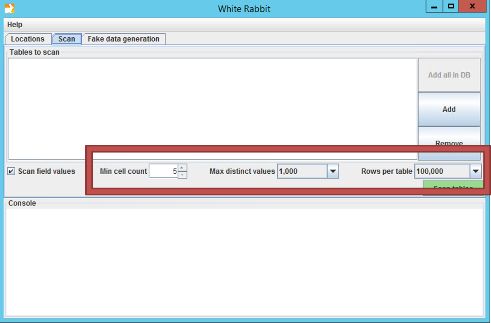
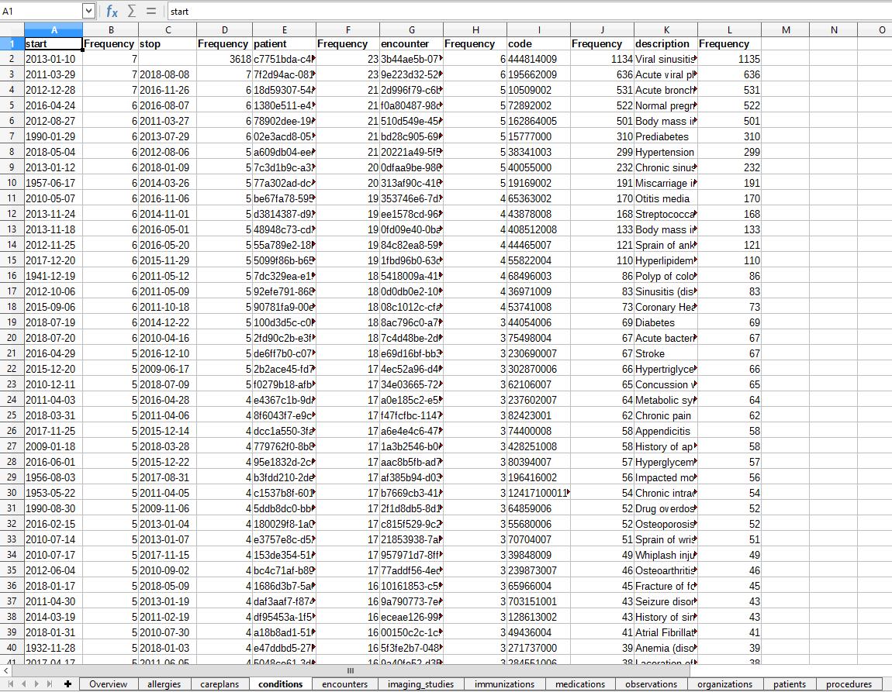

# Extract Transform Load {#ExtractTransformLoad}

*Chapter lead: Clair Blacketer*

## Introduction

In order to get from the native/raw data to the OMOP CDM an extract, transform, and load (ETL) process has been designed and developed. This process consists of four major steps:

1. Data experts and CDM experts together design the ETL
2. People with medical knowledge create the code mappings
3. A technical person implements the ETL
4. All are involved in quality control

There are tools available that have been developed by the community and this chapter will cover the steps in the process and the three tools available to facilitate those steps.

**Chapter Objectives:**

* Examine best practices around designing an ETL specification
* Introduce community tools available for facilitating the ETL process
* Discuss CDM and ETL maintenance

## ETL Step 1 - Data experts and CDM experts together design the ETL

### White Rabbit

**Description**

To initiate an ETL process on a database you need to understand your data, including the tables, fields, and content. This is where the White Rabbit tool comes in; it scans your data and creates a report containing all the information necessary to begin writing ETL logic.

**Scope and Purpose**

WhiteRabbit’s main function is to perform a scan of the source data, providing detailed information on the tables, fields, and values that appear in a field. The source data can be in comma-separated text files, or in a database (MySQL, SQL Server, Oracle, PostgreSQL, Microsoft APS, Microsoft Access, Amazon RedShift). The resulting scan will generate a report that can be used as a reference when designing the ETL, for instance by using it in conjunction with the Rabbit-In-a-Hat tool. White Rabbit differs from standard data profiling tools in that it attempts to prevent the display of personally identifiable information (PII) data values in the generated output data file.

**Process Overview**

The typical sequence  for using the software to scan source data in preparation of developing an ETL into an OMOP CDM:

1. Set working folder, the location on the local desktop computer where results will be exported.
2. Connect to the source database or CSV text file and test connection.
3. Select the tables of interest for the scan and scan the tables.
4. WhiteRabbit creates an export of information about the source data.

**Installation and support**

All source code and installation instructions available on GitHub: [https://github.com/OHDSI/WhiteRabbit](https://github.com/OHDSI/WhiteRabbit)

Additional information available on the OHDSI wiki: [http://www.ohdsi.org/web/wiki/doku.php?id=documentation:software:whiterabbit](http://www.ohdsi.org/web/wiki/doku.php?id=documentation:software:whiterabbit)

**Setting a Working Folder**

After downloading and installing the WhiteRabbit application, the first thing you need to do is set a working folder. Any files that WhiteRabbit creates will be exported to this local folder. Use the "Pick Folder" button to navigate in your local environment where you would like the scan document to go. 

(\#fig:WhiteRabbitLocation)The "Pick Folder" button allows the specification of a working folder for the WhiteRabbit application

**Connection to a Database**

WhiteRabbit supports delimited text files, Oracle, Sql Server, MySQL, and PostgreSQL. More detailed information for how to connect can be found on the wiki.

**Scanning the Tables in a Database**

After connecting to a database, you can scan the tables contained therein. A scan generates a report containing information on the source data that can be used to help design the ETL. Using the Scan tab in WhiteRabbit you can either select individual tables in the selected source database by clicking on ‘Add’ (Ctrl + mouse click), or automatically select all tables in the database by clicking on ‘Add all in DB’.

There are a few setting options as well with the scan:

* Checking the 'Scan field values' tells WhiteRabbit that you would like to investigate raw data items within tables selected for a scan (i.e. if you select Table A, WhiteRabbit will review the contents in each column in Table A).
* 'Min cell count' is an option when scanning field values. By default this is set to 5, meaning values in the source data that appear less than 5 times will not appear in the report.
* 'Rows per table' is an option when scanning field values. By default, WhiteRabbit will random 1 million rows in the table. There are other options to review 100,000 or all rows within the table.
* Unchecking the 'Scan field values' tells WhiteRabbit to not review or report on any of the raw data items.
* Once all settings are completed, press the “Scan tables” button. After the scan is completed the report will be written to the working folder.

(\#fig:WhiteRabbitScanSettings)WhiteRabbit scan settings

**Interpreting the Scan Report**

Once the scan is complete, an excel file is generated in the selected folder with one tab present for each table scanned as well as an overview tab. The overview tab lists all tables scanned, each field in each table, the data type of each field, the maximum length of the field, the number of rows in the table, the number of rows scanned, and how often each field was found to be empty. 

(\#fig:ScanOverviewTab)Example overview tab from a scan report

The tabs for each of the tables, for example the conditions table in the raw_synthea database, show each field, the values in each field, and the frequency of each value.

(\#fig:ScanConditionsTab)Example tab from a scan report

### Rabbit-In-a-Hat

Rabbit-In-a-Hat comes with WhiteRabbit and is designed to read and display a WhiteRabbit scan document. WhiteRabbit generates information about the source data while Rabbit-In-a-Hat uses that information and through a graphical user interface to allow a user to connect source data to tables and columns within the CDM. Rabbit-In-a-Hat generates documentation for the ETL process it does not generate code to create an ETL. 

Similar to WhiteRabbit, installation information can be found on the github[^whiteRabbitGithub] and information about the different options available in the application can be found on the wiki[^whiteRabbitWiki]. 

[^whiteRabbitGithub]: https://github.com/OHDSI/WhiteRabbit
[^whiteRabbitWiki]: http://www.ohdsi.org/web/wiki/doku.php?id=documentation:software:whiterabbit

**Writing ETL Logic**

Once you have opened your WhiteRabbit scan report in Rabbit-In-a-Hat you are ready to begin designing and writing the logic for how to convert the source data to the OMOP CDM. As an example, the next few sections will depict how some of the tables in the Synthea^TM^[^syntheaWiki] database might look during conversion. 

[^syntheaWiki]: Synthea^T^M is a patient generator that aims to model real patients. Data are created based on parameters passed to the application.The structure of the data can be found here: https://github.com/synthetichealth/synthea/wiki.

**General Flow of an ETL**

Since the OMOP CDM is a person-centric model it is always a good idea to start mapping the PERSON table first. Every clinical event table (CONDITION_OCCURRENCE, DRUG_EXPOSURE, PROCEDURE_OCCURRENCE, etc.) refers back to the PERSON table by way of the person_id so working out the logic for the PERSON table first makes it easier later on. After the PERSON table a good rule of thumb is to convert the OBSERVATION_PERIOD table next. Each person in a CDM database should have at least one OBSERVATION_PERIOD and, generally, most events for a person fall within this timeframe. Once the PERSON and OBSERVATION_PERIOD tables are done the dimensional tables like PROVIDER, CARE_SITE, and LOCATION are typically next. The final table logic that should be worked out prior to the clincal tables is VISIT_OCCURRENCE. Often this is the most complicated logic in the entire ETL and it is some of the most crucial since most events that occur during the course of a person's patient journey will happen during visits. Once those tables are finished it is your choice which CDM tables to map and in which order. 

(\#fig:etlFlow)General flow of an ETL and which tables to map first

*Note*

It is often the case that, during CDM conversion, you will need to make provisions for intermediate tables. This could be for assigning the correct visit_occurrence_ids to events, or for mapping source codes to standard concepts (doing this step on the fly is often very slow). This is 100% allowed and encouraged. What is discouraged is the persistence and reliance on these tables once the conversion is complete. 

#### Mapping Example: Person table

The Synthea data structure contains 20 columns in the patients table ([https://github.com/synthetichealth/synthea/wiki/CSV-File-Data-Dictionary#patients](https://github.com/synthetichealth/synthea/wiki/CSV-File-Data-Dictionary#patients)) but not all were needed to populate the PERSON table, as seen in figure \@ref(fig:syntheaPerson). This is very common and should not be cause for alarm. In this example many of the data points in the Synthea patients table that were not used in the CDM PERSON table were additional identifiers like patient name, driver's license number, and passport number. 

(\#fig:syntheaPerson)Mapping of Synthea Patients table to CDM PERSON table.

The table below shows the logic that was imposed on the Synthea patients table to convert it to the CDM PERSON table. The 'Comment field' column gives explanations for why the logic was chosen. 

Table: (\#tab:syntheaEtlPerson) ETL logic to convert the Synthea Patients table to CDM PERSON table.

| Destination Field | Source field | Logic | Comment field |
| :---------------------- | :--------- | ------------ | :---------------------------------------- |
| person_id                   |             |  Autogenerate| The person_id will be generated at the time of implementation. This is because the id value from the source is a varchar value while the person_id is an integer. The id field from the source is set as the person_source_value to preserve that value and allow for error-checking if necessary. |
| gender_concept_id           | gender      | When gender = 'M' then set gender_concept_id to 8507, when gender = 'F' then set to 8532. Drop any rows with missing/unknown gender. |These two concepts were chosen as they are the only two standard concepts in the gender domain[^athenaGender]. The choice to drop patients with unknown genders tends to be site-based, though it is recommended they are removed as people without a gender are excluded from analyses. |
| year_of_birth               | birthdate   | Take year from birthdate |  |
| month_of_birth              | birthdate   | Take month from birthdate |  |
| day_of_birth                | birthdate   | Take day from birthdate |  |
| birth_datetime              | birthdate   | With midnight as time 00:00:00 | Here, the source did not supply a time of birth so the choice was made to set it at midnight.  |
| race_concept_id             | race        | When race = 'WHITE' then set as 8527, when race = 'BLACK' then set as 8516, when race = 'ASIAN' then set as 8515, otherwise set as 0|These concepts were chosen because they are the standard concepts belonging to the race domain that most closely align with the race categories in the source[^athenaRace].  |
| ethnicity_concept_id        | race  ethnicity | When race = 'HISPANIC', or when ethnicity in ('CENTRAL_AMERICAN',   'DOMINICAN', 'MEXICAN', 'PUERTO_RICAN', 'SOUTH_AMERICAN') then set as 38003563, otherwise set as 0 | This is a good example of how multiple source columns can contribute to one CDM column. In the CDM ethnicity is represented as either hispanic or not hispanice so values from both the source column race and source column ethnicity will determine this value. |
| location_id                 |             |  |  |
| provider_id                 |             |  |  |
| care_site_id                |             |  |  |
| person_source_value         | id          |  |  |
| gender_source_value         | gender      |  |  |
| gender_source_concept_id    |             |  |  |
| race_source_value           | race        |  |  |
| race_source_concept_id      |             |  |  |
| ethnicity_source_value      | ethnicity   |  | In this case the ethnicity_source_value will have more granularity than the ethnicity_concept_id.  |
| ethnicity_source_concept_id |             |  |  |

[^athenaGender]: http://athena.ohdsi.org/search-terms/terms?domain=Gender&standardConcept=Standard&page=1&pageSize=15&query=
[^athenaRace]: http://athena.ohdsi.org/search-terms/terms?domain=Race&standardConcept=Standard&page=1&pageSize=15&query= 

For more examples on how the Synthea dataset was mapped to the CDM please see the full specification document [https://ohdsi.github.io/ETL-Synthea/](https://ohdsi.github.io/ETL-Synthea/).

Many of the choices made for Synthea follow the THEMIS agreed upon conventions, found here [https://github.com/ohdsi/themis](https://github.com/ohdsi/themis).

## ETL Step 2 - People with medical knowledge create the code mappings

Often the source data uses coding systems that are not in the OMOP Vocabulary. In this case, a mapping has to be created from the source coding system to one of the appropriate OMOP standard vocabularies (for example, for drugs the OMOP standard vocabulary is RxNorm, and for conditions it is SNOMED).

Mapping can be a daunting task, especially when there are many codes in the source coding system. There are several things that can be done to make the task easier:

- Focus on the most frequently used codes. A code that is never used or maybe just once or twice is not worth the effort of mapping, since it will never be used in a real study.
- Make use of existing information whenever possible. For example, many national drug coding systems have been mapped to ATC. Although ATC is not detailed enough for many purposes, the concept relationships between ATC and RxNorm can be used to make good guesses of what the right RxNorm codes are.
- Use Usagi[^Usagi].
  + Usagi is a tool to aid the manual process of creating a code mapping. It can make suggested mappings based on textual similarity of code descriptions. If the source codes are only available in a foreign language, we have found that Google Translate often gives surprisingly good translation of the terms into English. Usagi allows the user to search for the appropriate target concepts if the automated suggestion is not correct. Finally, the user can indicate which mappings are approved to be used in the ETL.

[^Usagi]: https://www.ohdsi.org/web/wiki/doku.php?id=documentation:software:usagi

## ETL Step 3 - A technical person implements the ETL

Implementation usually varies site to site and it largely depends on many factors including infrastructure, size of the database, the complexity of the ETL, and the technical expertise available. A few examples of different ETLs:

* ETL-CDMBuilder - A .NET application designed to transform multiple databases
  + [https://github.com/OHDSI/etl-cdmbuilder](https://github.com/OHDSI/etl-cdmbuilder)
* ETL-Synthea - A SQL builder written to convert the Synthea database
  + [https://github.com/OHDSI/etl-synthea](https://github.com/OHDSI/etl-synthea)
* ETL-LambdaBuilder - A builder using the AWS lambda functionality
  + [https://github.com/OHDSI/etl-lambdabuilder](https://github.com/OHDSI/etl-lambdabuilder)

## ETL Step 4 - All are involved in quality control

For the extract, transform, load process, quality control is iterative. The typical pattern is to write logic -> implement logic -> test logic -> fix/write logic. There are different ways to approach data quality as detailed in chapter \@ref(DataQuality) but we recommend at least the following steps in quality control: 

- Review of the ETL design document, computer code, and code mappings. Any one person can make mistakes, so always at least one other person should review what the first person did.
- Manually compare all information on a sample of persons in the source and target data.
- Compare overall counts in the source and target data.
- Replicate a study that has already been performed on the source data on the CDM version.
- Create unit tests meant to replicate a pattern in the source data that should be addressed in the ETL. For example, if your ETL specifies that patients without gender information should be dropped, create a unit test of a person without a gender and assess how the builder handles it.

## Final thoughts on ETL

The ETL process is a difficult one to master for many reasons, not the least of which the fact that we are all working off of unique source data, making it hard to create a "one-size-fits-all" solution.  However, there are some hard won lessons we have learned over the years.

- The 80/20 rule. If you can avoid it don't spend too much time manually mapping source codes to concepts sets. Ideally, map the source codes that cover the majority of your data. This should be enough to get you started and you can address any remaining codes in the future based on use cases.
- It's ok if you lose data that is not of research quality. Often these are the records that would be discarded before starting an analysis anyway, we just remove them during the ETL process instead. 
- A CDM requires maintenance. Just because you complete an ETL does not mean you don't need to touch it ever again. Your raw data might change, there might be a bug in the code, there may be new vocabulary or an update to the CDM. Plan for an allocate resources to these changes so your ETL is always up-to-date.

## Summary

\BeginKnitrBlock{rmdsummary}
- There is a generally agreed upon process for how to approach an ETL, including
  + Data experts and CDM experts together design the ETL
  + People with medical knowledge create the code mappings
  + A technical person implements the ETL
  + All are involved in quality control

- Tools have been developed by the OHDSI community to facilitae these steps and are freely available for use

- There are many ETL examples and agreed upon conventions you can use as a guide

\EndKnitrBlock{rmdsummary}
