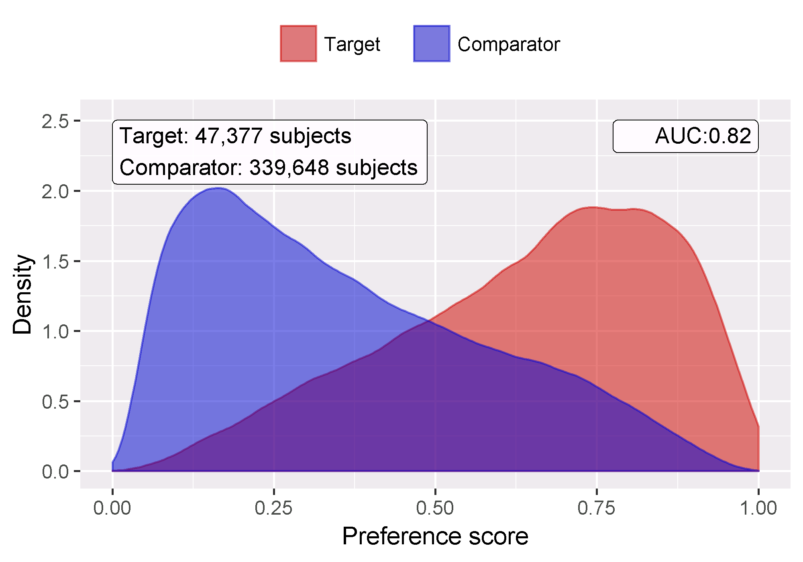
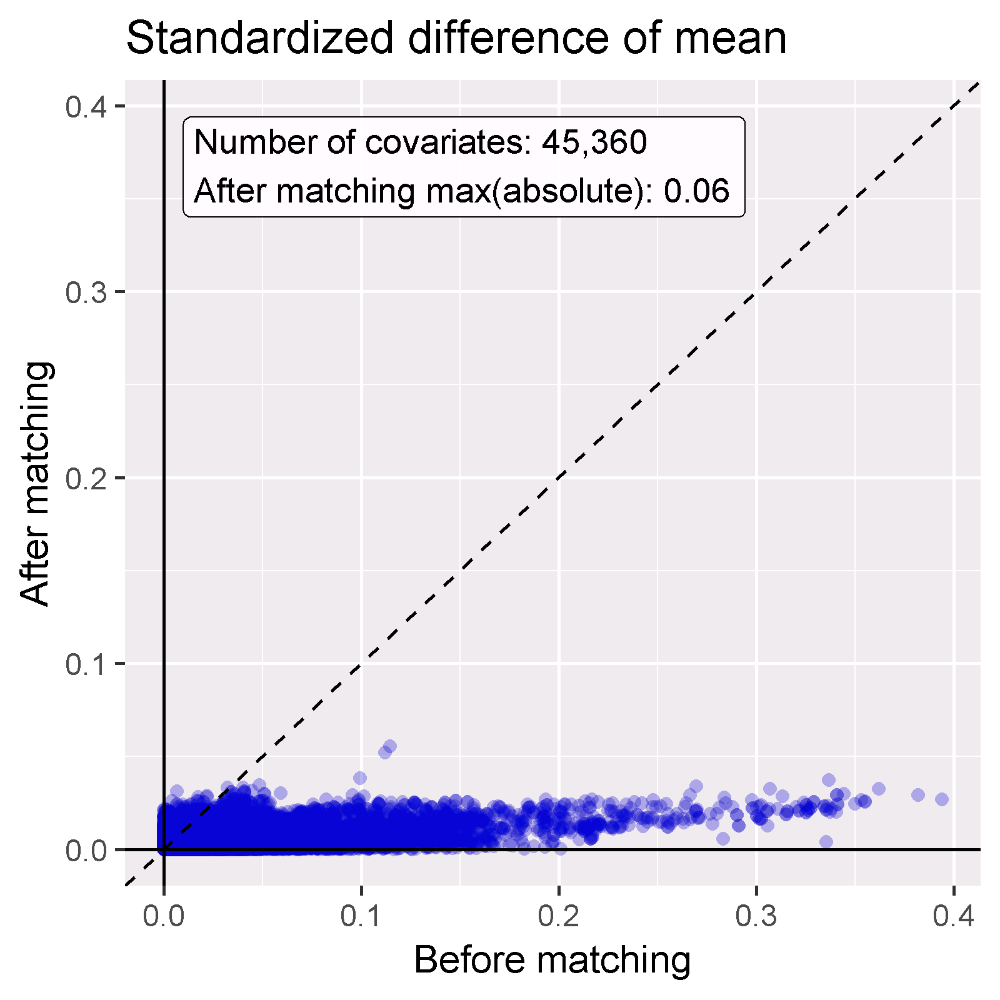

# Method Validity {#MethodValidity}

When considering method validity we aim to answer the question

> Is this method valid for answering this question?

Where 'method' includes not only the study design, but als the data and the implementation of the design. Method validity is therefore somewhat of a catch-all; It is often not possible to observe good method validity without good data quality, clinical validity, and software validity. Those aspects of evidence quality should have already been addressed separately before we consider method validity.

The core activity when establishing method validity is evaluating whether important assumptions in the analysis have been met. For example, we assume that propensity-score matching makes two populations comparable, but we need to evaluate whether this is the case. Where possible, empirical tests should be performed to test these assumptions. We can for example generate diagnostics to show that our two populations are indeed comparable on a wide range of characteristics after matching. In OHDSI we have developed a wide range of standardized diagnostics that should be generated and evaluated whenever an analysis is performed. Some of these diagnostics are specific to certain stud designs, whereas others are more generic.

## Design-specific diagnostics

For each study design there are diagnostics specific to such a design. Here we review some of the standard diagnostics included in the OHDSI Methods Library R packages. This review is not exhaustive, and we recommend the reader to consult the documentation for each method to learn about all implemented diagnostics. 

### Diagnostics for cohort method

In the comparative cohort design we compare two cohorts, for example representing two treatment choices, and we want to evaluate whether the treatment choice has an effect on the risk of some outcome of interest. For the effect size estimate w to be valid, it is essential that the two groups are comparable in all relevant aspects except the treatment choice. In observational data, this comparability is by no means guaranteed, and quite often there is a reason why one group gets a treatment while the group does not, leading to fundamental differences between the groups. We often employ propensity scores to make the two groups comparable again, but that assumes there is at least some commonality between the two groups. This assumption can be tested by reviewing the preference score plot as shown in Figure \@ref(fig:ps) (The preference score is a transformation of the propensity score that adjusts for differences in the sizes of the two treatment groups). we can evaluate whether there are patients that had some probability of receiving either treatment. In Figure \@ref(fig:ps) we see large numbers of people on the left and right for whom their treatment choice could have been predicted fairly accurately based on the baseline characteristics, meaning that without adjustment the two groups are incomparable. However, we also observe a substantial area of overlap, the purple area, where people where likely to get either treatment. This suggests that with some adjument, for example using propensity score matching, the two groups can be made comparable. It is important to note that a large overlap can also be due to an unpredictive propensity model, for example because key characteristics were not included in the model. A lack of overlap can be due to including variables directly related to the exposure, such as including the procedure code for an injection if one of the treatments is an injectable. This needs to be ruled out by examining the propensity model.

(\#fig:ps)Preference score distribution. The preference score is a transformation of the propensity score that adjusts for differences in the sizes of the two treatment groups. A higher overlap indicates subjects in the two groups were more similar in terms of their predicted probability of receiving one treatment over the other.

Once we believe there is some hope of making the two groups comparable, we need to evaluate whether we indeed succeed by examining a large number of baseline characteristics after adjustment. Figure \@ref(fig:balanceScatterplot) shows the absolute standardized difference of the mean between the two groups for a large number of covariates, both before and after matching on the propensity score. A rule-of-thumb that is often used is to consider any variabel with absolute standardized difference of the mean < 0.1 to be in balance. We see in Figure \@ref(fig:balanceScatterplot) that many covariates show imbalance before matching, but matching achieves balance on all covariates.

(\#fig:balanceScatterplot)Covariate balance before and after matching. Each dot represents the standardizes difference of means for a single covariate before and after matching on the propensity score. 

### Diagnostics for SCCS

One assumption in the self-controlled case series (SCCS) design is that the end of observation is independent of the outcome. This assumption is often violated in the case of serious, potentially lethal, events such as myocardial infarction. We can evaluate whether the assumption holds by generating the plot shown in Figure \@ref(fig:timeToObsEnd), which shows a histograms of the time to obsevation period end for those that are censored, and those that uncensored. In our data we consider those whose observation period ends at the end date of data capture (the date when observation stopped for the entire data base, for example the date of extraction, or the study end date) to be uncensored, and all others to be censored. In Figure \@ref(fig:timeToObsEnd) we see only minor differences between the two distributions, suggesting our assumptions holds.

(\#fig:timeToObsEnd)Time to observation end for those that are censored, and those that uncensored.

## Diagnostics for all estimation

Some diagnostics are applicable for all population-level estimation studies. These require the inclusion of control hypotheses, research questions where the answer is already known. We can then evaluate whether our design produces results in line with the truth. Controls can be divided into negative controls and positive controls.

### Negative and positive controls

Negative controls are exposure-outcome pairs where one believes no causal effect exists, and including negative controls or 'falsification endpoints' [@prased_2013] has been recommended as a means to detect confounding [@lipsitch_2010], selection bias and measurement error [@arnold_2016]. For example, in one study [@zaadstra_2008] investigating the relationship between childhood diseases and later multiple sclerosis (MS), the authors include three negative controls that are not believed to cause MS: a broken arm, concussion, and tonsillectomy. Two of these three controls produce statistically significant associations with MS, suggesting that the study may be biased. We should select negative controls that are comparable to our hypothesis of interest, which means we typically select exposure-outcome pairs that either have the same exposure as the hypothesis of interest (so-called 'outcome controls') or the same outcome ('exposure controls). In OHDSI we have developed a semi-automated procedure for selecting negative controls [@voss_2016]. In brief, information from literature, product labels, and spontaneous reporting is automatically extracted and synthesized to produce a candidate list of outcomes with no known links with any hypertension treatment. We rank-order this list by prevalence in an observational database and manually review these in order.

To understand the behavior of a method when the true relative risk is smaller or greater than one requires the use of positive controls, where the null is believed to not be true. Unfortunately, real positive controls for observational research tend to be problematic for three reasons. First, in most research contexts, for example when comparing the effect of two treatments, there is a paucity of positive controls relevant for that specific context. Second, even if positive controls are available, the magnitude of the effect size may not be known with great accuracy, and often depends on the population in which one measures it. Third, when treatments are widely known to cause a particular outcome, this shapes the behavior of physicians prescribing the treatment, for example by taking actions to mitigate the risk of unwanted outcomes, thereby rendering the positive controls useless as a means for evaluation [@noren_2014].
In OHDSI we therefore use synthetic positive controls [@schuemie_2018], created by modifying a negative control through injection of additional, simulated occurrences of the outcome during the time at risk of the exposure. One issue that stands important is the preservation of confounding. The negative controls may show strong confounding, but if we inject additional outcomes randomly, these new outcomes will not be confounded, and we may therefore be optimistic in our evaluation of our capacity to deal with confounding for positive controls. To preserve confounding, we want the new outcomes to show similar associations with baseline subject-specific covariates as the original outcomes. To achieve this, we fit large-scale predictive models for each negative control using $L_1$ regularized survival regression [@suchard_2013]. We insert new outcomes by drawing from the per-subject predicted probabilities within the exposed population until we achieve the desired incidence rate ratio. Figure \@ref(fig:posControlSynth) depicts this process.

(\#fig:posControlSynth)Synthesizing positive controls from negative controls.

### Metrics

Based on the estimates of a particular method for the negative and positive controls, we can then understand the operating characteristic by computing a range of metrics, for example:

*	**Area Under the receiver operator Curve (AUC)**: the ability to discriminate between positive and negative controls. 
*	**Coverage**: how often the true effect size is within the 95% confidence interval.
*	**Mean precision**: precision is computed as 1 / (standard error)2, higher precision means narrower confidence intervals. We can use the geometric mean to account for the skewed distribution of the precision.
*	**Mean squared error (MSE)**: Mean squared error between the log of the effect size point-estimate and the log of the true effect size.
*	**Type 1 error**: For negative controls, how often was the null rejected (at alpha = 0.05). This is equivalent to the false positive rate and 1 - specificity.
*	**Type 2 error**: For positive controls, how often was the null not rejected (at alpha = 0.05). This is equivalent to the false negative rate and 1 - sensitivity.
*	**Non-estimable**: For how many of the controls was the method unable to produce an estimate? There can be various reasons why an estimate cannot be produced, for example because there were no subjects left after propensity score matching, or because no subjects remained having the outcome.

Depending on our use case, we can evaluate whether these operating characterists are suitable for our goal. For example, if we wish to perform signal detection, we may care about type I and type II error, or if we are willing to modify our alpha threshold, we may inspect the AUC instead. 

### Empirical calibration

Often the type I error (at alpha = 0.05) is larger than 5%, and the coverage of the 95% confidence interval is lower than 95%. OHDSI has developed processes for calibration p-values and confidence intervals to restore these operating characteristics to nominal. 

For p-value calibration [@schuemie_2014] we estimate the empirical null distribution using the observed estimates for negative controls; We fit a Gaussian probability distribution to the estimates, taking into account the sampling error of each estimate. Using this null distribution we then compute the calibrated p-value for the hypothesis of interest, considering both random error and systematic error.

For confidence inteval calibration [@schuemie_2018] we estimate a systematic error distribution, which we assume is Gaussian with a mean and standard deviation linearly related to the logarithm of the true effect size. Using the estimated distribution, we then generate calibrated confidence intervals considering both random and systematic error. Typically, but not necessarily, the calibrated confidence interval is wider than the nominal confidence interval, reflecting the problems unaccounted for in the standard procedure (such as unmeasured confounding, selection bias and measurement error) but accounted for in the calibration.

Both p-value calibration and confidence interval calibration are implemented in the [EmpiricalCalibration](https://ohdsi.github.io/EmpiricalCalibration/) package.

### OHDSI Methods Benchmark

Todo: add text on OHDSI Methods Benchmark

### Replication across sites

Another form of method validation can come from executing the study across several different databases that possibly represent different populations, different health care systems, and different data capture processes. Prior research has shown that executing the same study design across different databases can produce vastly different effect size estimates [@madigan_2013], suggesting the design does not adequately address the different biases found in the different databases. However, not observing heterogeneity of effects does not guarantee an unbiased estimate. It is not unlikely that all databases share a similar bias, and that all estimates are therefore consistently wrong.

### Sensitivity analyses

When designing a study there are often design choices that are uncertain. For example, should propensity score matchign of stratification be used? If stratification is used, how many strata? What is the appropriate time-at-risk? When faced with such uncertainty, one solution is to evaluate various options, and observe the sensitivity of the results to the design choice. If the estimate remains the same under various options, we can say the study is robust to the uncertainty.

This definition of sensitivity analysis should not be confused with the definitions used by others such as @rosenbaum_2005, who define sensitivity analysis to 'appraise how the conclusions of a study might be altered by hidden biases of various magnitudes'.

## Diagnostics for all prediction

Todo

## Method validation in practice

Example: risk of angioedema and AMI in new users of ACE inhibitors compared to new users of thiazide and thiazide-like diuretics

How to select negative controls using ATLAS

- Create a concept set containing both target and comparator exposure concepts.
- Go to the 'Explore evidence' tab and click 'Generate'
- Manually review negative controls, considering
  - Does the drug not cause the outcome?
  - Does the drug not prevent / treat the outcome?
  - Does the negative control appear in the data? 

Include negative and positive controls. 

Compute metrics

- Need to add functions to MethodEvaluation

Generate calibration plots

Calibrate CI and p-value

- Use EmpiricalCalibration package

