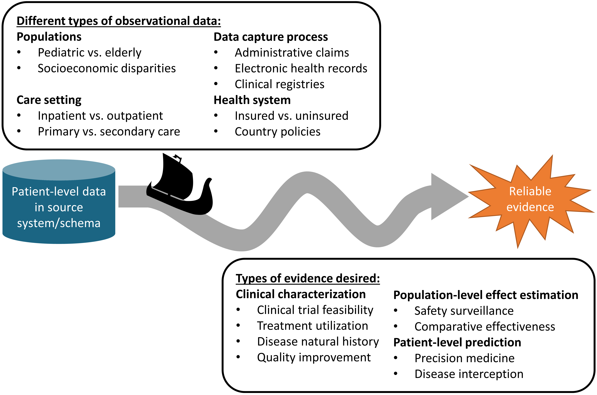
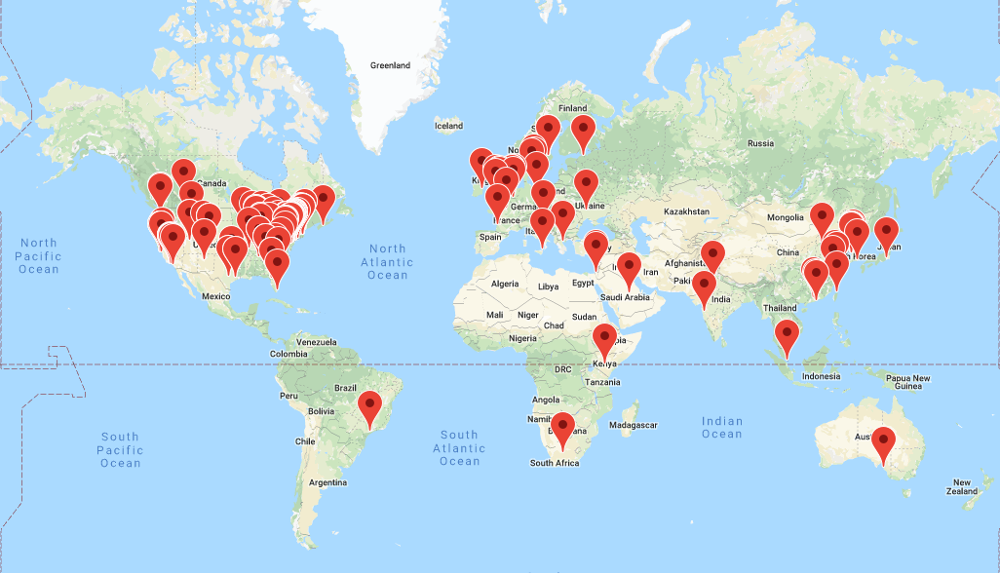

\mainmatter

# (PART) The OHDSI Community {-} 

# The OHDSI Community {#OhdsiCommunity}

*Chapter leads: Patrick Ryan & George Hripcsak*

> Coming together is a beginning; staying together is progress; working together is success. *Henry Ford*

## The Journey from Data to Evidence 

Everywhere in healthcare, all across the world, within academic medical centers and private practices, regulatory agencies and medical product manufacturers, insurance companies and policy centers, and at the heart of every patient-provider interaction, there is a common challenge:how do we apply what we've learned from the past to make better decisions for the future?

For more than a decade, many have argued for the vision of a **learning healthcare system**, "designed to generate and apply the best evidence for the collaborative healthcare choices of each patient and provider; to drive the process of discovery as a natural outgrowth of patient care; and to ensure innovation, quality, safety, and value in healthcare". [@olsen2007learning] A chief component of this ambition rests on the exciting prospect that patient-level data captured during the routine course of clinical care could be analyzed to produce **real-world evidence**, which in turn could be disseminated across the healthcare system to inform clincial practice. In 2007, the Institute of Medicine Roundtable on Evidence-Based Medicine issued a report, which established a goal that "By the year 2020, 90 percent of clinical decisions will be supported by accurate, timely, and up-to-date clinical information, and will reflect the best available evidence." [@olsen2007learning] While tremendous progress has been made on many different fronts, we still fall well short of these laudable aspirations.

Why? In part, because the journey from patient-level data to reliable evidence is an ardous one. There is no single defined path from data to evidence, and no single map that can help to navigate along the way. In fact, there is no single notion of 'data', nor is there a singular notion of 'evidence'.

```{r datajourney, fig.cap='The journey from data to evidence', echo=FALSE, out.width='100%', fig.align='center'}

```

There are different types of observational databases which capture disparate patient-level data in source systems. These databases are as diverse as the healthcare system itself, reflecting different populations, care settings, and data capture processes. There are also different types of evidence that could be useful to inform decision-making, which can be classified by the analytic use cases of clinical characterization, population-level effect estimation, and patient-level prediction. Independent from the origin (source data) and desired destination (evidence), the challenge is further complicated by the breadth of clinical, scientific, and technical competencies that are required to undertake the journey. It requires a thorough understanding of health informatics, including its full provenence of the source data from the point-of-care interaction between a patient and provider through the administrative and clinical systems and into final repository, with an appreciation of the biases that can arise as part of the health policies and behavioral incentives associated with the data capture and curation processeses. It requires mastery of epidemiologic principles and statistical methods to translate a clinical question into an observational study design properly suited produce a relavant answer. It requires the technical ability to implement and execute computationally-efficient data science algorithms to datasets containing millions of patients with billions of clinical observations over years of longitudinal follow-up. It requires the clinical knowledge to synthesize what has been learned across an observational data network with evidence from other information sources, and to determine how this new knowledge should impact health policy and clinical practice. Accordingly, it is quite rare that any one individual would possess the requisite skills and resources to successfully trek from data to evidence alone. Instead, the journey often requires collaboration across multiple individuals and organizations to ensure that the best available data are analyzed using the most appropriate methods to produce the evidence that all stakeholders can trust and use in their decision-making processes.


## Observational Medical Outcomes Partnership 

A notable example of collaboration in observational research was the Observational Medical Outcomes Partnership (OMOP). OMOP was a public-private partnership, chaired by the US Food and Drug Administration, administered by the Foundation for the National Institutes of Health, and funded by a consortium of pharmaceutical companies, who collaborated with academic researchers and health data partners to establish a research program that sought to advance the science of active medical product safety surveillance using observational healthcare data. [@stang2010omop] OMOP established a multi-stakeholder governance structure and designed a series of methodological experiments to empirically test the performance of alternative epidemiologic designs and statistical methods when applied to an array of administrative claims and electronic health records databases for the task of identifying true drug safety associations and discriminating them from false positive findings.

Recognizing the technical challenges of conducting research across disparate observational databases in both a centralized environment and a distributed research network, the team designed the OMOP Common Data Model (CDM) as a mechanism to standardize the structure, content and semantics of observational data and to make it possible to write statistical analysis code once that could be re-used at every data site. [@overhage2012cdm] The OMOP experiments demonstrated it was feasible to establish a common data model and standardized vocabularies that could accomodate different data types from different care settings and represented by different source vocabularies in a manner that could facilitate cross-institutional collaboration and computationally-efficient analytics.

From its inception, OMOP adopted an open science approach, placing all of its work products, including study designs, data standards, analysis code, and empirical results in the public domain to promote transperency, build confidence in the research that OMOP was conducting, but also to provide a community resource that could repurposed to advance others' research objectives. While OMOP's original focus was drug safety, the OMOP CDM continually evolved to support an expanded set of analytical use cases, including comparative effectiveness of medical interventions and health system policies.

And while OMOP was successful in completing its large-scale empirical experiments,  [@ryan2012omop; @ryan2013omop] developing methodological innovations, [@schuemie_2014] and generating useful knowledge that has informed the appropriate use of observational data for safety decision-making,  [@madigan_2013; @madigan2013design] the legacy of OMOP may be more remembered for its early adoption of open science principles and its stimulus that motivated the formation of OHDSI community.

When the OMOP project had completed, having fulfilled its mandate to perform methodological research to inform FDA's active surveillance activities, the team recognized the end of the OMOP journey needed to become the start of a new journey together. In spite of OMOP's methodological research providing tangible insights into scientific best practices that could demonstrably improve the quality of evidence geneated from observational data, adoption of those best practices was slow. Several barriers were identified, including: 1) fundamental concerns about observational data quality that were felt to be higher priority to address before analytics innovations; 2) insufficient conceptual understanding of the methodological problems and solutions; 3) inability to independently implement solutions within their local enviroment; 4) uncertainty over whether these approaches were applicable to their clinical problems of interest. The one common thread to every barrier was the sense that one person alone didn't have everything they needed to enact change by themselves, but with some collaborative support all issues could be overcome. But several areas of collaboration were needed:

- Collaboration on establishing open community data standards, standardized vocabularies and ETL (Extract-Transform-Load) conventions that would increase confidence in the underlying data quality and promote consistency in structure, content, and semantics to enable standardized analytics. 
- Collaboration on methodological research beyond drug safety to establish best practices more broadly for clinical characterization, population-level effect estimation, and patient-level prediction. Collaboration on open-source analytics development, to codify the scientific best practices proven through methodological reearch and make accessible as publicly available tools that can be easily adopted by the research community. 
- Collaboration on clinical applications that address important health questions of shared interest across the community by collectively navigating the journey from data to evidence. 

From this insight, OHDSI was born.

## OHDSI as an Open Science Collaborative

Observational Health Data Sciences and Informatics (OHDSI) is an open science community that aims to improve health by empowering the community to collaboratively generate the evidence that promotes better health decisions and better care. [@Hripcsak2015] OHDSI conducts methodological research to establish scientific best practices for the appropriate use of observational health data, develops open-source analytics software that codify these practices into consistent, transparent, reproducible solutions, and applies these tools and practices to clinical questions to generate evidence that can guide healthcare policy and patient care. 

### Our Mission 

> To improve health by empowering a community to collaboratively generate the evidence that promotes better health decisions and better care. \index{mission}

### Our Vision 

> A world in which observational research produces a comprehensive understanding of health and disease. \index{vision}

### Our Objectives 

* **Innovation**: Observational research is a field which will benefit greatly from disruptive thinking. We actively seek and encourage fresh methodological approaches in our work.

* **Reproducibility**: Accurate, reproducible, and well-calibrated evidence is necessary for health improvement.

* **Community**: Everyone is welcome to actively participate in OHDSI, whether you are a patient, a health professional, a researcher, or someone who simply believes in our cause. \index{community}

* **Collaboration**: We work collectively to prioritize and address the real world needs of our community’s participants.

* **Openness**: We strive to make all our community’s proceeds open and publicly accessible, including the methods, tools and the evidence that we generate.

* **Beneficence**: We seek to protect the rights of individuals and organizations within our community at all times.
\index{objectives}

## OHDSI's Progress

OHDSI has grown since its inception in 2014 to include over 2,500 collaborators on its online forums from different stakeholders, including academia, medical product industry, regulators, government, payers, technology providers, health systems, clinicians, patients, and representing different disciplines, including computer science, epidemiology, statistics, biomedical informatics, health policy, and clinical sciences. A listing of self-identified OHDSI collaborators is available on the OHDSI website. [^collaboratorUrl] The OHDSI collaborator map (Figure \@ref(fig:collaboratormap)) highlights the breadth and diversity of the international community.

[^collaboratorUrl]: https://www.ohdsi.org/who-we-are/collaborators/

```{r collaboratormap, fig.cap='Map of OHDSI collaborators', echo=FALSE, out.width='100%', fig.align='center'}

```

OHDSI has also established a data network of over 100 different healthcare databases from over 20 countries, collectively capturing over one billion patient records by applying a distributed network approach using an open community data standard it maintains, the OMOP CDM. A distributed network means that patient-level data are not required to be shared between individuals or organizations. Instead, research questions are asked by indvidiuals within the community in the form of a study protocol and accompanied by analysis code that generates evidence as a set of aggregated summary statistics, and only these summary statistics are shared amongst the partners who opt to collaborate in the study. With the OHDSI distributed network, each data partner retains full autonomy over the use of their patient-level data, and continue to observe the data governance policies within their respective institutions. 

The OHDSI developer community has created a robust library of open-source analytics tools atop the OMOP CDM to support 3 use cases: 1) clinical characterization for disease natural history, treatment utilization, and quality improvement; 2) population-level effect estimation to apply causal inference methods for medical product safety surveillance and comparative effectiveness; and 3) patient-level prediction to apply machine learning algorithms for precision medicine and disease interception. OHDSI developers have also developed applications to support adoption of the OMOP CDM, data quality assessment, and facilitation of OHDSI network studies. These tools include back-end statistical packages built in R and Python, and front-end web applications developed in HTML and Javascript. All OHDSI tools are open source and publicly available via Github.[^GitUrl]

[^GitUrl]: https://github.com/OHDSI

OHDSI’s open science community approach, coupled with its open-source tools, has enabled tremendous advances in observational research. One of the first OHDSI network analyses examined treatment pathways across three chronic diseases: diabetes, depression, and hypertension. Published in the Proceedings of the National Academy of Science, it was one of the largest observational studies ever conducted, with results from 11 data sources covering more than 250 million patients and revealed tremendous geographic differences and patient heterogeneity in treatment choices that had never been previously observable. [@Hripcsak7329] OHDSI has developed new statistical methods for confounding adjustment [@tian_2018] and evaluating the validity of observational evidence for causal inference,  [@schuemie_2018] and has applied these approaches in multiple contexts, from an individual safety surveillance question in epilepsy [@duke_2017] to comparative effectiveness of second-line diabetes medications [@vashisht_2018] to a large-scale population-level effect estimation study for comparative safety of depression treatments. [@schuemie_2018b] The OHDSI community has also established a framework for how to responsibly apply machine learning algorithms to observational healthcare data, [@reps2018] which has been applied across various therapeutic areas. [@johnston_2019; @cepeda_2018; @reps_2019]

## Collaborating in OHDSI

Since OHDSI is a community aimed to empower collaboration to generate evidence, what does it mean to be an OHDSI collaborator? If you are someone who believes in OHDSI's mission and is interested in making a contribution anywhere along the journey from data to evidence, then OHDSI can be the community for you. Collaborators can be individuals who have access to patient-level data who are interested in seeing that data put to use to generate evidence. Collaborators can be methodologists interested in establishing scientific best practices and evaluating alternative approaches. Collaborators can be software developers who are interested in applying their programming skills to create tools that can be used by the rest of the community. Collaborators can be clinical researchers who have important public health questions and are seeking to provide the evidence to those questions to the broader healthcare community through publication and other forms of dissemination. Collaborators can be individuals or organizations who believe in this common cause for public health and wish to provide resources to ensure that the community can sustain itself and continue its mission, including hosting community activities and training sessions around the world. No matter your disciplinary background or stakeholder affiliation, OHDSI seeks to be a place where individuals can work together towards a common purpose, each making their individual contributions which collectively can advance healthcare. If you are interested in joining the journey, check out Chapter \@ref(WhereToBegin) ("Where To Begin") for how to get started.

## Summary

```{block2, type='rmdsummary'}
- OHDSI's mission is to improve health by empowering a community to collaboratively generate the evidence that promotes better health decisions and better care.

- Our vision is a world in which observational research produces a comprehensive understanding of health and disease, which will be achieved through our objectives of innovation, reproducibility, community, collaboration, openness, and beneficence.

- OHDSI collaborators are focused on open community data standards, methodological research, open-source analytics development, and clincial applications to improve the journey from data to evidence.

```
