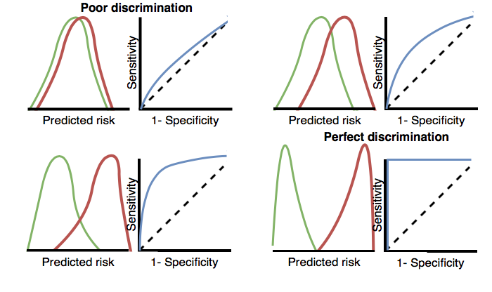

# Patient Level Prediction {#PatientLevelPrediction}

*Chapter leads: Peter Rijnbeek & Jenna Reps*


## Introduction

Clinical decision making is a complicated task in which the clinician has to infer a diagnosis or treatment pathway based on the available medical history of the patient and the current clinical guidelines. Clinical prediction models have been developed to support this decision making process and are used in clinical practice in a wide spectrum of specialties. These models predict a diagnostic or prognostic outcome based on a combination of patient characteristics, e.g. demographic information, disease history, treatment history. The number of publications describing clinical prediction models has increased strongly over the last 10 years. An example is the Garvan model that predicts the 5-years and 10-years fractures risk in any elderly man or woman based on age, fracture history, fall history, bone mass density or weight [@nguyen2008]. Many prediction models have been developed in patient subgroups at higher risk that need more intensive monitoring, e.g. the prediction of 30-day mortality after an acute myocardial described by @lee1995. Also, many models have been developed for asymptomatic subjects in the population, e.g. the famous Framingham risk functions for cardiovascular disease [@wilson1998], or the models for breast cancer screening [@engel2015].

Surprisingly, most currently used models are estimated using small datasets and contain a limited set of patient characteristics. For example, in a review of 102 prognostic models in traumatic brain injury showed that three quarters of the models were based on samples with less than 500 patients [@perel2006]. This low sample size, and thus low statistical power, forces the data analyst to make stronger modelling assumptions. The selection of the often limited set of patient characteristics is strongly guided by the expert knowledge at hand. This contrasts sharply with the reality of modern medicine wherein patients generate a rich digital trail, which is well beyond the power of any medical practitioner to fully assimilate. Presently, health care is generating huge amount of patient-specific information contained in the Electronic Health Record (EHR). This includes structured data in the form of diagnose, medication, laboratory test results, and unstructured data contained in clinical narratives. Currently, it is unknown how much predictive accuracy can be gained by leveraging the large amount of data originating from the complete EHR of a patient.

Massive-scale, patient-specific predictive modeling has become reality due the OHDSI initiative in which the common data model (CDM) allows for uniform and transparent analysis at an unprecedented scale. These large standardized populations contain rich data to build highly predictive large-scale models and also provide immediate opportunity to serve large communities of patients who are in most need of improved quality of care. Such models can inform truly personalized medical care leading hopefully to sharply improved patient outcomes. Furthermore, these models could assist in the design and analysis of randomized controlled trials (RCT) by enabling a better patient stratification or can be utilized to adjust for confounding variables in observational research. More accurate prediction models contribute to targeting of treatment and to increasing cost-effectiveness of medical care.

Advances in machine learning for large dataset analysis have led to increased interest in applying patient-level prediction on this type of data. However, many published efforts in patient-level-prediction do not follow the model development guidelines, fail to perform extensive external validation, or provide insufficient model details that limits the ability of independent researchers to reproduce the models and perform external validation. This makes it hard to fairly evaluate the predictive performance of the models and reduces the likelihood of the model being used appropriately in clinical practice. To improve standards, several papers have been written detailing guidelines for best practices in developing and reporting prediction models.

The Transparent Reporting of a multivariable prediction model for Individual Prognosis Or Diagnosis (TRIPOD) statement ^[https://www.equator-network.org/reporting-guidelines/tripod-statement/] provides clear recommendations for reporting prediction model development and validation and addresses some of the concerns related to transparency. However, data structure heterogeneity and inconsistent terminologies still make collaboration and model sharing difficult as different researchers are often required to write new code to extract the data from their databases and may define variables differently.

In our paper [@reps2018], we propose a standardised framework for patient-level prediction that utilizes the OMOP Common Data Model (CDM) and standardized vocabularies, and describe the open-source software that we developed implementing the framework's pipeline. The framework is the first to support existing best practice guidelines and will enable open dissemination of models that can be extensively validated across the network of OHDSI collaborators.

Figure \@ref(fig:figure1), illustrates the prediction problem we address. Among a population at risk, we aim to predict which patients at a defined moment in time (t = 0) will experience some outcome during a time-at-risk. Prediction is done using only information about the patients in an observation window prior to that moment in time.

```{r figure1, fig.cap='The prediction problem.',echo=FALSE, out.width='100%'}
knitr::include_graphics("images/PatientLevelPrediction/Figure1.png")
```

As shown in Table \@ref(tab:plpDesign), to define a prediction problem we have to define t=0 by a target Cohort (T), the outcome we like to predict by an outcome cohort (O), and the time-at-risk (TAR). We define the standard prediction question as:

```{block2, type='rmdimportant'}
Amongst [add Target cohort definition], who will go on to have [add outcome definition] within [add time at risk period]
```

Furthermore, we  have to make design choices for the model we like to develop, and determine the observational datasets to perform internal and external validation. 

Table: (\#tab:plpDesign) Main design choices in a prediction design.

| Choice            | Description                                              |
|:----------------- |:-------------------------------------------------------- |
| Target cohort     | A cohort for whom we wish to predict                     |
| Outcome cohort    | A cohort representing the outcome we wish to predict     |
| Time-at-risk      | For what time relative to t=0 do we want to make the prediction? |
| Model             | What algorithms using which parameters do we want use, and what predictor variables do we want to include?  |


This conceptual framework works for all type of prediction problems:

- Disease onset and progression
    - **Structure**: Amongst patients who are newly diagnosed with *[a disease]*, who will go on to have *[another disease or complication]* within *[time horizon from diagnosis]*?
    - **Example**: Among newly diagnosed atrial fibrilation patients, who will go on to have ischemic stroke in the next three years?
- Treatment choice
    - **Structure**: Amongst patients with *[indicated disease]* who are treated with either *[treatment 1]* or *[treatment 2]*, which patients were treated with *[treatment 1]* (on day 0).
    - **Example**: Among patients with atrial fibrilation who took either warfarin or rivaroxaban, which patients gets warfarin? (e.g. for a propensity model)
- Treatment response
    - **Structure**: Amongst new users of *[a treatment]*, who will experience *[some effect]* in *[time window]* ?
    - **Example**: Which patients with diabetes who start on metformin stay on metform for three years?
- Treatment safety
    - **Structure**: Amongst new users of *[a treatment]*, who will experience *[adverse event]* in *[time window]*?
    - **Example**:  Amongst new users of warfarin, who will have a GI bleed in one year?
- Treatment adherence
    - **Structure**: Amongst new users of *[a treatment]*, who will achieve *[adherence metric]* at *[time window]*?
    - **Example**: Which patients with diabetes who start on metformin achieve >=80% proportion of days covered at one year?
    
In the next sections we will explain the best practices for model specification, implementation, and evaluation using OHDSI's Patient-Level Prediction (PLP) framework as guidance.

\newpage

## Patient-level Prediction Theory

### Creating Labelled Data
The observational datasets we use in OHDSI consist of timestamped records of patient medical interactions. These are represented by tables containing anonymised patient details such as gender and year of birth in addition to tables containing date stamped medical records.

```{r figuretheory1, fig.cap='Observational data.',echo=FALSE, out.width='100%'}
knitr::include_graphics("images/PatientLevelPrediction/theory/patienttimeline.png")
```

Applying supervised learning techniques for prediction requires having covariate and label pairs for a sufficient number of patients.  The covariates (also referred to as features or independant variables) describe a patient.  Example covariates could be: the patient's gender, age and health state based on the presence or absense of medical conditions.  Many of these covariates are time dependant, for example age changes over time, as do some medical conditions.  The labels correspond to whether a patient has a outcome of interest during some time interval.  The label is also time dependant.

To convert the observational data into labelled data consisting of covariate and label pairs for a set of patients, we need to specify a point in time for each patient that will be used as a pivot. Covariates can be constructed at that pivot point in time (using all records up to that point), and we can can determine whether a patient has the outcome of interest during some time interval relative to the pivot point in time (the time at risk).

```{r figuretheory2, fig.cap='Create laelled data from observational data.',echo=FALSE, out.width='100%'}
knitr::include_graphics("images/PatientLevelPrediction/theory/dataplot1.png")
```

This will then provide us with labelled data.  The definition of the target cohort population is what we use to define this pivot point in time.  For example, if the target cohort was new users of drug A, then the pivot point in time is the date a patient first had drug A recorded in the database.  Alternatively, if the target cohort was diagnoses of cardiovascular disease, then the pivot point in time is the date a patient first has a record indicating cardiovascular disease is present.  Our prediction specification directly links to how the labelled data are constructed.

```{r figuretheory3, fig.cap='Create laelled data from observational data.',echo=FALSE, out.width='100%'}
knitr::include_graphics("images/PatientLevelPrediction/theory/dataplot2.png")
```

### Supervised learning
The idea of supervised learning is to be able to generalise what is observed in the labelled data so that when a new patient's covariates are known but their label is unknown, we can predict their label. 

If we consider the situation where we have two covariates, then we can represent each patient as a plot in two dimensional space.  The shape/color of a data points corresponds to the patient's label.  The idea of supervised learning is to generalise the what we see and fill in where there are no current data points.  A supervised learning model will try to partition the space via a decision boundary, as seen in Figure \ref{fig:figuretheory4} that aims to minimise the cases where the data point labels do not match the models prediction.  Different supervised learning techniques lead to different decision boundaries and there are often hyper-parameters that can impact the complexity of the decision boundary. 

```{r figuretheory4, fig.cap='Decision boundary.',echo=FALSE, out.width='100%'}
knitr::include_graphics("images/PatientLevelPrediction/theory/learning.png")
```

In Figure Figure \ref{fig:figuretheory4} you can see three different decision boundaries.  The boundaries are used to infer the class of any new data point.  In figure Figure \ref{fig:figuretheory5} the decision boundaries are used to shade the 2 dimentional space into red regions and green regions.  If a new data point falls into the green shaded area then the model will predict 'no outcome', otherwise it will predict 'has outcome'.

Ideally a decision boundary should partition the two classes with no error.  However, generlizability is an issue, as complex models can 'overfit' where they can correctly partition each data points in the labelled data by using very complex boundaries:

```{r figuretheory5, fig.cap='Overfitting issues.',echo=FALSE, out.width='100%'}
knitr::include_graphics("images/PatientLevelPrediction/theory/noise.png")
```

The issue here is that these boundaries may be fit too closely to the labelled data used to learn them and may not work for new data.  For example, noise causing incorrectly positioned data points can cause issues.  This is shown in Figure Figure \ref{fig:figuretheory5} where the decision boundary goes around a data point that was incorrectly positioned due to noise and this impacts predictions near this region.

Therefore, you want a model that appears to partition the labelled data well but is also as simple as possible.  Techniques such as regularization aim to maximise model performance on the labelled data while minimising complexity.  Complexity can also be controlled by picking classifier hyper-parameters such that a simpler decision boundary is used.     

Another way to think about supervised learning is finding a function that maps from a patient's covariates to their label. [add function]. Each supervised learning model has a different way to learn the mapping function and the no free lunch theorem states that no one algorithm is always going to outperform the others.  The performance of each type of supervised learning algorithm depends on how the labelled data points are distributed in space. Therefore we recommend trying multiple supervised learning techniques when developing patient-level prediction models. 

#### Regularized Logistic Regression
Lasso logistic regression belongs to the family of generalized linear models, where a linear combination of the variables is learned and finally a logistic function maps the linear combination to a value between 0 and 1.  The lasso regularization adds a cost based on model complexity to the objective function when training the model.  This cost is the sum of the absolute values of the linear combination of the coefficients.  The model automatically performs feature selection by minimizing this cost. We use the [Cyclops](https://ohdsi.github.io/Cyclops/) (Cyclic coordinate descent for logistic, Poisson and survival analysis) package to perform large-scale regularized logistic regression. **Hyper-parameters**: var  (starting  variance), seed.

#### Gradient boosting machines
Gradient boosting machines is a boosting ensemble technique and in our framework it combines multiple decision trees.  Boosting works by iteratively adding decision trees but adds more weight to the data-points that are misclassified by prior decision trees in the cost function when training the next tree.  We use Extreme Gradient Boosting, which is an efficient implementation of the gradient boosting framework implemented in the xgboost R package available from CRAN. **Hyper-parameters**: ntree (number of trees), max depth (max levels in tree), min rows (minimum data points in in node), learning rate, seed  | mtry  (number  of  features  in  each  tree),ntree (number of trees), maxDepth (max levels in tree), minRows (minimum data points in in node),balance (balance class labels), seed.

#### Random forest
Random forest is a bagging ensemble technique that combines multiple decision trees.  The idea behind bagging is to reduce the likelihood of overfitting, by using weak classifiers, but combining multiple diverse weak classifiers into a strong classifier.  Random forest accomplishes this by training multiple decision trees but only using a subset of the variables in each tree and the subset of variables differ between trees. Our packages uses the sklearn learn implementation of Random Forest in python. **Hyper-parameters**: mtry  (number  of  features  in  each  tree),ntree (number of trees), maxDepth (max levels in tree), minRows (minimum data points in in node),balance (balance class labels), seed.

####K-nearest neighbors
K-nearest neighbors (KNN) is an algorithm that uses some metric to find the K closest labelled data-points, given the specified metric, to a new unlabelled data-point. The prediction of the new data-points is then the most prevalent class of the K-nearest labelled data-points. There is a sharing limitation of KNN, as the model requires labelled data to perform the prediction on new data, and it is often not possible to share this data across data sites. We included the [BigKnn](https://github.com/OHDSI/BigKnn) package developed in OHDSI which is a large scale k-nearest neighbor classifier. **Hyper-parameters**: k (number of neighbours), weighted (weight by inverse frequency).

#### Naive Bayes
The Naive Bayes algorithm applies the Bayes theorem with the naive assumption of conditional independence between every pair of features given the value of the class variable. Based on the likelihood the data belongs to a class and the prior distribution of the class, a posterior distribution is obtained. **Hyper-parameters**: none.

#### AdaBoost
AdaBoost is a boosting ensemble technique. Boosting works by iteratively adding classifiers but adds more weight to the data-points that are misclassified by prior classifiers in the cost function when training the next classifier. We use the sklearn AdaboostClassifier implementation in Python. **Hyper-parameters**: nEstimators (the maximum number of estimators at which boosting is terminated), learningRate (learning rate shrinks the contribution of each classifier by learning_rate. There is a trade-off between learningRate and nEstimators).

#### Decision Tree
A decision tree is a classifier that partitions the variable space using individual tests selected using a greedy approach.  It aims to find partitions that have the highest information gain to separate the classes.  The decision tree can easily overfit by enabling a large number of partitions (tree depth) and often needs some regularization (e.g., pruning or specifying hyper-parameters that limit the complexity of the model). We use the sklearn DecisionTreeClassifier implementation in Python. **Hyper-parameters**: maxDepth (the maximum depth of the tree), minSamplesSplit,minSamplesLeaf, minImpuritySplit (threshold for early stopping in tree growth. A node will split if its impurity is above the threshold, otherwise it is a leaf.), seed,classWeight ("Balance"" or "None").

#### Multilayer Perception
Neural networks containing multiple layers that weight their inputs using a non-linear function.  The first layer is the input layer, the last layer is the output layer the between are the hidden layers.  Neural networks are generally trained using feed forward back-propagation.  This is when you go through the network with a data-point and calculate the error between the true label and predicted label, then go backwards through the network and update the linear function weights based on the error.  **Hyper-parameters**: size (the number of hidden nodes), alpha (the l2 regularisation), seed.

#### Deep Learning
Deep learning such as deep nets, convolutional neural networks or recurrent neural networks are similar to a neural network but have multiple hidden layers that aim to learn latent representations useful for prediction. In a seperate vignette in the [PatientLevelPrediction](https://ohdsi.github.io/PatientLevelPrediction/) package we describe these models and hyper-parameters in more detail.

### Evaluating Models

#### Evaluation Types
There are various ways to evaluate a prediction model: internal validation, external valdiation, temporal validation and  spatial validation.  

Internal validation is when a prediction model is evaluated using the same dataset used to develop the model.  There are three ways to perform internal validation: using a holdout set, using cross validation and using bootstrapping.  In the patient-level prediction framework we use a holdout set for internal validation.  

A holdout set approach simply splits the labelled data into two independent sets, a train set and a test set (the hold out set).  The train set is used to learn the model and the test set is used to evaluate it. 

Cross validation is useful when the data are limited.  A user needs to specify the number of folds, such as 10, then the data are split into that number of independent sets.  For each data split, a model is trained on all other data splits and then applied to the split to obtain the predicted risks for each patient in the split.  The model performance can then be estimated using the predicted risk obtained when the patients were held out from model training.  A form of cross validation is leave one out validation, where for each patient, the model is trained using all other data except that patient’s data and then applied to the patient to obtain their predicted risk.  This is repeated for each patient to obtain risks for all the patients which can be used to evaluate the model.  In the patient-level prediction framework we use cross validation to pick the optimal hyper-parameters on the train set.

Bootstrapping is useful when calculating confidence intervals.  In bootstrapping multiple sample sets are drawn with replacement from the whole labelled dataset to generate hold out sets, the unsampled patient data are used to develop the models and then evaluated on the sample sets.  This gives a range for each metric.  We currently do not use bootstrapping in the patient-level prediction framework.

```{r figuretheoryval, fig.cap='Types of internal valdiation.',echo=FALSE, out.width='100%'}
knitr::include_graphics("images/PatientLevelPrediction/theory/validationTypes.png")
```

External validation is when a model trained on one dataset is validated on a new dataset or set of patients.  This is important as it helps model developers understand which types of patients the model will transport to.

```{r figuretheoryextval, fig.cap='Visulisation of external validation.',echo=FALSE, out.width='100%'}
knitr::include_graphics("images/PatientLevelPrediction/theory/externalValidation.png")
```

Temporal validation is a type of validation where a model is validated on data that were collected after the data used to develop the model.  This can help identify situations where they may be temporal shifts in the data that impact the transportability of the model across time.  Another type of validation, spatial validation, is location based where a model is developed on patients for some locations (perhaps certain hospitals or doctor surgeries) and validated on patients at a different location.

#### Performance Metrics

A prediction model assigned a value between 0 and 1 for each patient corresponding to the risk of the patient having the outcome during the time at risk.  A value of 0 means 0% risk, a value of 0.5 means 50% risk and a value of 1 means 100% risk.  Common metrics such as accuracy, sensitivity, specificity, positivity predictive value can be calculated by first specifying a threshold that is used to class patients as having the outcome or not having the outcome during the time at risk.  For example, given Table …, if we set the threshold as 0.5, the patients 1,3,7 and 10 have a predicted risk greater than or equal to the threshold of 0.5 so they would be predicted to have the outcome.  All other patients had a predicted risk less than 0.5, so would be predicted to not have the outcome. 

```{r figuretheorytab, fig.cap='Example performance table.',echo=FALSE, out.width='100%'}
knitr::include_graphics("images/PatientLevelPrediction/theory/exampleTable.png")
```

If a patient is predicted to have the outcome and has the outcome during TAR then this is called as a true positive (TP).  If a patient is predicted to have the outcome but does not have the outcome during TAR then this I called a false positive (FP).  If a patient is predicted to not have the outcome and does not have the outcome during TAR then this is called a true negative (TN).  Finally, if a patient is predicted to not have the outcome but does have the outcome during TAR then this is called a false negative (FN).

The following threshold based metrics are:

-	accuracy: (TP+TN)/(TP+TN+FP+FN)
-	sensitivity: TP/(TP+FN)
-	specificity: TN/(TN+FP)
-	positive predictive value: TP/(TP+FP)

There are two main criteria used to assess a prediction model; discrimination and calibration.  

Discrimination is the ability to assign a higher risk to patients who will experience the outcome during the time at risk, where the area under the receiver operating characteristic curve (AUROC) gives an overall measure of discrimination where a value of 0.5 corresponds to randomly assigning the risk and a value of 1 means perfect discrimination.  In reality, most prediction models obtain AUCs between 0.6-0.8.   The AUC is calculated by plotting 1 – specificity on the x-axis and sensitivity on the y-axis at all possible thresholds.  This generated a plot as seen in Figure … and the area under the line is the AUROC.  The AUROC is invariant to class imbalance, unlike accuracy, but for rare outcomes even a model with a high AUROC may not be practical.  When the outcome is rare another measure known as the area under the precision recall curve (AUPRC) is recommended. A model may obtain a high AUC when the outcome is rare but have a very low positive predictive value.  This would mean may false positives.  Depending on the severity of the outcome and cost (health risk and/or monetary) of some intervention, a low false positive rate may result in a non-practical model.  The AUPRC is the area under the line generated by plotting the sensitivity on the x-axis (also known as the recall) and the positive predictive value (also known as the precision) on the y-axis. 

The AUROC provides a way to determine how different the predicted risk distributions are between the patients who experience the outcome during the time at risk and those who do not. If the AUROC is high, then the distributions will be mostly disjointed, whereas when there is a lot of overlap, the AUROC will be closer to 0.5:

```{r figuretheoryroctheory, fig.cap='How the ROC plots are linked to discrimination.',echo=FALSE, out.width='100%'}

```


```{r figuretheoryroc, fig.cap='Example discrimination plots generated by the patient-level prediction framework.',echo=FALSE, out.width='100%'}
knitr::include_graphics("images/PatientLevelPrediction/theory/discrimination.png")
```

Calibration is the ability of the model to assign a correct risk.  For example, if the model assigned one hundred patients a risk of 10% then ten of the patients should experience the outcome during the time at risk.  If the model assigned 100 patients a risk of 80% then eighty of the patients should experience the outcome during the time at risk.  The calibration is generally calculated by partitioning the patients into deciles based on the predicted risk and in each group calculating the mean predicted risk and the fraction of the patients who experienced the outcome during the time at risk.  We then plot these ten points (predicted risk on the y-axis and observed risk on the x-axis) and see whether they fall on the x = y line, indicating the model is well calibrated.  We also fit a linear model using the points to calculate the intercept (which should be close to 0) and the gradient (which should be close to 1).  If the gradient is greater than 1 then the model is assigning a higher risk than the true risk and if the gradient is less than 1 the model is assigning a lower risk than the true risk.

```{r figuretheorycal, fig.cap='Example calibration plots generated by the patient-level prediction framework.',echo=FALSE, out.width='100%'}
knitr::include_graphics("images/PatientLevelPrediction/theory/calibration.png")
```

It can also be useful to determine how well calibrated a model is for different demographics (age and gender groups).  This can be calculated by partitioning the patients into groups of similar age and gender and comparing the mean predicted risk within the group with the observed fraction of the patients who experience the outcome during the time at risk.  This can identify demographic groups where the model does not perform well when applied.

\newpage 

## Specfifying a Patient-level Prediction Study

In this section we will demonstrate how to define a prediction problem using an example for hypertension.

The first step is to clearly define the prediction problem. Interestingly, in many published papers the prediction problem is poorly defined, e.g. it is unclear how the index date (start of the target Cohort) is defined. A poorly defined prediction problem does not allow for external validation by others let alone implementation in clinical practice. In the PLP framework we have enforced that we have to define the prediction problem we like to address, in which population we will build the model, which model we will build and how we will evaluate its performance. In this section we will guide you through this process and we will use a "Treatment safety" prediction type as an example.

### Problem definition

Angioedema is a well known side-effect of ACE inhibitors, and the incidence of angioedema reported in the labeling for ACE inhibitors is in the range of 0.1% to 0.7% [@byrd_2006]. Monitoring patients for this adverse effect is important, because although angioedema is rare, it may be life-threatening, leading to respiratory arrest and death [@norman_2013]. Further, if angioedema is not initially recognized, it may lead to extensive and expensive workups before it is identified as a cause [@norman_2013; @thompson_1993]. Other than the higher risk among African-American patients, there are no known predisposing factors for the development of ACE inhibitor related angioedema [@byrd_2006]. Most reactions occur within the first week or month of initial therapy and often within hours of the initial dose [@circardi_2004]. However, some cases may occur years after therapy has begun [@mara_1996].No diagnostic test is available that specifically identifies those at risk. If we could identify those at risk, doctors could act, for example by discontinuing the ACE inhibitorin favor of another hypertension drug.

We will apply the PLP framework to observational healthcare data to address the following patient-level prediction question:

> Amongst patients who have just started on an ACE inhibitor for the first time, who will experience angioedema in the following year?

### Study population definition

The final study population in which we will develop our model is often a subset of the target population, because we will e.g. apply criteria that are dependent on T and O or we want to do sensitivity analyses with subpopulations of T. For this we have to answer the following questions:

- *What is the minimum amount of observation time we require before the start of the target cohort?* This choice could depend on the available patient time in your training data, but also on the time you expect  to be available in the data sources you want to apply the model on in the future. The longer the minimum observation time, the more baseline history time is available for each person to use for feature extraction, but the fewer patients will qualify for analysis. Moreover, there could  be clinical reasons to choose a short or longer lookback period. For our example, we will use a prior history as lookback period (washout period).

- *Can patients enter the target cohort multiple times?* In the target cohort definition, a person may qualify for the cohort multiple times during different spans of time, for example if they had different episodes of a disease or separate periods of exposure to a medical product. The cohort definition does not necessarily apply a restriction to only let the patients enter once, but in the context of a particular patient-level prediction problem, a user may want to restrict the cohort to the first qualifying episode. In our example, a person can only enter the target cohort once since our criteria was based on first use of an ACE inhibitor.

- *Do we allow persons to enter the cohort if they experienced the outcome before?* Do we allow persons to enter the target cohort if they experienced the outcome before qualifying for the target cohort? Depending on the particular patient-level prediction problem, there may be a desire to predict incident first occurrence of an outcome, in which case patients who have previously experienced the outcome are not at-risk for having a first occurrence and therefore should be excluded from the target cohort. In other circumstances, there may be a desire to predict prevalent episodes, whereby patients with prior outcomes can be included in the analysis and the prior outcome itself can be a predictor of future outcomes. For our prediction example, we will choose not to include those with prior angioedema.

- *How do we define the period in which we will predict our outcome relative to the target cohort start?* We actually have to make two decisions to answer that question. First, does the time-at-risk window start at the date of the start of the target cohort or later? Arguments to make it start later could be that you want to avoid outcomes that were entered late in the record that actually occurred before the start of the target cohort or you want to leave a gap where interventions to prevent the outcome could theoretically be implemented. Second, you need to define the time-at-risk by setting the risk window end, as some specification of days offset relative to the target cohort start or end dates. For our problem we will predict in a time-at-risk window starting 1 day after the start of the target cohort up to 365 days later.

- *Do we require a minimum amount of time-at-risk?* We have to decide if we want to include patients that did not experience the outcome but did leave the database earlier than the end of our time-at-risk period. These patients may experience the outcome when we do not observe them. For our  prediction problem we decide to answer this question with Yes, require a mimimum time-at-risk for that reason. Furthermore, we have to decide if this constraint also applies to persons who experienced the outcome or we will include all persons with the outcome irrespective of their total time at risk. For example, if the outcome is death, then persons with the outcome are likely censored before the full time-at-risk period is complete.

### Model development settings

To develop the model we have to decide which algorithm(s) we like to train. We see the selection of the best algorithm for a certain prediction problem as an empirical question, i.e. you need to let the data speak for itself and try different approaches to find the best one. There is no algorithm that will work best for all problems (no free lunch). In our framework we therefore aim to implement many algorithms. Furthermore, we made the system modular so you can add your own custom algorithms. This out-of-scope for this chapter but mode details can be found in the *AddingCustomAlgorithms* vignette in the [PatientLevelPrediction](https://ohdsi.github.io/PatientLevelPrediction/) package. 

Our framework currently contains the following algorithms to choose from:


Furthermore, we have to decide on the **covariates** that we will use to train our model. In our example, we like to add gender, age, all conditions, drugs and drug groups, and visit counts. We also have to specify in which time windows we will look and we decide to look in year before and any time prior.

### Model evaluation

Finally, we have to define how we will train and test our model on our data, i.e. how we perform **internal validation**. For this we have to decide how we divide our dataset in a training and testing dataset and how we randomly assign patients to these two sets. Dependent on the size of the training set we can decide how much data we like to use for training, typically this is a 75% - 25% split. If you have very large datasets you can use more data for training. To randomly assign patients to the training and testing set, there are two commonly used approaches:

1. split by person. In this case a random seed is used to assign the patient to either sets.
2. split by time. In this case a time point is used to split the persons, e.g. 75% of the data is before and 25% is after this date. The advantage of this is that you take into consideration that the health care system has changed over time.

For our prediction model we decide to start with a Regularized Logistic Regression and will use the default parameters. We will do a 75%-25% split by person.

### Study summary

We now completely defined our study as shown in Table \@ref(tab:plpSummary).

Table: (\#tab:plpSummary) Main design choices for our study.

| Choice            | Value                                                    |
|:----------------- |:-------------------------------------------------------- |
| Target cohort     | Patients who have just started on an ACE inhibitor for the first time. |
| Outcome cohort    | Angioedema.                                              |
| Time-at-risk      | 1 day till 365 days from cohort start. We will require at least 364 days at risk. |
| Model             | Gradient Boosting Machine with hyper-parameters ntree: 5000, max depth: 4 or 7 or 10 and learning rate: 0.001 or 0.01 or 0.1 or 0.9. Covariates will include gender, age, conditions, drugs, drug groups, and visit count. Data split: 75% train - 25% test, randomly assigned by person.  |

We define the target cohort as the first exposure to any ACE inhibitor. Patients are excluded if they have less than 365 days of prior observation time or have prior angioedema.

\newpage

## Implementing a Patient-level Prediction Study
There are two ways to use the OHDSI tools for patient-level prediction.  The first approach is to use the atlas interface to design a study and then atlas creates an R package that goes end to end from data extraction to model develoment and evaluation.  This requires only basic R knowledge.  The second approach is to manually write R code using our PatientLevelPrediction R library.  This requires intermediate R knowledge at a minimum, but enables greater flexibility in the prediction analysis study design.  In this section, we will provide step-by-step guides for both approaches. 

### Implementing the study in Atlas
#### Introduction 
The atlas interface to patient-level prediction enables a users to design a prediction study analysis containing multiple prediction questions and analyses settings.  The atlas interface creates a prediction study R package populated with all the code ready to develop and evaluate the specified models.  All a user needs to develop the models is R studio with: 

- OHDSI's PatientLevelPrediction R package installed
- devtools R package installed 
- connection details for the OMOP CDM databases 

The atlas created prediction study R package has additional functionality to:

- Create a study protocol template
- Create a shiny app for interactively exploring the results 
- Create a validation study R package that can be shared to externally validate the developed models

In this section we will detail the design choices for the prediction problem specification, the analysis settings and the executing settings.  We will then guide the user through the process of reviewing analysis, downloading and running the prediction study package and interpreting the results via the shiny app.

#### The Atlas layout
The interface for designing a prediction study can be opened by clicking on the 'Prediction' button in the left hand side atlas menu.

```{r figure2a, fig.cap='The Atlas home page.',echo=FALSE, out.width='100%'}
knitr::include_graphics("images/PatientLevelPrediction/atlasImplementation/Atlas_home_prediction.png")
```

Once in the 'Prediction' view you should see:

```{r figure2b, fig.cap='The Atlas prediction page.',echo=FALSE, out.width='100%'}
knitr::include_graphics("images/PatientLevelPrediction/atlasImplementation/prediction_page.png")
```

You can create a new study by clicking on the blue 'New Patient Level Prediction'' button or by clicking on a row in the table with the name of the study you want to open.  Once inside the prediction study (either by clicking the blue 'New Patient Level Prediction'' button or an existing row in the table) you should see a specification option with the top stating 'Patient Level Prediction ' with a number such as '#52'.  This tells us the cohort definition id is 52.

```{r figure2c, fig.cap='Where to find the cohort definition id of the prediction study in atlas.',echo=FALSE, out.width='100%'}
knitr::include_graphics("images/PatientLevelPrediction/atlasImplementation/prediction_cohort_id.png")
```

To the right of the 'Patient Level Prediction #52' there are buttons to save (green button), exit (blue button with x), copy (blue button with double paper) and delete (red button with bin) the current study.

```{r figure2d, fig.cap='The save/exit/copy/delete options for the prediction study',echo=FALSE, out.width='100%'}
knitr::include_graphics("images/PatientLevelPrediction/atlasImplementation/prediction_saveexitcopydelete.png")
```

Below these is a white text form where you can name the study:

```{r figure2e, fig.cap='How to name a prediction study',echo=FALSE, out.width='100%'}
knitr::include_graphics("images/PatientLevelPrediction/atlasImplementation/prediction_naming.png")
```

The 'Specification' tab contains all the settings a user needs to define for the prediction study.  The first part is the 'Prediction Problem Settings', this is where the user defines the Target cohorts and Outcome cohorts for the prediction analyses.  These cohorts need to be created in atlas using the 'Cohort Definition' view and can then be imported into the Prediction study. Instantiating cohorts is described in Chapter \@ref(Cohorts). 

```{r figure2f, fig.cap='The Prediction Problem Settings area',echo=FALSE, out.width='100%'}
knitr::include_graphics("images/PatientLevelPrediction/atlasImplementation/Spec_prediction_problem_spec.png")
```

The next part of the 'Specification' is the 'Analysis Settings'.  This is where the user specifies the models to train (classifiers or survival models), the candidate covariates (these are standard OHDSI covariates), the time-at-risk and additional inclusion criteria:

```{r figure2g, fig.cap='The Analysis Setting area',echo=FALSE, out.width='100%'}
knitr::include_graphics("images/PatientLevelPrediction/atlasImplementation/Spec_analysis_settings.png")
```

Then the 'Execution Settings' define how many patients to extract for the model development, whether to remove rare covariates and whether to normalise the covariates:

```{r figure2h, fig.cap='The Execution Settings area',echo=FALSE, out.width='100%'}
knitr::include_graphics("images/PatientLevelPrediction/atlasImplementation/Spec_executing_settings.png")
```

Finally, the last part in the 'Specification' is  the 'Training Settings' which specifies' how to split the labelled data into data used to develop the model (including how many folds you want to use when applying cross validation) and validate the model:

```{r figure2i, fig.cap='The Training Settings area',echo=FALSE, out.width='100%'}
knitr::include_graphics("images/PatientLevelPrediction/atlasImplementation/Spec_training_settings.png")
```

Each of the 'Specification' settings are described in more detail in the following sections.  We also describe the 'Utilities' tab where a user can review, import/export and download their study as an executional R library.   

#### Atlas Specification Tab
The specification section is where a user can specify her prediction question, covariates, additional study population inclusion criteria, model type and hyper-parameters and execution settings. 

##### Prediction Problem Settings
The prediction problem settings enables you to select the target population cohorts and outcome cohorts for the analysis.  A prediction model will be developed for all combinations of the target population cohorts and the outcome cohorts.  

For example, if you specify two target populations: 

- 'T1: new users of ACE inhibitors'
- 'T2: new users of ACE inhibitors with no prior anti-hypertensive' 

and three outcomes: 

- 'O1: angioedema'
- 'O2: stroke'
- 'O3: myocardial infarction'

then six prediction problems will be investigated in the study:

- 'In T1: new users of ACE inhibitors predict O1: angioedema during TAR'
- 'In T1: new users of ACE inhibitors predict O1: stroke during TAR'
- 'In T1: new users of ACE inhibitors predict O1: myocardial infarction during TAR'
- 'In T2: new users of ACE inhibitors with no prior anti-hypertensive predict O1: angioedema during TAR'
- 'In T2: new users of ACE inhibitors with no prior anti-hypertensive predict O1: stroke during TAR'
- 'In T2: new users of ACE inhibitors with no prior anti-hypertensive predict O1: myocardial infarction during TAR'

To select a target population cohort you need to have previously defined it atlas. Instantiating cohorts is described in Chapter \@ref(Cohorts). The Appendix provides the full definitions of the target (Appendix \@ref(AceInhibitors)) and outcome (Appendix \@ref(Angioedema)) cohorts used in this example.  To add a target population to the cohort you then need to click on the blue '+ Add Target Cohort' button:

```{r figure2j, fig.cap='The Training Settings area',echo=FALSE, out.width='100%'}
knitr::include_graphics("images/PatientLevelPrediction/atlasImplementation/prediction_problemSettings_adding_cohort.png")
```

This will open up a table of cohorts that have been created in atlas:
```{r figure2k, fig.cap='The Training Settings area',echo=FALSE, out.width='100%'}
knitr::include_graphics("images/PatientLevelPrediction/atlasImplementation/target_pop_cohort_table.png")
```

You can simple click on any row in the table to add that cohort.  If you have many cohorts, using the filter option on the top right may help (just make sure to remember the cohort name).  We filtered the book of ohdsi cohorts by adding 'book' to the filter as the cohort names all included the work 'book':
```{r figure2l, fig.cap='The Training Settings area',echo=FALSE, out.width='100%'}
knitr::include_graphics("images/PatientLevelPrediction/atlasImplementation/target_pop_cohort_filter.png")
```

By clicking on the row '[BookOfOHDSI] New users of ACE inhibitors as first-line monotherapy for hypertension' this is now added as a target population cohort in the study:
```{r figure2m, fig.cap='The Training Settings area',echo=FALSE, out.width='100%'}
knitr::include_graphics("images/PatientLevelPrediction/atlasImplementation/target_pop_added.png")
```

This process can be repeated to add more target population cohorts.  Adding outcome cohorts is a similar process, but requires click on the blue '+ Add Outcome Cohort' button:
```{r figure2n, fig.cap='The Training Settings area',echo=FALSE, out.width='100%'}
knitr::include_graphics("images/PatientLevelPrediction/atlasImplementation/prediction_problemSettings_adding_outcome_cohort.png")
```

You need to specify, at minimum, one target population cohort and one outcome cohort:
```{r figure2o, fig.cap='The Training Settings area',echo=FALSE, out.width='100%'}
knitr::include_graphics("images/PatientLevelPrediction/atlasImplementation/completed_problem_specification.png")
```

Once you have added all the target population cohorts and outcome cohorts you are now ready to procede to the analysis settings.

#####  Analysis Settings
The analysis settings enables you to pick the supervised learning models, the covariates and population settings.

###### Model Settings
You can pick one or more supervised learning models to investigate using for model development. To add a supervised learning model click on the blue '+ Add Model Settings' button.  A dropdown containing all the models currently supported in the Atlas interface will appear (note: more models may be available outside of Atlas);

```{r figureAS1, fig.cap='Adding a supervised learning model',echo=FALSE, out.width='100%'}
knitr::include_graphics("images/PatientLevelPrediction/atlasImplementation/analysis_add_model.png")
```

You can select the supervised learning model you want to include in the study by clicking on the name in the dropdown menu.  This will then take you to a view for that specific model and the hyper-parameters you can include into a grid search.  For example, if I click on 'Lasso Logistic Regression' the following view will appear:

```{r figureAS2, fig.cap='The lasso logistic regression view',echo=FALSE, out.width='100%'}
knitr::include_graphics("images/PatientLevelPrediction/atlasImplementation/analysis_lasso_lr_view.png")
```

As the Lasso Logistic Regression model only has one hyper-parameter, we do an automatic search for the optimal value rather than a grid search so a user just needs to specify the starting value, see Figure \@ref(fig:figureAS2).  Once you are happy with the hyper-parameter settings you can return to the main settings view by clicking on the grey '<' button:
```{r figureAS3, fig.cap='Returning from the lasso logistic regression view',echo=FALSE, out.width='100%'}
knitr::include_graphics("images/PatientLevelPrediction/atlasImplementation/analysis_back_from_model_view.png")
```


You will now see your chosen supervised learning model added:
```{r figureAS4, fig.cap='The analysis settings with a model added',echo=FALSE, out.width='100%'}
knitr::include_graphics("images/PatientLevelPrediction/atlasImplementation/analysis_with_model.png")
```
To edit the model you added, click on the corresponding row and it will take you back to the model view where you can edit the hyper-parameter settings.

To add a gradient boosting machine model we can follow the same process and click on 'Gradient Boosting Machine' in the drop down menu.  This will take us into the gradient boosting machine view:
```{r figureAS5, fig.cap='The gradient boosting machine view',echo=FALSE, out.width='100%'}
knitr::include_graphics("images/PatientLevelPrediction/atlasImplementation/analysis_gbm_view.png")
```

The gradient boosting machine model has four hyper-parameters you can define a grid search for (boosting learn rate, maximum number of interactions, minimum number of trees and number of trees to build).  Initially the default values are shown, but a user can add a new value by typing it into the text field at the bottom of the hyper-parameter box and clicking on the blue 'Add' button.  
```{r figureAS6, fig.cap='Adding a hyper-parameter value into the grid search',echo=FALSE, out.width='100%'}
knitr::include_graphics("images/PatientLevelPrediction/atlasImplementation/analysis_adding_hyper.png")
```

It is also possible to remove a hyper-parameter value from the grid search by clicking on 'Remove' for the corresponding row:
```{r figureAS7, fig.cap='Removing a hyper-parameter value into the grid search',echo=FALSE, out.width='100%'}
knitr::include_graphics("images/PatientLevelPrediction/atlasImplementation/analysis_removing_hyper.png")
```

Once happy with the hyper-parameters, click on the grey '<' button on the top left to add the model into the prediction study.  You will now see you model and hyper-parameter settings in the 'Model Setttings' table.  Repeat the process to include all the supervised learning models you want to investigate.

###### Covariate Settings
We have defined a set of *standard* covariates that can be extracted from the observational data in the OMOP CDM format.  In the covariate settings view, it is possible to select which of the standard covariates to include.  It is possible to add many different types of covariate settings.

To add a covariate setting into the study, click on the blue '+ Add Covariate Settings' button:
```{r figureAS8, fig.cap='Adding a covariate setting specification',echo=FALSE, out.width='100%'}
knitr::include_graphics("images/PatientLevelPrediction/atlasImplementation/analysis_adding_covariate.png")
```


This will take you into the covariate setting view:
```{r figureAS9, fig.cap='The covariate settings view',echo=FALSE, out.width='100%'}
knitr::include_graphics("images/PatientLevelPrediction/atlasImplementation/analysis_covariate_view.png")
```

The *standard* OHDSI covariates includes indicator covariates corresponding to any concept id that is recorded in the database.  The indicator covariates are binary and indicate whether a patient had a concept id recorded during some time interval relative to the target cohort start date.  The user can specify up to three time intervals, longterm, mediumterm and shortterm in addition to using anytime prior.  There is also the option of whether to include the target cohort start date:

[add picture]

Although the *standard* OHDSI covariates iclude 4 time intervals (all time prior, longterm, mediumterm and short term) and all concept ids, generally only a subset of these covariates will be chosen. The concept ids can be restricted by OHDSI vocabulary domain (condition, drug, procedure, measurement and observation).  Generally, a user will select one or two time intervals and some of the domains.  For example, if a user selects long term (using default set to 365 days prior) conditions and drugs and anytime prior measurements with end days set to 0, then there could be covariates for any condition or drug concept id record 365 days prior to and up to the cohort start day for any patient in the target cohort and covariates for any measurement concept id recorded on the cohort start day or anytime prior.     

Age group and gender are also binary covariates, with age group covariates for every 5 years (0-4, 5-9, 10-14, ..., 95+).

Non binary covariates include age, domain counts, such as the number of condition concept ids were recorded for each time interval per patient or the number of inpatient visits a patient had during the time interval. Measurement covaraites can be binary (indicating a measurement was taken or whether it was abnormal) or non-binary (the value of the measurement). Existing risk scores can also be chosen.   

**Include/Exclude options**

The first part is of the covariate settings is the exclude/include option.  
```{r figureAS11, fig.cap='The option to specify concepts/covariates to only include or to exclude',echo=FALSE, out.width='100%'}
knitr::include_graphics("images/PatientLevelPrediction/atlasImplementation/analysis_covariate_include_exclude.png")
```

Above we mentioned that covariates are generally constructed for any concept id in the chosen time intervals and domains. However, you may be in a situation where you only want to include certain concept ids or you may want to exlcude concept ids (e.g., if the concept id is linked to the target cohort definition).  

To only include certain concepts, create a concept set in atlas and then under the "What concepts do you want to include in baseline covariates in the patient-level prediction model? (Leave blank if you want to include everything)" select the concept set by clicking on the blue button with a folder icon:
```{r figureAS12, fig.cap='The option to specify concepts/covariates to only include or to exclude',echo=FALSE, out.width='100%'}
knitr::include_graphics("images/PatientLevelPrediction/atlasImplementation/analysis_covariate_include_folder.png")
```

this will then open up a table with all the concept sets, select the one you want. You can include the concept ids in the concept set and all descendants by select 'yes' to the "Should descendant concepts be added to the list of included concepts?" option. This option will mean after you select the covariates you want, only covariates corresponding to these included concept ids will be included. 

The same process can be repeated for the "What concepts do you want to exclude in baseline covariates in the patient-level prediction model? (Leave blank if you want to include everything)" but this will mean after you select the covariates you want, any covariates corresponding to these concept ids will be removed. 

To remove any include/exclude setting, click on the red button with an X.

The final option "A comma delimited list of covariate IDs that should be restricted to:" enables you to add a set of covariate ids (rather than concept ids) comma seperated that will only be included in the model.  For example if you wanted covariate ids 340504504 and 8373747504 then you would type "340504504,8373747504" into the text box. You must ensure the domain/time interval corresponding to these covariates are selected below.

**Non time bound options**

The next section enables the selection of non-time bound variables:

- Gender: a binary variable indicating male or female gender
- Age: a continuous variable corresponding to age in years
- Age group: binary variables for every 5 years of age (0-4, 5-9, 10-14, ..., 95+)
- Race: a binary variable for each race, 1 means the patient has that race recorded, 0 otherwise
- Ethnicity: a binary variable for each ethnicity, 1 means the patient has that ethnicity recorded, 0 otherwise
- Index year: [Not recommended for prediction] a binary variable for each cohort start date year, 1 means that was the patients cohort start date year, 0 otherwise
- Index month - a binary variable for each cohort start date month, 1 means that was the patients cohort start date month, 0 otherwise
- Prior observation time: [Not recommended for prediction] a continuous variable corresponding to how long in days the patient was in the database prior to the cohort start date
- Post observation time: [Not recommended for prediction] a continuous variable corresponding to how long in days the patient was in the database post cohort start date
- Time in cohort: a continuous variable corresponding to how long in days the patient was in the cohort (cohort end date minus cohort start date)
- Index year and month: [Not recommended for prediction] a binary variable for each cohort start date year and month combination, 1 means that was the patients cohort start date year and month, 0 otherwise

To include any of these variables, click the corresponding unticked box to add a tick (clicking a ticked box will remove the variable):
```{r figureAS13, fig.cap='The option to include non-time bound variables',echo=FALSE, out.width='100%'}
knitr::include_graphics("images/PatientLevelPrediction/atlasImplementation/analysis_covariates_nontime.png")
```

**Time interval options**

The standard covariates enable three flexible time intervals for the covariates:

- end days: when to end the time intervals relative to the cohort start date [default is 0]
- long term [default -365 days to end days prior to cohort start date]
- medium term [default -180 days to end days prior to cohort start date]
- short term [default -30 days to end days prior to cohort start date]

These settings can be input into the text boxes to update them 
```{r figureAS14, fig.cap='The options to set the time intervals',echo=FALSE, out.width='100%'}
knitr::include_graphics("images/PatientLevelPrediction/atlasImplementation/analysis_covariates_timeset.png")
```


**Domain covariates**

The next option is the covariates extracted from the era tables:

- Condition: Construct covariates for each condition concept id and time interval selected and if a patient has the concept id with an era (i.e., the condition starts or ends during the time interval or starts before and ends after the time interval) during the specified time interval prior to the cohort start date in the condition era table, the covariate value is 1, otherwise 0.
- Condition group: Construct covariates for each condition concept id and time interval selected and if a patient has the concept id **or any descendant concept id** with an era  during the specified time interval prior to the cohort start date in the condition era table, the covariate value is 1, otherwise 0.
- Drug: Construct covariates for each drug concept id and time interval selected and if a patient has the concept id with an era during the specified time interval prior to the cohort start date in ths drug era table, the covariate value is 1, otherwise 0.
- Drug group: Construct covariates for each drug concept id and time interval selected and if a patient has the concept id **or any descendant concept id** with an era during the specified time interval prior to the cohort start date in ths drug era table, the covariate value is 1, otherwise 0.

Click on a box with no tick to add a tick and select that covariate into the covariate settings.  Clicking on a box with a tick with untick it and remove that covariate from the covaraite settings. 
```{r figureAS15, fig.cap='The options to pick the covariates extracted using the era table and vocabulary heirarchy',echo=FALSE, out.width='100%'}
knitr::include_graphics("images/PatientLevelPrediction/atlasImplementation/analysis_covariates_era.png")
```

[need to check this] Overlapping time inverval setting means you want the drug or condition to start prior to the cohort start date and end after the cohort start date (so it overlaps with the cohort start date).  The **era start** option restricts to finding condition or drug eras that start during the time interval selected.  

The domain tables covariates enable you to pick whether to include covariates corresponding to concept ids in each domain for the various time intervals:

- Condition: Construct covariates for each condition concept id and time interval selected and if a patient has the concept id recorded during the specified time interval prior to the cohort start date in the condition occurrence table, the covariate value is 1, otherwise 0.
- Condition Primary Inpatient: ?
- Drug:  Construct covariates for each drug concept id and time interval selected and if a patient has the concept id recorded during the specified time interval prior to the cohort start date in the drug exposure table, the covariate value is 1, otherwise 0.
- Procedure:  Construct covariates for each procedure concept id and time interval selected and if a patient has the concept id recorded during the specified time interval prior to the cohort start date in the procedure occurrence table, the covariate value is 1, otherwise 0.
- Measurement:  Construct covariates for each measurement concept id and time interval selected and if a patient has the concept id recorded during the specified time interval prior to the cohort start date in the measurement table, the covariate value is 1, otherwise 0.
- Measurement Value:  Construct covariates for each measurement concept id with a value and time interval selected and if a patient has the concept id recorded during the specified time interval prior to the cohort start date in the measurement table, the covariate value is the measurement value, otherwise 0.
- Measurement range group:  ?
- Observation: Construct covariates for each observation concept id and time interval selected and if a patient has the concept id recorded during the specified time interval prior to the cohort start date in the observation table, the covariate value is 1, otherwise 0.
- Device: Construct covariates for each device concept id and time interval selected and if a patient has the concept id recorded during the specified time interval prior to the cohort start date in the device table, the covariate value is 1, otherwise 0.
- Visit Count: Construct covariates for each visit and time interval selected and count the number of visits recorded during the time interval as the covariate value
- Visit Concept Count: Construct covariates for each visit, domain and time interval selected and count the number of records per domain recorded during the visit type and time interval as the covariate value 

The distinct count option counds the number of records per domain and time interval [expand].

```{r figureAS16, fig.cap='The options to pick the covariates from the domain tables',echo=FALSE, out.width='100%'}
knitr::include_graphics("images/PatientLevelPrediction/atlasImplementation/analysis_covariates_main.png")
```


**Risk score covariates**

The final option is whether to include commonly used risk scores as covariate:
```{r figureAS17, fig.cap='The options to pick existing risk scores as covariates',echo=FALSE, out.width='100%'}
knitr::include_graphics("images/PatientLevelPrediction/atlasImplementation/analysis_covariates_riskscores.png")
```

Once happy with the covariate settings, click the '<' button on the top left corner to return to the main prediction settings.  Your covariate options you picked  will now show in the covaraite settings table.  You can edit an exisitng setting by clicking on the corresponding row or add more covariate settings by clicking on the blue '+ Add Covariate Settings' button again. 

###### Population Settings
The population settings is where addition inclusion criteria can be applied to the target population (this may be useful for sensitivity investigations) and is also where the time-at-risk is defined.

To add a population setting into the study, click on the blue '+ Add Population Settings' button:
```{r figureAS18, fig.cap='Adding a population setting specification',echo=FALSE, out.width='100%'}
knitr::include_graphics("images/PatientLevelPrediction/atlasImplementation/analysis_adding_population.png")
```

This will open up the population setting view containing various setting to define:
```{r figureAS19, fig.cap='The population setting options',echo=FALSE, out.width='100%'}
knitr::include_graphics("images/PatientLevelPrediction/atlasImplementation/analysis_population_settings.png")
```

The first set of options, A and B, enable the user to specify the time-at-risk period.  This is a time interval relative to the target cohort dates where we look to see whether the outcome of interest occurs.  If a patient has the outcome during the time at risk period then we will class them as 'outcome', otherwise they are classed as 'non-outcome'.

The first option labelled with a red A is: "Define the time-at-risk window start, relative to target cohort entry:" - this settings lets you define the start of the time-at-risk. It is relative to the target cohort dates (cohort start date or cohort end date).  You can pick an offset corresponding to the number of days and whether it is relative to the target cohort start date or the target cohort end date. 

The second option labelled with a red B is: "Define the time-at-risk window end:" - this settings lets you define the end of the time-at-risk. It is relative to the target cohort dates (cohort start date or cohort end date).  You can pick an offset corresponding to the number of days and whether it is relative to the target cohort start date or the target cohort end date. 

See Figure \@ref(fig:figureAS20) for an illustration of how these settings define the time-at-risk period:

```{r figureAS20, fig.cap='How the population setting options define the time-at-risk',echo=FALSE, out.width='100%'}
knitr::include_graphics("images/PatientLevelPrediction/atlasImplementation/analysis_population_plot.png")
```

The next option, marked by the red C, is "Minimum lookback period applied to target cohort:". This is where you can specify the minimum baseline period, specifically the minimum number of days prior to the cohort start date that a patient has been continuously observed.  The default is 365 days.  Expanding the minimum lookback will give a more complete picture of a patient (as they must have been observed for longer) but will filter many patienst (who do not have the minimum number of days prior observation).

The option maked by the red D is "Should subjects without time at risk be removed?".  If this is set to yes, then a value for "Minimum time at risk:" is also required.  This option lets you deal with people who are lost to follow-up (e.g., they leave the database during the time-at-risk period).  If you select 'yes' then you need to specify the minimum time a patient needs to be in the time-at-risk period for them to be included in the labelled data (if they do not have the minimum time they are excluded from the population).  For example, if the time-at-risk period was 1 day from cohort start until 365 days from cohort start, then the full time-at-risk interval is 364 days (365-1).  If you only want to include patients who are observed the whole interval, then set the minimum time at risk to be 364.  If you are happy as long as people are in the time-at-risk for the first 100 days, then select minimum time at risk to be 100.  In this case as the time-at-risk start as 1 day from the cohort start, a patient will be include if they remain in the database for at least 101 days from the cohort start date.  If you set "Should subjects without time at risk be removed?" to 'No', then this will keep every patient, even those who drop out from the database during the time-at-risk.

The option E "Include people with outcomes who are not observed for the whole at risk period?" is also linked to D.  This option lets you treat people with the outcome who drop out of the database during time-at-risk differently to those who do not have the outcome observed before dropping out.  If "Include people with outcomes who are not observed for the whole at risk period?" is set to 'No', then people who are not observed for the whole time-at-risk are include/excluded depending on your settings for D.  However, if "Include people with outcomes who are not observed for the whole at risk period?" is set to 'Yes', then this means people who have the outcome recorded during the time-at-risk interval are included in the labelled data even if they drop out from the database before the end of the time-at-risk interval.

The option "Should only the first exposure per subject be included?" labelled in F is only useful if you have a target cohort that contains patients multiple times but with different cohort start dates.  In this situation, picking 'yes' for "Should only the first exposure per subject be included?" will result in only keeping the earliest target cohort date per patient in the analysis (i.e., unique patients); otherwise a patient can be in the labbelled dataset multiple times but the covariates and time-at-risk will be at different time points in the patients observation.

The final option G is "Remove patients who have observed the outcome prior to cohort entry?".  Selecting 'Yes' to this option will remove patients who have the outcome prior to the time-at-risk start date, so the model is in patients who have never experience the outcome prior.  If 'No' is selected, then patients could have had the outcome prior.  Generally, having the outcome prior is very predictive of having the outcome during the time-at-risk.

Once you are happy with the population settings, click on the grey '<' button in the top left and this will return you to the main setting view.  You will now see your population settings as a new row in the population settings table.  To edit the settings click on the corresponding row.  This will take you to the population setting view where you can change any of the settings.  

To add more population settings, repeat the process detailed in this section.

###### Execution settings

Execution settings determine whether to use sampling, how to manage rare events, and whether to normalize covariates. Sampling can be an efficient means to determine if a model for a large population (i.e. 10 million patients) is accurate, by creating and testing the model with a subgroup of patients (e.g. if AUC is close to 0.5 on your sampling, you might abandon the model). The user specifies the size of the subgroup to be sampled.  A minimum threshold value for covariate occurrence is necessary to remove rare events that are not representative of the overall population.  Normalization of the covariates is usually necessary for successful implementation of a LASSO model.

```{r figureAS21, fig.cap='The execution settings',echo=FALSE, out.width='100%'}
knitr::include_graphics("images/PatientLevelPrediction/atlasImplementation/analysis_execution_settings.png")
```

There are three options:

- "Perform sampling": here you can choosen whether to perform sampling (default = ‘No’).  If you set this to 'yes', another option will appear "How many patients to use for a subset?", here you can add the sample size you wish to extract.
- "Minimum covariate occurrence: If a covariate occurs in a fraction of the target population less than this value, it will be removed:": here you can choose then minimum covariate occurrence (default = 0.001)
- "Normalize covariate": here you can choose whether to normalize covariates (default = ‘Yes)

###### Training settings

Training settings determine how to distribute the data between training and testing groups. Most of the data will be used to train the model and the rest will be used to test it. The data can be divided by either unit person or time. The percentage of data attributed to training or testing the model is specified by the user (Figure X). Additionally, the number of folds for cross-validation is specified, which partitions the training data for hyper-parametric analysis (Figure Y).  The user has the option of specifying the seed used to split the training and testing data for consistent distribution of the outcomes between the groups. This option is only needed for person based splitting.

```{r figureAS22, fig.cap='The training settings',echo=FALSE, out.width='100%'}
knitr::include_graphics("images/PatientLevelPrediction/atlasImplementation/analysis_training_settings.png")
```

There are four options:

- "Specify how to split the test/train set:: Select whether to differentiate the train/test data by person (stratified by outcome) or by time (older data to train the model, later data to evaluate the model)
- "Percentage of the data to be used as the test set (0-100%)": Select the percentage of data to be used as test data (default = 25%)
- "The number of folds used in the cross validation": Select the number of folds for cross-validation (default = 3)
- "The seed used to split the test/train set when using a person type testSplit (optional):": Select the seed used to split the train/test set when using a person type test split 

[add picture of the test/train and cross valdiation]

##### Atlas Utilities Tab
The Utilities tab is where a user can review the prediction study (once minimum required settings are defined), export/import existing atlas prediction studies and download the prediction study R package.

```{r figureU1, fig.cap='The utilities tab',echo=FALSE, out.width='100%'}
knitr::include_graphics("images/PatientLevelPrediction/atlasImplementation/utilities_main.png")
```


###### How to review a study
**Review and Download Tab**
If you have not completed all pre-requisites needed to run the study, you will see the following:

```{r figureU2, fig.cap='Reviewing when insufficient design',echo=FALSE, out.width='100%'}
knitr::include_graphics("images/PatientLevelPrediction/atlasImplementation/utilities_review_insuf.png")
```

Assuming your study contains all necessary components, you will see the following screen, showing the tabs Full Analysis List, Prediction Problem Settings, and Analysis Settings.

```{r figureU3, fig.cap='The utilities tab reviewing valid study',echo=FALSE, out.width='100%'}
knitr::include_graphics("images/PatientLevelPrediction/atlasImplementation/utilities_review.png")
```


Clicking on the Prediction Problem Settings shows the screen below, showing the respective Target Cohort and Outcome Cohort names:
```{r figureU4, fig.cap='The utilities tab reviewing the prediction questions in the study',echo=FALSE, out.width='100%'}
knitr::include_graphics("images/PatientLevelPrediction/atlasImplementation/utilities_review_prediction.png")
```


Finally, clicking on the Analysis Settings tab results in the screen below, allowing you to review all of the Model Names, Model Settings, Covariate Settings, Risk Window Start and Risk Window End.

```{r figureU5, fig.cap='The utilities tab reviewing the analysis settings in the study',echo=FALSE, out.width='100%'}
knitr::include_graphics("images/PatientLevelPrediction/atlasImplementation/utilities_review_analysis.png")
```

###### How to import/export study

To export a study, click on the Export tab under utilities.  ATLAS will produce JSON file that can be directly copied and pasted into a file that contains all of the data (study name, cohort definitions, models selected, covariates, settings, etc.) needed to run the study.

```{r figureU6, fig.cap='Exporting a study design',echo=FALSE, out.width='100%'}
knitr::include_graphics("images/PatientLevelPrediction/atlasImplementation/utilities_export.png")
```

To import a study, first go back to the main ATLAS menu and click on Prediction.  Click on the New Patient Level Prediction button, give your study a name, and Save.  Next, click on the Utilities tab, then the Import tab. Paste the contents of a  Patient Level Prediction JSON file into this window, then click on the Import button below the other tab buttons.
```{r figureU7, fig.cap='Importing a study design',echo=FALSE, out.width='100%'}
knitr::include_graphics("images/PatientLevelPrediction/atlasImplementation/utilities_import.png")
```

###### How to download package 
The Download Study button is available at the bottom of the Utilities screen.  Enter a descriptive name for the R package, noting that any illegal characters in R will automatically be removed from the file name by ATLAS.

```{r figureU8, fig.cap='Downloading the study design as an R package',echo=FALSE, out.width='100%'}
knitr::include_graphics("images/PatientLevelPrediction/atlasImplementation/utilities_download.png")
```

ATLAS will generate an R package for the study.

```{r figureU9, fig.cap='The downloaded study design R package',echo=FALSE, out.width='100%'}
knitr::include_graphics("images/PatientLevelPrediction/atlasImplementation/utilities_downloading.png")
```


##### Building Atlas created prediction study R package

######  Setting up R 
To run the atlas generated prediction R package study requires having R studio () installed, the devtools R package [in R run: install.packages(‘devtools’)] and the OHDSI PatientLevelPrediction package installed (see …).

###### Unzipping atlas compressed folder
Atlas generates a zipped directory containing the R package.  This zipped directory needs to be extracted. Once extracted the directory will look like:

```{r figureU10, fig.cap='The directory of study design R package',echo=FALSE, out.width='100%'}
knitr::include_graphics("images/PatientLevelPrediction/atlasImplementation/download_folder.png")
```

######  Opening package project in R
The easiest way to open the atlas created package in R is to double click on the project file:

```{r figureU11, fig.cap='Opening the study design R package',echo=FALSE, out.width='100%'}
knitr::include_graphics("images/PatientLevelPrediction/atlasImplementation/download_folder_project.png")
```


This will then open a new R studio session:

```{r figureU12, fig.cap='Rstudio open with the study design project',echo=FALSE, out.width='100%'}
knitr::include_graphics("images/PatientLevelPrediction/atlasImplementation/rstudio_start.png")
```

###### Building project
Once R studio has opened the project, you can then build the package by clicking on the ‘build’ option in the top right hand side:
```{r figureU13, fig.cap='Building the R project into a local R library',echo=FALSE, out.width='100%'}
knitr::include_graphics("images/PatientLevelPrediction/atlasImplementation/building.png")
```

If you find a message like (but with the text in red matching the name you called your study):
```{r figureU14, fig.cap='Building the R project completed',echo=FALSE, out.width='100%'}
knitr::include_graphics("images/PatientLevelPrediction/atlasImplementation/buildComplete.png")
```

Your package has now been created and will be available to run.  If you have a message with an error then there was an issue with building the package and the package did not get built.  Common issues causing the build to fail are missing dependencies, to find out the R packages required for your built, open the ‘DESCRIPTION’ file in the main directory:

```{r figureU15, fig.cap='Finding the DECSRIPTION file',echo=FALSE, out.width='100%'}
knitr::include_graphics("images/PatientLevelPrediction/atlasImplementation/download_folder_desc.png")
```

This will open up in R studio and show what R packages are required (the packages in the Imports section)

```{r figureU16, fig.cap='The DECSRIPTION file content',echo=FALSE, out.width='100%'}
knitr::include_graphics("images/PatientLevelPrediction/atlasImplementation/description.png")
```

If you do not have any of the packages listed in ‘Imports:’ then you will need to install them before building the atlas generated package.

##### Running Study
###### Readme and extras/codetorun.R

The key file in the atlas generated package directory is the one that contains code for running the study, the CodeToRun.R file found in the extras directory:

```{r figureU17, fig.cap='The CodeToRun.R file is in the extras folder',echo=FALSE, out.width='100%'}
knitr::include_graphics("images/PatientLevelPrediction/atlasImplementation/download_folder_extras.png")
```

We recommend opening the file CodeToRun.R
```{r figureU18, fig.cap='The CodeToRun.R file',echo=FALSE, out.width='100%'}
knitr::include_graphics("images/PatientLevelPrediction/atlasImplementation/code_to_run.png")
```

######  CodeToRun.R Settings 
The final step to running the study is to connect to the database through R and specify where the results should be saved.,

The CodeToRun.R file looks like:
```{r figureU19, fig.cap='The CodeToRun.R default setting',echo=FALSE, out.width='100%'}
knitr::include_graphics("images/PatientLevelPrediction/atlasImplementation/code_to_run_open.png")
```

The inputs for the CodeToRun file are:

- outputFolder: This is a string specifying where in your computer to save the results.  This location needs to have sufficient space as data will be extracted from the database into this location and the lcoation must have read/write access.
- options(fftempdir = ''): this is a location in your computer that must have read/write access and large amounts of space.  It will be used to store temporary data.
- dbms: The database management system you use 
- user:  Your username for the database connection (contact database administrator if unknown)
- pw:  Your password for the database connection (contact database administrator if unknown)
- server: a string specifying the database server (contact database administrator if unknown) 
- port: (optional) the port number (contact database administrator if unknown)
- cdmDatabaseSchema: a string specifying the database schema containing the OMOP CDM instance
- cohortDatabaseSchema: a string specifying the database schema either containing the cohorts or where to create the cohorts.
- oracleTempSchema: if using oracle, this is your temp database schema 
- cohortTable: the name of the cohort table (if using atlas cohorts then this will be 'cohort')

Once the settings are filled out, the final step is to pick what parts of the study to execute:
```{r figureU20, fig.cap='Executing the study',echo=FALSE, out.width='100%'}
knitr::include_graphics("images/PatientLevelPrediction/atlasImplementation/execute.png")
```

The following options specify:

- A: createProtocol - set to 'True' if you want to create a word document protocol template that automatically inserts the study design settings.  This can be shared if creating a network study.
- B: createCohorts - do you need to create the cohorts for this study?  If you are using atlas cohorts you can set this to 'False' otherwise set this to 'True' and the cohorts you picked for the study will all be generated.
- C: runAnalyses - setting this to 'True' will result in models being developed and evaluated for each setting you specified in the study design.  This requires cohorts to have been generated (in atlas or using B createCohorts set to 'True').
- D: createResultsDoc - if you set A: createProtocol to 'True' and generated a protocol and also ran the analysis by setting C: runAnalyses to 'True' then you can add the results into the protocol to create a word document with the protocol and results.
- E: packageResults - if you set C: runAnalyses to 'True' and have results, you can set packageResults to 'True' to create a zipped folder containing your results with any sensitive data removed.  This can be easily shared with other OHDSI colabortors.
- F: createValidationPackage - if a model seems to do, we can use this option to create a new R package for validating the model.  Set to 'True' to create a validation package containing all the models for external validation.  In later Atlas versions there is another input where you can specify the analysis id of a model rather than validating all models.
- G: minCellCount - this is linked to E: packageResults and  F: createValidationPackage and specifies the minimum cell count for any result to be included when sharing the models.  For example, if the minCellCount is 5, then any count with a value less than 5 will be removed.


##### Viewing the Results
After running the R package analysis you can view the results in an interactive shiny app by running:
```{r tidy=TRUE,eval=FALSE}
PatientLevelPrediction::viewMultiplePlp(outputFolder)
```

\newpage
### Implementing the study in R

Now we have completely designed our study we have to implement the study in R. This will be done using the [PatientLevelPrediction](https://ohdsi.github.io/PatientLevelPrediction/) package to build patient-level predictive models. The package enables data extraction, model building, and model evaluation using data from databases that are translated into the OMOP CDM. 

#### Cohort instantiation

We first need to instantiate the target and outcome cohorts. Instantiating cohorts is described in Chapter \@ref(Cohorts). The Appendix provides the full definitions of the target (Appendix \@ref(AceInhibitors)) and outcome (Appendix \@ref(Angioedema)) cohorts. In this example we will assume the ACE inhibitors cohort has ID 1, and the angioedema cohort has ID 2.

#### Data extraction

We first need to tell R how to connect to the server. [`PatientLevelPrediction`](https://ohdsi.github.io/PatientLevelPrediction/) uses the [`DatabaseConnector`](https://ohdsi.github.io/DatabaseConnector/) package, which provides a function called `createConnectionDetails`. Type `?createConnectionDetails` for the specific settings required for the various database management systems (DBMS). For example, one might connect to a PostgreSQL database using this code:

```{r tidy=FALSE,eval=FALSE}
library(PatientLevelPrediction)
connDetails <- createConnectionDetails(dbms = "postgresql",
                                       server = "localhost/ohdsi",
                                       user = "joe",
                                       password = "supersecret")

cdmDbSchema <- "my_cdm_data"
cohortsDbSchema <- "scratch"
cohortsDbTable <- "my_cohorts"
cdmVersion <- "5"
```

The last four lines define the `cdmDbSchema`, `cohortsDbSchema`, and `cohortsDbTable` variables, as well as the CDM version. We will use these later to tell R where the data in CDM format live, where the cohorts of interest have been created, and what version CDM is used. Note that for Microsoft SQL Server, database schemas need to specify both the database and the schema, so for example `cdmDbSchema <- "my_cdm_data.dbo"`.

First it makes sense to verify that the cohort creation has succeeded, by counting the number of cohort entries:

```{r tidy=FALSE,eval=FALSE}
sql <- paste("SELECT cohort_definition_id, COUNT(*) AS count",
"FROM @cohortsDbSchema.cohortsDbTable",
"GROUP BY cohort_definition_id")
conn <- connect(connDetails)
renderTranslateQuerySql(connection = conn, 
                        sql = sql,
                        cohortsDbSchema = cohortsDbSchema,
                        cohortsDbTable = cohortsDbTable)
```
```{r echo=FALSE,message=FALSE}
data.frame(cohort_definition_id = c(1, 2),count = c(527616, 3201))
```

Now we can tell [PatientLevelPrediction](https://ohdsi.github.io/PatientLevelPrediction/) to extract all necessary data for our analysis. Covariates are extracted using the [`FeatureExtraction`](https://ohdsi.github.io/FeatureExtraction/) package. For more detailed information on the FeatureExtraction package see its vignettes. For our example study we decided to use these settings:

```{r tidy=FALSE,eval=FALSE}
covSettings <- createCovariateSettings(useDemographicsGender = TRUE,
                                       useDemographicsAge = TRUE,
                                       useConditionGroupEraLongTerm = TRUE,
                                       useConditionGroupEraAnyTimePrior = TRUE,
                                       useDrugGroupEraLongTerm = TRUE,
                                       useDrugGroupEraAnyTimePrior = TRUE,
                                       useVisitConceptCountLongTerm = TRUE,
                                       longTermStartDays = -365,
                                       endDays = -1)
```

The final step for extracting the data is to run the `getPlpData` function and input the connection details, the database schema where the cohorts are stored, the cohort definition ids for the cohort and outcome, and the washoutPeriod which is the minimum number of days prior to cohort index date that the person must have been observed to be included into the data, and finally input the previously constructed covariate settings.

```{r tidy=FALSE,eval=FALSE}
plpData <- getPlpData(connectionDetails = connDetails,
                      cdmDatabaseSchema = cdmDbSchema,
                      cohortDatabaseSchema = cohortsDbSchema,
                      cohortTable = cohortsDbSchema,
                      cohortId = 1,
                      covariateSettings = covariateSettings,
                      outcomeDatabaseSchema = cohortsDbSchema,
                      outcomeTable = cohortsDbSchema,
                      outcomeIds = 2,
                      sampleSize = 10000
)
```

There are many additional parameters for the `getPlpData` function which are all documented in the [PatientLevelPrediction](https://ohdsi.github.io/PatientLevelPrediction/) manual. The resulting `plpData` object uses the package `ff` to store information in a way that ensures R does not run out of memory, even when the data are large.

Creating the `plpData` object can take considerable computing time, and it is probably a good idea to save it for future sessions. Because `plpData` uses `ff`, we cannot use R's regular save function. Instead, we'll have to use the `savePlpData()` function:

```{r tidy=TRUE,eval=FALSE}
savePlpData(plpData, "angio_in_ace_data")
```

We can use the `loadPlpData()` function to load the data in a future session.

#### Additional inclusion criteria

To completely define the prediction problem the final study population is obtained by applying additional constraints on the two earlier defined cohorts, e.g., a minumim time at risk can be enforced (`requireTimeAtRisk, minTimeAtRisk`) and we can specify if this also applies to patients with the outcome (`includeAllOutcomes`). Here we also specify the start and end of the risk window relative to target cohort start. For example, if we like the risk window to start 30 days after the at-risk cohort start and end a year later we can set `riskWindowStart = 30` and `riskWindowEnd = 365`. In some cases the risk window needs to start at the cohort end date. This can be achieved by setting `addExposureToStart = TRUE` which adds the cohort (exposure) time to the start date.

In the example below all the settings we defined for our study are imposed:

```{r tidy=FALSE,eval=FALSE}
population <- createStudyPopulation(plpData = plpData,
                                    outcomeId = 2,
                                    washoutPeriod = 364,
                                    firstExposureOnly = FALSE,
                                    removeSubjectsWithPriorOutcome = TRUE,
                                    priorOutcomeLookback = 9999,
                                    riskWindowStart = 1,
                                    riskWindowEnd = 365,
                                    addExposureDaysToStart = FALSE,
                                    addExposureDaysToEnd = FALSE,
                                    minTimeAtRisk = 364,
                                    requireTimeAtRisk = TRUE,
                                    includeAllOutcomes = TRUE,
                                    verbosity = "DEBUG"
)
```

#### Model Development

In the set function of an algorithm the user can specify a list of eligible values for each hyper-parameter. All possible combinations of the hyper-parameters are included in a so-called grid search using cross-validation on the training set. If a user does not specify any value then the default value is used instead.

For example, if we use the following settings for the gradientBoostingMachine: ntrees=c(100,200), maxDepth=4 the grid search will apply the gradient boosting machine algorithm with ntrees=100 and maxDepth=4 plus  the  default  settings  for  other  hyper-parameters  and  ntrees=200  and  maxDepth=4  plus  the  default settings  for  other  hyper-parameters. The  hyper-parameters  that lead to the  bestcross-validation  performance will then be chosen for the final  model. For our problem we choose to build a logistic regression model with the default hyper-parameters

```{r tidy=TRUE,eval=FALSE}
gbmModel <- setGradientBoostingMachine(ntrees = 5000, 
                                       maxDepth = c(4,7,10), 
                                       learnRate = c(0.001,0.01,0.1,0.9))
```

The `runPlP` function uses the population, `plpData`, and model settings to train and evaluate the model. We can use the testSplit (person/time) and testFraction parameters to split the data in a 75%-25% split and run the patient-level prediction pipeline:

```{r tidy=FALSE,eval=FALSE}
gbmResults <- runPlp(population = population, 
                     plpData = plpData, 
                     modelSettings = gbmModel, 
                     testSplit = 'person',
                     testFraction = 0.25, 
                     nfold = 2, 
                     splitSeed = 1234)
```
Under the hood the package will now use the R xgboost package to fit a a gradient boosting machine model using 75% of the data and will evaluate the model on the remaining 25%. A results data structure is returned containing information about the model, its performance etc. 

In the `runPlp` function there are several parameters to save the `plpData`, `plpResults`, `plpPlots`, `evaluation`, etc. objects which are all set to `TRUE` by default. 

You can save the model using:

```{r tidy=TRUE,eval=FALSE}
savePlpModel(gbmResults$model, dirPath = "model")
```

You can load the model using:

```{r tidy=TRUE,eval=FALSE}
plpModel <- loadPlpModel("model")
```

You can also save the full results structure using:

```{r tidy=TRUE,eval=FALSE}
savePlpResult(gbmResults, location = "gbmResults")
```

To load the full results structure use:

```{r tidy=TRUE,eval=FALSE}
gbmResults <- loadPlpResult("gbmResults")
```

#### Interpreting the Patient-level Prediction Study Performance

##### Internal Validation

Once we execute the study, the `runPlp` function returns the trained model and the evaluation of the model on the train/test sets. You can interactively view the results by running: `viewPlp(runPlp = gbmResults)`. This will open a Shiny App in your browser in which you can view all performance measures created by the framework, including interactive plots, as shown in Figure \@ref(fig:shinysummary).

**Todo: update Shiny app screenshot with hypertension example**

```{r shinysummary, echo=FALSE, out.width='100%'}
  knitr::include_graphics("images/PatientLevelPrediction/shinysummary.png")
```

To generate and save all the evaluation plots to a folder run the following code:

```{r tidy=TRUE,eval=FALSE}
plotPlp(gbmResults, "plots")
```

The plots are described in more detail in the next sections.

*Discrimination*

The Receiver Operating Characteristics (ROC) plot shows the sensitivity against 1-specificity on the test set. The plot illustrates how well the model is able to discriminate between the people with the outcome and those without. The dashed diagonal line is the performance of a model that randomly assigns predictions. The higher the area under the ROC plot the better the discrimination of the model. Figure \@ref(fig:roc) is created by changing the probability threshold to assign the positive class.

**Todo: update plots with hypertension example**


```{r roc, fig.cap='The Receiver Operating Characteristics (ROC) curve.',echo=FALSE, out.width='80%', fig.align='center'}
  knitr::include_graphics("images/PatientLevelPrediction/sparseROC.png")
```

*Calibration*

The calibration plot (Figure \@ref(fig:plpCalibration)) shows how close the predicted risk is to the observed risk. The diagonal dashed line thus indicates a perfectly calibrated model. The ten (or fewer) dots represent the mean predicted values for each quantile plotted against the observed fraction of people in that quantile who had the outcome (observed fraction). The straight black line is the linear regression using these 10 plotted quantile mean predicted vs observed fraction points. The straight vertical lines represented the 95% lower and upper confidence intervals of the slope of the fitted line.

```{r plpCalibration, fig.cap='Calibration plot.',echo=FALSE, out.width='90%', fig.align='center'}
knitr::include_graphics("images/PatientLevelPrediction/sparseCalibration.png")
```

*Smooth Calibration*

Similar to the traditional calibration shown above the Smooth Calibration plot shows the relationship between predicted and observed risk. the major difference is that the smooth fit allows for a more fine grained examination of this. Whereas the traditional plot will be heavily influenced by the areas with the highest density of data the smooth plot will provide the same information for this region as well as a more accurate interpretation of areas with lower density. the plot also contains information on the distribution of the outcomes relative to predicted risk.

However, the increased information gain comes at a computational cost. It is recommended to use the traditional plot for examination and then to produce the smooth plot for final versions. To create the smooth calibarion plot you have to run the follow command:

```{r tidy=TRUE,eval=FALSE}
plotSmoothCalibration(gbmResults)
```

See the help function for more information, on how to set the smoothing method etc.

Figure \@ref(fig:plpSmoothCal) shows an example from another study that better demonstrates the impact of using a smooth calibration plot. The default line fit would not highlight the miss-calibration at the lower predicted probability levels that well.

```{r plpSmoothCal, fig.cap='Smooth calibration plot.',echo=FALSE, out.width='100%', fig.align='center'}
  knitr::include_graphics("images/PatientLevelPrediction/smoothCalibration.jpeg")
```

*Preference distribution*

The preference distribution plot (Figure \@ref(fig:plpPreference)) shows the preference score distributions for people in the test set with the outcome (red) without the outcome (blue).

```{r plpPreference, fig.cap='Preference distribution plot.',echo=FALSE, out.width='90%', fig.align='center'}
  knitr::include_graphics("images/PatientLevelPrediction/preferencePDF.png")
```

*Predicted probability distribution*

The prediction distribution box plot shows the predicted risks of the people in the test set with the outcome (blue) and without the outcome (red). 

The box plots in Figure \@ref(fig:plpPredProb) show that the predicted probability of the outcome is indeed higher for those with the outcome but there is also overlap between the two distribution which lead to an imperfect discrimination.

```{r plpPredProb, fig.cap='Predicted probability distribution.',echo=FALSE, out.width='90%', fig.align='center'}
  knitr::include_graphics("images/PatientLevelPrediction/predictionDistribution.png")
```

*Test-Train similarity*

The test-train similarity is assessed by plotting the mean covariate values in the train set against those in the test set for people with and without the outcome.

The results in Figure \@ref(fig:plpTestTrain) for our example look very promising since the mean values of the covariates are on the diagonal.

```{r plpTestTrain, fig.cap='Predicted probability distribution.',echo=FALSE, out.width='100%', fig.align='center'}
  knitr::include_graphics("images/PatientLevelPrediction/generalizability.png")
```

*Variable scatter plot*

The variable scatter plot shows the mean covariate value for the people with the outcome against the mean covariate value for the people without the outcome. The color of the dots corresponds to the inclusion (green) or exclusion in the model (blue), respectively. It is highly recommended to use the Shiny App since this allows you to hoover over a covariate to show more details (name, value etc).

Figure \@ref(fig:plpVarScatter) shows that the mean of most of the covariates is higher for subjects with the outcome compared to those without.

```{r plpVarScatter, fig.cap='Predicted probability distribution.',echo=FALSE, out.width='100%', fig.align='center'}
  knitr::include_graphics("images/PatientLevelPrediction/variableScatterplot.png")
```

*Precision recall*

Precision (P) is defined as the number of true positives (TP) over the number of true positives plus the number of false positives (FP):

$$P\ =\frac{\ TP}{TP\ +\ FP}$$


Recall (R) is defined as the number of true positives over the number of true positives plus the number of false negatives (FN):

$$R\ =\frac{\ TP}{TP\ +\ FN}$$

These quantities are also related to the (F1) score, which is defined as the harmonic mean of precision and recall.

$$F1\ =\ 2\ \cdot\ \frac{P\cdot R}{P+R}$$

Note that the precision can either decrease or increase if the threshold is lowered.  Lowering the threshold of a classifier may increase the denominator, by increasing the number of results returned. If the threshold was previously set too high, the new results may all be true positives, which will increase precision. If the previous threshold was about right or too low, further lowering the threshold will introduce false positives, decreasing precision. For Recall the denominator does not depend on the classifier threshold (Tp+Fn is a constant). This means that lowering the classifier threshold may increase recall, by increasing the number of true positive results. It is also possible that lowering the threshold may leave recall unchanged, while the precision fluctuates.

Figure \@ref(fig:plpPrecisionRecall) shows the tradeoff between precision and recall.

```{r plpPrecisionRecall, fig.cap='Precision-recall plot.',echo=FALSE, out.width='80%', fig.align='center'}
  knitr::include_graphics("images/PatientLevelPrediction/precisionRecall.png")
```

*Demographic summary*

Figure \@ref(fig:plpDemoSummary) shows for females and males the expected and observed risk in different age groups together with a confidence area. The results show that our model is well calibrated across gender and age groups.

```{r plpDemoSummary, fig.cap='Precision-recall plot.',echo=FALSE, out.width='100%', fig.align='center'}
  knitr::include_graphics("images/PatientLevelPrediction/demographicSummary.png")
```

##### External validation

We recommend to always perform external validation, i.e. apply the final model on as much new datasets as feasible and evaluate its performance. Here we assume the data extraction has already been peformed on a second database and stored in the `newData` folder. We load the model we previously fitted from the `model` folder:

```{r tidy=FALSE,eval=FALSE}
# load the trained model
plpModel <- loadPlpModel("model")

#load the new plpData and create the population
plpData <- loadPlpData("newData")

population <- createStudyPopulation(plpData = plpData,
                                    outcomeId = 2,
                                    washoutPeriod = 364,
                                    firstExposureOnly = FALSE,
                                    removeSubjectsWithPriorOutcome = TRUE,
                                    priorOutcomeLookback = 9999,
                                    riskWindowStart = 1,
                                    riskWindowEnd = 365,
                                    addExposureDaysToStart = FALSE,
                                    addExposureDaysToEnd = FALSE,
                                    minTimeAtRisk = 364,
                                    requireTimeAtRisk = TRUE,
                                    includeAllOutcomes = TRUE
)

# apply the trained model on the new data
validationResults <- applyModel(population, plpData, plpModel)
```

To make things easier we also provide the `externalValidatePlp` function for performing external validation that also extracts the required data. This function is described in the package manual.

\newpage


## Exploring the Shiny App
The interactive shiny app will start at the summary page:

```{r shinySummary, fig.cap='The shiny summary page containing key hold out set performance metrics for each model trained',echo=FALSE, out.width='80%', fig.align='center'}
  knitr::include_graphics("images/PatientLevelPrediction/shiny/shinySummary.png")
```

This summary page table contains:

- basic information about the model (e.g., database information, classifier type, time at risk settings, target population and outcome names)
- hold out target population count and incidence of outcome 
- discrimination metrics: AUC, AUPRC

To the left of the table is the filter option:
```{r shinyFilter, fig.cap='Demonstration of the filter option',echo=FALSE, out.width='80%', fig.align='center'}
  knitr::include_graphics("images/PatientLevelPrediction/shiny/shinyFilter.png")
```

Here a user can specify the development/valdiation databases to focus on, the type of model, the time at risk settings of interest and/or the cohorts of interest.  For example, to pick the models corresponding to the target population "New users of ACE inhibitors as first line monotherapy for hypertension", select this in the *Target Cohort* option.

To explore a model click on the corresponding row, a selected row will be highlighted.  To unselect simply click on the selected row again or select a new row.
```{r shinySelect, fig.cap='The highlighted row shows a selected model.  We can then use other tab to explore the settings and results for the selected model',echo=FALSE, out.width='80%', fig.align='center'}
  knitr::include_graphics("images/PatientLevelPrediction/shiny/shinySelect.png")
```

With a row selected, you can now explore the model settings used when developing the model by clicking on the *Model Settings* tab:
```{r shinyModelSet, fig.cap='To view the model settings used when developing the model.',echo=FALSE, out.width='80%', fig.align='center'}
  knitr::include_graphics("images/PatientLevelPrediction/shiny/shinyModelSet.png")
```

To explore the population settings, click on the *Population Settings* tab to display the settings used when developing the model:
```{r shinyPopSet, fig.cap='To view the model settings used when developing the model.',echo=FALSE, out.width='80%', fig.align='center'}
  knitr::include_graphics("images/PatientLevelPrediction/shiny/shinyPopSet.png")
```

Simialrly, to explore the covariates settings, click on the *Covariate Settings* tab to display which covariates were used as candidate covariates in the model:
```{r shinyCovSet, fig.cap='To view the covariate settings used when developing the model.',echo=FALSE, out.width='80%', fig.align='center'}
  knitr::include_graphics("images/PatientLevelPrediction/shiny/shinyCovSet.png")
```

The row selection also works for displaying the model performance.  To view the performance you need to select 'Performance' from the left menu:
```{r shinyBar, fig.cap='The shiny option bar for navigating around the interface.',echo=FALSE, out.width='80%', fig.align='center'}
  knitr::include_graphics("images/PatientLevelPrediction/shiny/shinyBar.png")
```

By clicking the 'Performance' option from the menu you will be taken to a threshold performance summary:

```{r shinyPerformanceSum, fig.cap='The summary performance measures at a set threshold.',echo=FALSE, out.width='80%', fig.align='center'}
  knitr::include_graphics("images/PatientLevelPrediction/shiny/shinyPerformanceSum.png")
```

You can adjust the threshold by moving the dot in the *Input* box:
```{r shinyPerformanceThres, fig.cap='Moving this changes the threshold and the values in the Dashboard will update.',echo=FALSE, out.width='80%', fig.align='center'}
  knitr::include_graphics("images/PatientLevelPrediction/shiny/shinyPerformanceThres.png")
```

To look at the overal discrimiantion ability of the model click on the 'Discrimination' tab, this then takes you to a view with the ROC plot, PR plot, and distribution plots (the line on the plots corresponds to the selected threshold point):
```{r shinyPerformanceDisc, fig.cap='The ROC and PR plots used to access the overal discrimination ability of the model.',echo=FALSE, out.width='80%', fig.align='center'}
  knitr::include_graphics("images/PatientLevelPrediction/shiny/shinyPerformanceDisc.png")
```

```{r shinyPerformanceDist, fig.cap='The predicted risk distribtion for those with and without the outcome.  The more these overlap the worse the discrimination',echo=FALSE, out.width='80%', fig.align='center'}
  knitr::include_graphics("images/PatientLevelPrediction/shiny/shinyPerformanceDist.png")
```

Finally, you can also inspect the calibration of the model by clicking on the 'Calibration' tab.  This displays the calibration plot and the demographic calibration:
```{r shinyPerformanceCal, fig.cap='The risk stratified calibration and demographic calibration',echo=FALSE, out.width='80%', fig.align='center'}
  knitr::include_graphics("images/PatientLevelPrediction/shiny/shinyPerformanceCal.png")
```


To inspect the final model, select the "Model" option from the left hand menu. This will open a view containing plots for each variable in the model and a table summarising all the candidate covariates.  The variable plots are seperated into binary variables and continuous variables.  The x-axis is the prevalance/mean in patients without the outcome and the y-axis is the prevalance/mean in patients with the outcome.  Therefore, any variable's dot falling above the diagonal is more common in patients with the outcome and any variable's dot falling below the diagonal is less common in patients with the outcome:
```{r shinyModelPlots, fig.cap='Each dot corresponds to a varible included in the model.',echo=FALSE, out.width='80%', fig.align='center'}
  knitr::include_graphics("images/PatientLevelPrediction/shiny/shinyModelPlots.png")
```

The table below displays the Name, Value (coefficient if using a glm or variable importance otherwise) all the candidate covariates, Outcome mean (the mean value for those who have the outcome) and non-outcome mean (the mean value for those who do not have the outcome):
```{r shinyModelTable, fig.cap='Each dot corresponds to a varible included in the model.',echo=FALSE, out.width='80%', fig.align='center'}
  knitr::include_graphics("images/PatientLevelPrediction/shiny/shinyModelTable.png")
```

You can click on the columns headers to order by the chosen column.  For example, to order by Value, click on the 'Value' heading.

The shiny interface also enables you to view the model development and evaluation log file.  Click on 'Log' in the left hand option bar:
```{r shinyLog, fig.cap='Example log display.',echo=FALSE, out.width='80%', fig.align='center'}
  knitr::include_graphics("images/PatientLevelPrediction/shiny/shinyLog.png")
```

Finally, for instructions on accessing a youtube video demonstrating how to use the interactive shiny result viewer click on "Help" in the left hand option bar: 
```{r shinyHelp, fig.cap='Instructions for viewing a demo video.',echo=FALSE, out.width='80%', fig.align='center'}
  knitr::include_graphics("images/PatientLevelPrediction/shiny/shinyHelp.png")
```


\newpage

## Additional Patient-level Prediction Features
### Journal paper generation

We have added functionality to automatically generate a word document you can use as start of a journal paper. It contains many of the generated study details and results. If you have performed external validation these results will can be added as well. Optionally, you can add a "Table 1" that contains data on many covariates for the target population. You can create the draft journal paper by running this function:

```{r tidy=FALSE,eval=FALSE}

 createPlpJournalDocument(plpResult = <your plp results>,
                          plpValidation = <your validation results>,
                          plpData = <your plp data>,
                          targetName = "<target population>",
                          outcomeName = "<outcome>",
                          table1 = F,
                          connectionDetails = NULL,
                          includeTrain = FALSE,
                          includeTest = TRUE,
                          includePredictionPicture = TRUE,
                          includeAttritionPlot = TRUE,
                          outputLocation = "<your location>")
````

For more details see the help page of the function.

## Excercises
