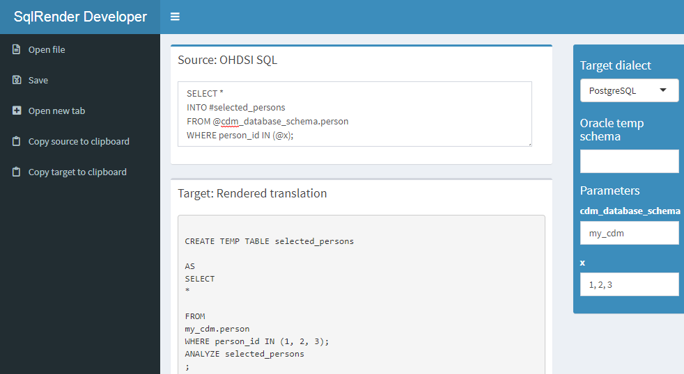
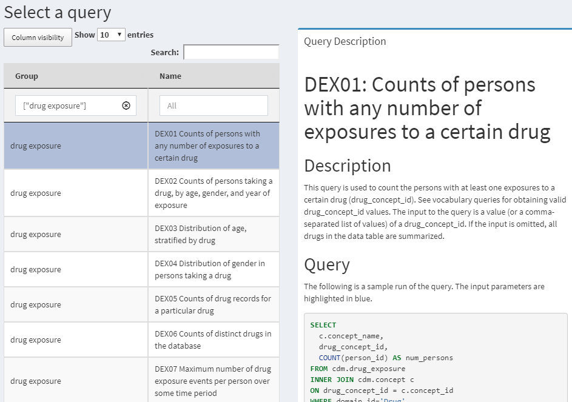

# SQL and R {#SqlAndR}

*Chapter leads: Martijn Schuemie & Peter Rijnbeek*


The Common Data Model (CDM) is a relational database model (all data is represented as records in tables that have fields), which means that the data will typically be stored in a relational database using a software platform like PostgreSQL, Oracle, or Microsoft SQL Server. The various OHDSI tools such as ATLAS and the Methods Library work by querying the database behind the scene, but we can also query the database directly ourselves if we have appropriate access rights. The main reason to do this is to perform analyses that currently are not supported by any existing tool. However, directly querying the database also comes with greater risk of making mistakes, as the OHDSI tools are often designed to help guide the user to appropriate analysis of the data. Direct queries do not provide such guidance.

The standard language for querying relational databases is SQL (Structured Query Language), which can be used both to query the database as well as to make changes to the data. Although the basic commands in SQL are indeed standard, meaning the same across software platforms, each platform has its own dialect, with subtle changes. For example, to retrieve the top 10 rows of the PERSON table on SQL Server, one would type: \index{SQL} \index{structured query language|see {SQL}}


```sql
SELECT TOP 10 * FROM person;
```

Whereas the same query on PostgreSQL would be:


```sql
SELECT * FROM person LIMIT 10;
```

In OHDSI, we would like to be agnostic to the specific dialect a platform uses; we would like to 'speak' the same SQL language across all OHDSI databases. For this reason OHDSI developed the [SqlRender](https://ohdsi.github.io/SqlRender/) package, an R package that can translate from one standard dialect to any of the supported dialects that will be discussed later in this chapter. This standard dialect - **OHDSI SQL** - is mainly a subset of the SQL Server SQL dialect. The example SQL statements provided throughout this chapter will all use OHDSI SQL. \index{SqlRender} \index{agnostic SQL|see {SqlRender}} \index{Standard SQL Dialect|see {SqlRender}} \index{OHDSI SQL|see {SqlRender}}

Each database platform also comes with its own software tools for querying the database using SQL. In OHDSI we developed the [DatabaseConnector](https://ohdsi.github.io/DatabaseConnector/) package, one R package that can connect to many database platforms. DatabaseConnector will also be discussed later in this chapter. \index{DatabaseConnector}

So although one can query a database that conforms to the CDM without using any OHDSI tools, the recommended path is to use the DatabaseConnector and SqlRender packages. This allows queries that are developed at one site to be used at any other site without modification. R itself also immediately provides features to further analyze the data extracted from the database, such as performing statistical analyses and generating (interactive) plots. \index{R} 

In this chapter we assume the reader has a basic understanding of SQL. We first review how to use SqlRender and DatabaseConnector. If the reader does not intend to use these packages these sections can be skipped. In Section \@ref(QueryTheCdm) we discuss how to use SQL (in this case OHDSI SQL) to query the CDM. The following section highlights how to use the OHDSI Standardized Vocabulary when querying the CDM. We highlight the QueryLibrary, a collection of commonly-used queries against the CDM that is publicly available. We close this chapter with an example study estimating incidence rates, and implement this study using SqlRender and DatabaseConnector. \index{Query Library} \index{SQL Query Libary|see {Query Library}}

## SqlRender {#SqlRender}

The [SqlRender](https://ohdsi.github.io/SqlRender/) package is available on CRAN (the Comprehensive R Archive Network), and can therefore be installed using: 


```r
install.packages("SqlRender")
```

SqlRender supports a wide array of technical platforms including traditional database systems (PostgreSQL, Microsoft SQL Server, SQLite, and Oracle), parallel data warehouses (Microsoft APS, IBM Netezza, and Amazon RedShift), as well as Big Data platforms (Hadoop through Impala, and Google BigQuery). The R package comes with a package manual and a vignette that explores the full functionality. Here we describer some of the main features.

### SQL Parameterization

One of the functions of the package is to support parameterization of SQL. Often, small variations of SQL need to be generated based on some parameters. SqlRender offers a simple markup syntax inside the SQL code to allow parameterization. Rendering the SQL based on parameter values is done using the `render()` function. \index{SqlRender!parameterization}

#### Substituting Parameter Values {-}

The `@` character can be used to indicate parameter names that need to be exchanged for actual parameter values when rendering. In the following example, a variable called `a` is mentioned in the SQL. In the call to the render function the value of this parameter is defined:


```r
sql <- "SELECT * FROM concept WHERE concept_id = @a;"
render(sql, a = 123)
```

```
## [1] "SELECT * FROM concept WHERE concept_id = 123;"
```

Note that, unlike the parameterization offered by most database management systems, it is just as easy to parameterize table or field names as values:


```r
sql <- "SELECT * FROM @x WHERE person_id = @a;"
render(sql, x = "observation", a = 123)
```

```
## [1] "SELECT * FROM observation WHERE person_id = 123;"
```

The parameter values can be numbers, strings, booleans, as well as vectors, which are converted to comma-delimited lists:


```r
sql <- "SELECT * FROM concept WHERE concept_id IN (@a);"
render(sql, a = c(123, 234, 345))
```

```
## [1] "SELECT * FROM concept WHERE concept_id IN (123,234,345);"
```

#### If-Then-Else {-}

Sometimes blocks of codes need to be turned on or off based on the values of one or more parameters. This is done using the `{Condition} ? {if true} : {if false}` syntax. If the *condition* evaluates to true or 1, the *if true* block is used, else the *if false* block is shown (if present).


```r
sql <- "SELECT * FROM cohort {@x} ? {WHERE subject_id = 1}"
render(sql, x = FALSE)
```

```
## [1] "SELECT * FROM cohort "
```

```r
render(sql, x = TRUE)
```

```
## [1] "SELECT * FROM cohort WHERE subject_id = 1"
```

Simple comparisons are also supported:


```r
sql <- "SELECT * FROM cohort {@x == 1} ? {WHERE subject_id = 1};"
render(sql, x = 1)
```

```
## [1] "SELECT * FROM cohort WHERE subject_id = 1;"
```

```r
render(sql, x = 2)
```

```
## [1] "SELECT * FROM cohort ;"
```

As well as the `IN` operator:


```r
sql <- "SELECT * FROM cohort {@x IN (1,2,3)} ? {WHERE subject_id = 1};"
render(sql, x = 2)
```

```
## [1] "SELECT * FROM cohort WHERE subject_id = 1;"
```

### Translation to Other SQL Dialects

Another function of the [SqlRender](https://ohdsi.github.io/SqlRender/) package is to translate from OHDSI SQL to other SQL dialects. For example:


```r
sql <- "SELECT TOP 10 * FROM person;"
translate(sql, targetDialect = "postgresql")
```

```
## [1] "SELECT  * FROM person LIMIT 10;"
```

The `targetDialect` parameter can have the following values: "oracle", "postgresql", "pdw", "redshift", "impala", "netezza", "bigquery", "sqlite", and "sql server". \index{SqlRender!translation}

\BeginKnitrBlock{rmdimportant}<div class="rmdimportant">There are limits to what SQL functions and constructs can be translated properly, both because only a limited set of translation rules have been implemented in the package, but also some SQL features do not have an equivalent in all dialects. This is the primary reason why OHDSI SQL was developed as its own, new SQL dialect. However, whenever possible we have kept to the SQL Server syntax to avoid reinventing the wheel.</div>\EndKnitrBlock{rmdimportant}

Despite our best efforts, there are quite a few things to consider when writing OHDSI SQL that will run without error on all supported platforms. In what follows we discuss these considerations in detail.

#### Functions and Structures Supported By Translate {-}

These SQL Server functions have been tested and were found to be translated correctly to the various dialects:\index{SqlRender!supported functions}

Table: (\#tab:sqlFunctions) Functions supported by translate.

|Function           |Function           |Function           |    
|:----------------- |:----------------- |:----------------- |
|ABS               |EXP        |RAND       |
|ACOS              |FLOOR      |RANK       |
|ASIN              |GETDATE    |RIGHT      |
|ATAN              |HASHBYTES* |ROUND      |
|AVG               |ISNULL     |ROW_NUMBER |
|CAST              |ISNUMERIC  |RTRIM      |
|CEILING           |LEFT       |SIN        |
|CHARINDEX         |LEN        |SQRT       |
|CONCAT            |LOG        |SQUARE     |
|COS               |LOG10      |STDEV      |
|COUNT             |LOWER      |SUM        |
|COUNT_BIG         |LTRIM      |TAN        |
|DATEADD           |MAX        |UPPER      |
|DATEDIFF          |MIN        |VAR        |
|DATEFROMPARTS     |MONTH      |YEAR       |
|DATETIMEFROMPARTS |NEWID      |           |
|DAY               |PI         |           |
|EOMONTH           |POWER      |           |

\* Requires special privileges on Oracle. Has no equivalent on SQLite.

Similarly, many SQL syntax structures are supported. Here is a non-exhaustive list of expressions that we know will translate well:

```sql
-- Simple selects:
SELECT * FROM table;

-- Selects with joins:
SELECT * FROM table_1 INNER JOIN table_2 ON a = b;

-- Nested queries:
SELECT * FROM (SELECT * FROM table_1) tmp WHERE a = b;

-- Limiting to top rows:
SELECT TOP 10 * FROM table;

-- Selecting into a new table:
SELECT * INTO new_table FROM table;

-- Creating tables:
CREATE TABLE table (field INT);

-- Inserting verbatim values:
INSERT INTO other_table (field_1) VALUES (1);

-- Inserting from SELECT:
INSERT INTO other_table (field_1) SELECT value FROM table;
  
-- Simple drop commands:
DROP TABLE table;

-- Drop table if it exists:
IF OBJECT_ID('ACHILLES_analysis', 'U') IS NOT NULL
  DROP TABLE ACHILLES_analysis;
  
-- Drop temp table if it exists:
IF OBJECT_ID('tempdb..#cohorts', 'U') IS NOT NULL
  DROP TABLE #cohorts;  

-- Common table expressions:
WITH cte AS (SELECT * FROM table) SELECT * FROM cte;

-- OVER clauses:
SELECT ROW_NUMBER() OVER (PARTITION BY a ORDER BY b)
  AS "Row Number" FROM table;
  
-- CASE WHEN clauses:
SELECT CASE WHEN a=1 THEN a ELSE 0 END AS value FROM table;

-- UNIONs:
SELECT * FROM a UNION SELECT * FROM b;

-- INTERSECTIONs:
SELECT * FROM a INTERSECT SELECT * FROM b;

-- EXCEPT:
SELECT * FROM a EXCEPT SELECT * FROM b;
```

#### String Concatenation {-}

String concatenation is one area where SQL Server is less specific than other dialects. In SQL Server, one would write `SELECT first_name + ' ' + last_name AS full_name FROM table`, but this should be `SELECT first_name || ' ' || last_name AS full_name FROM table` in PostgreSQL and Oracle. SqlRender tries to guess when values that are being concatenated are strings. In the example above, because we have an explicit string (the space surrounded by single quotation marks), the translation will be correct. However, if the query had been `SELECT first_name + last_name AS full_name FROM table`, SqlRender would have had no clue the two fields were strings, and would incorrectly leave the plus sign. Another clue that a value is a string is an explicit cast to VARCHAR, so `SELECT last_name + CAST(age AS VARCHAR(3)) AS full_name FROM table` would also be translated correctly. To avoid ambiguity altogether, it is probable best to use the ```CONCAT()``` function to concatenate two or more strings.

#### Table Aliases and the AS Keyword {-}

Many SQL dialects allow the use of the `AS` keyword when defining a table alias, but will also work fine without the keyword. For example, both these SQL statements are fine for SQL Server, PostgreSQL, RedShift, etc.:

```sql
-- Using AS keyword
SELECT * 
FROM my_table AS table_1
INNER JOIN (
  SELECT * FROM other_table
) AS table_2
ON table_1.person_id = table_2.person_id;

-- Not using AS keyword
SELECT * 
FROM my_table table_1
INNER JOIN (
  SELECT * FROM other_table
) table_2
ON table_1.person_id = table_2.person_id;
```

However, Oracle will throw an error when the `AS` keyword is used. In the above example, the first query will fail. It is therefore recommended to not use the `AS` keyword when aliasing tables. (Note: we can't make SqlRender handle this, because it can't easily distinguish between table aliases where Oracle doesn't allow `AS` to be used, and field aliases, where Oracle requires `AS` to be used.)

#### Temp Tables {-}

Temp tables can be very useful to store intermediate results, and when used correctly can dramatically improve performance of queries. On most database platforms temp tables have very nice properties: they're only visible to the current user, are automatically dropped when the session ends, and can be created even when the user has no write access. Unfortunately, in Oracle temp tables are basically permanent tables, with the only difference that the data inside the table is only visible to the current user. This is why, in Oracle, SqlRender will try to emulate temp tables by

1. Adding a random string to the table name so tables from different users will not conflict.
2. Allowing the user to specify the schema where the temp tables will be created. 

For example:

```r
sql <- "SELECT * FROM #children;"
translate(sql, targetDialect = "oracle", oracleTempSchema = "temp_schema")
```

```
## [1] "SELECT * FROM temp_schema.ka3yeppkchildren ;"
```

Note that the user will need to have write privileges on `temp_schema`.

Also note that because Oracle has a limit on table names of 30 characters. **Temp table names are only allowed to be at most 22 characters long**, because else the name will become too long after appending the session ID.

Furthermore, remember that temp tables are not automatically dropped on Oracle, so you will need to explicitly ```TRUNCATE``` and ```DROP``` all temp tables once you're done with them to prevent orphan tables accumulating in the Oracle temp schema.

#### Implicit Casts {-}

One of the few points where SQL Server is less explicit than other dialects is that it allows implicit casts. For example, this code will work on SQL Server:

```sql
CREATE TABLE #temp (txt VARCHAR);

INSERT INTO #temp
SELECT '1';

SELECT * FROM #temp WHERE txt = 1;
```

Even though `txt` is a VARCHAR field and we are comparing it with an integer, SQL Server will automatically cast one of the two to the correct type to allow the comparison. In contrast, other dialects such as PostgreSQL will throw an error when trying to compare a VARCHAR with an INT.

You should therefore always make casts explicit. In the above example, the last statement should be replaced with either

```sql
SELECT * FROM #temp WHERE txt = CAST(1 AS VARCHAR);
```

or

```sql
SELECT * FROM #temp WHERE CAST(txt AS INT) = 1;
```

#### Case Sensitivity in String Comparisons {-}

Some DBMS platforms such as SQL Server always perform string comparisons in a case-insensitive way, while others such as PostgreSQL are always case sensitive. It is therefore recommended to always assume case-sensitive comparisons, and to explicitly make comparisons case-insensitive when unsure about the case. For example, instead of 

```sql
SELECT * FROM concept WHERE concep_class_id = 'Clinical Finding'
```
it is preferred to use
```sql
SELECT * FROM concept WHERE LOWER(concep_class_id) = 'clinical finding'
```

#### Schemas and Databases {-}

In SQL Server, tables are located in a schema, and schemas reside in a database. For example, `cdm_data.dbo.person` refers to the `person` table in the `dbo` schema in the `cdm_data` database. In other dialects, even though a similar hierarchy often exists they are used very differently. In SQL Server, there is typically one schema per database (often called `dbo`), and users can easily use data in different databases. On other platforms, for example in PostgreSQL, it is not possible to use data across databases in a single session, but there are often many schemas in a database. In PostgreSQL one could say that the equivalent of SQL Server's database is the schema.

We therefore recommend concatenating SQL Server's database and schema into a single parameter, which we typically call `@databaseSchema`. For example, we could have the parameterized SQL
```sql
SELECT * FROM @databaseSchema.person
```
where on SQL Server we can include both database and schema names in the value: `databaseSchema = "cdm_data.dbo"`. On other platforms, we can use the same code, but now only specify the schema as the parameter value: `databaseSchema = "cdm_data"`.

The one situation where this will fail is the `USE` command, since `USE cdm_data.dbo;` will throw an error. It is therefore preferred not to use the `USE` command, but always specify the database / schema where a table is located. 


#### Debugging Parameterized SQL {-}

Debugging parameterized SQL can be a bit complicated. Only the rendered SQL can be tested against a database server, but changes to the code should be made in the parameterized (pre-rendered) SQL. \index{SqlRender!debugging}

A Shiny app is included in the SqlRender package for interactively editing source SQL and generating rendered and translated SQL. The app can be started using:


```r
launchSqlRenderDeveloper()
```

That will open the default browser with the app shown in Figure \@ref(fig:sqlDeveloper). The app is also publicly available on the web.[^sqlDeveloperUrl] 

<div class="figure" style="text-align: center">

<p class="caption">(\#fig:sqlDeveloper)The SqlDeveloper Shiny app.</p>
</div>

In the app you can enter OHDSI SQL, select the target dialect as well as provide values for the parameters that appear in your SQL, and the translation will automatically appear at the bottom.

[^sqlDeveloperUrl]: http://data.ohdsi.org/SqlDeveloper/

## DatabaseConnector {#DatabaseConnector}

[DatabaseConnector](https://ohdsi.github.io/DatabaseConnector/) is an R package for connecting to various database platforms using Java's JDBC drivers. The DatabaseConnector package is available on CRAN (the Comprehensive R Archive Network), and can therefore be installed using:


```r
install.packages("DatabaseConnector")
```

DatabaseConnector supports a wide array of technical platforms including traditional database systems (PostgreSQL, Microsoft SQL Server, SQLite, and Oracle), parallel data warehouses (Microsoft APS, IBM Netezza, and Amazon RedShift), as well as Big Data platforms (Hadoop through Impala, and Google BigQuery). The package already contains most drivers, but because of licensing reasons the drivers for BigQuery, Netezza and Impala are not included but must be obtained by the user. Type `?jdbcDrivers` for instructions on how to download these drivers. Once downloaded, you can use the `pathToDriver` argument of the `connect`, `dbConnect`, and `createConnectionDetails` functions.

### Creating a Connection

To connect to a database a number of details need to be specified, such as the database platform, the location of the server, the user name, and password. We can call the `connect` function and specify these details directly: \index{DatabaseConnector!creating a connection}


```r
conn <- connect(dbms = "postgresql",
                server = "localhost/postgres",
                user = "joe",
                password = "secret",
                schema = "cdm")
```

```
## Connecting using PostgreSQL driver
```

See `?connect` for information on which details are required for each platform. Don't forget to close any connection afterwards:


```r
disconnect(conn)
```

Note that, instead of providing the server name, it is also possible to provide the JDBC connection string if this is more convenient:


```r
connString <- "jdbc:postgresql://localhost:5432/postgres"
conn <- connect(dbms = "postgresql",
                connectionString = connString,
                user = "joe",
                password = "secret",
                schema = "cdm")
```

```
## Connecting using PostgreSQL driver
```

Sometimes we may want to first specify the connection details, and defer connecting until later. This may be convenient for example when the connection is established inside a function, and the details need to be passed as an argument. We can use the `createConnectionDetails` function for this purpose:


```r
details <- createConnectionDetails(dbms = "postgresql",
                                   server = "localhost/postgres",
                                   user = "joe",
                                   password = "secret",
                                   schema = "cdm")
conn <- connect(details)
```

```
## Connecting using PostgreSQL driver
```

### Querying

The main functions for querying database are the `querySql` and `executeSql` functions. The difference between these functions is that `querySql` expects data to be returned by the database, and can handle only one SQL statement at a time. In contrast, `executeSql` does not expect data to be returned, and accepts multiple SQL statements in a single SQL string. \index{DatabaseConnector!querying}

Some examples:


```r
querySql(conn, "SELECT TOP 3 * FROM person")
```

```
##   person_id gender_concept_id year_of_birth
## 1         1              8507          1975
## 2         2              8507          1976
## 3         3              8507          1977
```


```r
executeSql(conn, "TRUNCATE TABLE foo; DROP TABLE foo;")
```

Both functions provide extensive error reporting: When an error is thrown by the server, the error message and the offending piece of SQL are written to a text file to allow better debugging. The `executeSql` function also by default shows a progress bar, indicating the percentage of SQL statements that has been executed. If those attributes are not desired, the package also offers the `lowLevelQuerySql` and `lowLevelExecuteSql` functions.

### Querying Using Ffdf Objects

Sometimes the data to be fetched from the database is too large to fit into memory. As mentioned in Section \@ref(BigDataSupport), in such a case we can use the `ff` package to store R data objects on file, and use them as if they are available in memory. `DatabaseConnector` can download data directly into ffdf objects:


```r
x <- querySql.ffdf(conn, "SELECT * FROM person")
```

x is now an ffdf object. 

### Querying Different Platforms Using the Same SQL

The following convenience functions are available that first call the `render` and `translate` functions in the SqlRender package: `renderTranslateExecuteSql`, `renderTranslateQuerySql`, `renderTranslateQuerySql.ffdf`. For example:


```r
x <- renderTranslateQuerySql(conn, 
                             sql = "SELECT TOP 10 * FROM @schema.person",
                             schema = "cdm_synpuf")
```
Note that the SQL Server-specific 'TOP 10' syntax will be translated to for example 'LIMIT 10' on PostgreSQL, and that the SQL parameter `@schema` will be instantiated with the provided value 'cdm_synpuf'.

### Inserting Tables

Although it is also possible to insert data in the database by sending SQL statements using the `executeSql` function, it is often more convenient and faster (due to some optimization) to use the `insertTable` function:


```r
data(mtcars)
insertTable(conn, "mtcars", mtcars, createTable = TRUE)
```


In this example, we're uploading the mtcars data frame to a table called 'mtcars' on the server, which will be automatically created.

## Querying the CDM {#QueryTheCdm}

In the following examples we use OHDSI SQL to query a database that adheres to the CDM. These queries use `@cdm` to denote the database schema where the data in CDM can be found.

We can start by just querying how many people are in the database:

```sql
SELECT COUNT(*) AS person_count FROM @cdm.person;
```
| PERSON_COUNT |     
| ------------:|
| 26299001     |


Or perhaps we're interested in the average length of an observation period:

```sql
SELECT AVG(DATEDIFF(DAY, 
                    observation_period_start_date, 
                    observation_period_end_date) / 365.25) AS num_years
FROM @cdm.observation_period;
```
| NUM_YEARS |     
| ---------:|
| 1.980803  |

We can join tables to produce additional statistics. A join combines fields from multiple tables, typically by requiring specific fields in the tables to have the same value. For example, here we join the PERSON table to the OBSERVATION_PERIOD table on the PERSON_ID fields in both tables. In other words, the result of the join is a new table-like set that has all the fields of the two tables, but in all rows the PERSON_ID fields from the two tables must have the same value. We can now for example compute the maximum age at observation end by using the OBSERVATION_PERIOD_END_DATE field from the OBSERVATION_PERIOD table together with the year_of_birth field of the PERSON table:

```sql
SELECT MAX(YEAR(observation_period_end_date) -
           year_of_birth) AS max_age
FROM @cdm.person
INNER JOIN @cdm.observation_period
  ON person.person_id = observation_period.person_id;
```
| MAX_AGE |     
| -------:|
|      90 |

A much more complicated query is needed to determine the distribution of age at the start of observation. In this query, we first join the PERSON to the OBSERVATION_PERIOD table to compute age at start of observation. We also compute the ordering for this joined set based on age, and store it as order_nr. Because we want to use the result of this join multiple times, we define it as a common table expression (CTE) (defined using `WITH ... AS`) that we call "ages," meaning we can refer to ages as if it is an existing table. We count the number of rows in ages to produce "n," and then for each quantile find the minimum age where the order_nr is smaller than the fraction times n. For example, to find the median we use the minimum age where $order\_nr < .50 * n$. The minimum and maximum age are computed separately:

```sql
WITH ages
AS (
	SELECT age,
		ROW_NUMBER() OVER (
			ORDER BY age
			) order_nr
	FROM (
		SELECT YEAR(observation_period_start_date) - year_of_birth AS age
		FROM @cdm.person
		INNER JOIN @cdm.observation_period
			ON person.person_id = observation_period.person_id
		) age_computed
	)
SELECT MIN(age) AS min_age,
	MIN(CASE 
			WHEN order_nr < .25 * n
				THEN 9999
			ELSE age
			END) AS q25_age,
	MIN(CASE 
			WHEN order_nr < .50 * n
				THEN 9999
			ELSE age
			END) AS median_age,
	MIN(CASE 
			WHEN order_nr < .75 * n
				THEN 9999
			ELSE age
			END) AS q75_age,
	MAX(age) AS max_age
FROM ages
CROSS JOIN (
	SELECT COUNT(*) AS n
	FROM ages
	) population_size;
```
| MIN_AGE | Q25_AGE | MEDIAN_AGE | Q75_AGE | MAX_AGE |
| -------:| -------:| ----------:| -------:| -------:|
|       0 |       6 |         17 |      34 |      90 |

More complex computations can also be performed in R instead of using SQL. For example, we can get the same answer using this R code:


```r
sql <- "SELECT YEAR(observation_period_start_date) -
               year_of_birth AS age
FROM @cdm.person
INNER JOIN @cdm.observation_period
  ON person.person_id = observation_period.person_id;"
age <- renderTranslateQuerySql(conn, sql, cdm = "cdm")
quantile(age[, 1], c(0, 0.25, 0.5, 0.75, 1))
```

```
##   0%  25%  50%  75% 100% 
##    0    6   17   34   90
```

Here we compute age on the server, download all ages, and then compute the age distribution. However, this requires millions of rows of data to be downloaded from the database server, and is therefore not very efficient. You will need to decide on a case-by-case basis whether a computation is best performed in SQL or in R.

Queries can use the source values in the CDM. For example, we can retrieve the top 10 most frequent condition source codes using:

```sql
SELECT TOP 10 condition_source_value, 
  COUNT(*) AS code_count
FROM @cdm.condition_occurrence
GROUP BY condition_source_value
ORDER BY -COUNT(*);
```
| CONDITION_SOURCE_VALUE | CODE_COUNT |    
| ----------------------:| ----------:|
|                   4019 |   49094668 |
|                  25000 |   36149139 |
|                  78099 |   28908399 |
|                    319 |   25798284 |
|                  31401 |   22547122 |
|                    317 |   22453999 |
|                    311 |   19626574 |
|                    496 |   19570098 |
|                    I10 |   19453451 |
|                   3180 |   18973883 |

Here we grouped records in the CONDITION_OCCURRENCE table by values of the CONDITION_SOURCE_VALUE field, and counted the number of records in each group. We retrieve the CONDITION_SOURCE_VALUE and the count, and reverse-order it by the count.

## Using the Vocabulary When Querying

Many operations require the vocabulary to be useful. The Vocabulary tables are part of the CDM, and are therefore available using SQL queries. Here we show how queries against the Vocabulary can be combined with queries against the CDM. Many fields in the CDM contain concept IDs which can be resolved using the CONCEPT table. For example, we may wish to count the number of persons in the database stratified by gender, and it would be convenient to resolve the GENDER_CONCEPT_ID field to a concept name:

```sql
SELECT COUNT(*) AS subject_count,
  concept_name
FROM @cdm.person
INNER JOIN @cdm.concept
  ON person.gender_concept_id = concept.concept_id
GROUP BY concept_name;
```
| SUBJECT_COUNT | CONCEPT_NAME |    
| -------------:| ------------:|
|      14927548 |       FEMALE |
|      11371453 |         MALE |

A very powerful feature of the Vocabulary is its hierarchy. A very common query looks for a specific concept *and all of its descendants*. For example, imagine we wish to count the number of prescriptions containing the ingredient ibuprofen:

```sql
SELECT COUNT(*) AS prescription_count
FROM @cdm.drug_exposure
INNER JOIN @cdm.concept_ancestor
  ON drug_concept_id = descendant_concept_id
INNER JOIN @cdm.concept ingredient
  ON ancestor_concept_id = ingredient.concept_id
WHERE LOWER(ingredient.concept_name) = 'ibuprofen'
  AND ingredient.concept_class_id = 'Ingredient'
  AND ingredient.standard_concept = 'S';
```
| PRESCRIPTION_COUNT |
| ------------------:|
|           26871214 |

## QueryLibrary

\index{QueryLibrary}

QueryLibrary is a library of commonly-used SQL queries for the CDM. It is available as an online application[^queryLibraryUrl] shown in Figure \@ref(fig:queryLibrary), and as an R package.[^queryLibraryPackageUrl]

[^queryLibraryUrl]: http://data.ohdsi.org/QueryLibrary

[^queryLibraryPackageUrl]: https://github.com/OHDSI/QueryLibrary

<div class="figure" style="text-align: center">

<p class="caption">(\#fig:queryLibrary)QueryLibrary: a library of SQL queries against the CDM.</p>
</div>

The purpose of the library is to help new users learn how to query the CDM. The queries in the library have been reviewed and approved by the OHDSI community. The query library is primarily intended for training purposes, but it is also a valuable resource for experienced users.

The QueryLibrary makes use of SqlRender to output the queries in the SQL dialect of choice. Users can also specify the CDM database schema, vocabulary database schema (if separate), and the Oracle temp schema (if needed), so the queries will be automatically rendered with these settings.

## Designing a Simple Study

### Problem Definition

Angioedema is a well-known side-effect of ACE inhibitors (ACEi). @slater_1988 estimate the incidence rate of angioedema in the first week of ACEi treatment to be one case per 3,000 patients per week. Here we seek to replicate this finding, and stratify by age and gender. For simplicity, we focus on one ACEi: lisinopril. We thus answer the question

> What is the rate of angioedema in the first week following lisinopril treatment initiation, stratified by age and gender?

### Exposure

We'll define exposure as first exposure to lisinopril. By first we mean no earlier exposure to lisinopril. We require 365 days of continuous observation time prior to the first exposure.

### Outcome

We define angioedema as any occurrence of an angioedema diagnosis code during an inpatient or emergency room (ER) visit. 

### Time-At-Risk

We will compute the incidence rate in the first week following treatment initiation, irrespective of whether patients were exposed for the full week.

## Implementing the Study Using SQL and R

Although we are not bound to any of the OHDSI tool conventions, it is helpful to follow the same principles. In this case, we will use SQL to populate a cohort table, similarly to how the OHDSI tools work. The COHORT table is defined in the CDM, and has a predefined set of fields that we will also use. We first must create the COHORT table in a database schema where we have write access, which likely is not the same as the database schema that holds the data in CDM format. 


```r
library(DatabaseConnector)
conn <- connect(dbms = "postgresql",
                server = "localhost/postgres",
                user = "joe",
                password = "secret")
cdmDbSchema <- "cdm"
cohortDbSchema <- "scratch"
cohortTable <- "my_cohorts"

sql <- "
CREATE TABLE @cohort_db_schema.@cohort_table (
  cohort_definition_id INT,
  cohort_start_date DATE,
  cohort_end_date DATE,
  subject_id BIGINT
);
"
renderTranslateExecuteSql(conn, sql,
                          cohort_db_schema = cohortDbSchema,
                          cohort_table = cohortTable)
```

Here we have parameterized the database schema and table names, so we can easily adapt them to different environments. The result is an empty table on the database server.

### Exposure Cohort

Next we create our exposure cohort, and insert it into our COHORT table:


```r
sql <- "
INSERT INTO @cohort_db_schema.@cohort_table (
  cohort_definition_id,
  cohort_start_date,
  cohort_end_date,
  subject_id
)
SELECT 1 AS cohort_definition_id,
  cohort_start_date,
  cohort_end_date,
  subject_id
FROM (
  SELECT drug_era_start_date AS cohort_start_date,
    drug_era_end_date AS cohort_end_date,
    person_id AS subject_id
  FROM (
    SELECT drug_era_start_date,
      drug_era_end_date,
      person_id,
      ROW_NUMBER() OVER (
        PARTITION BY person_id
  			ORDER BY drug_era_start_date
      ) order_nr
    FROM @cdm_db_schema.drug_era
    WHERE drug_concept_id = 1308216 -- Lisinopril
  ) ordered_exposures
  WHERE order_nr = 1
) first_era
INNER JOIN @cdm_db_schema.observation_period
  ON subject_id = person_id
    AND observation_period_start_date < cohort_start_date
    AND observation_period_end_date > cohort_start_date
WHERE DATEDIFF(DAY,
               observation_period_start_date,
               cohort_start_date) >= 365;
"

renderTranslateExecuteSql(conn, sql,
                          cohort_db_schema = cohortDbSchema,
                          cohort_table = cohortTable,
                          cdm_db_schema = cdmDbSchema)
```

Here we use the DRUG_ERA table, a standard table in the CDM that is automatically derived from the DRUG_EXPOSURE table. The DRUG_ERA table contains eras of continuous exposure at the ingredient level. We can thus search for lisinopril, and this will automatically identify all exposures to drugs containing lisinopril. We take the first drug exposure per person, and then join to the OBSERVATION_PERIOD table, and because a person can have several observation periods we must make sure we only join to the period containing the drug exposure. We then require at least 365 days between the OBSERVATION_PERIOD_START_DATE and the COHORT_START_DATE.

### Outcome Cohort

Finally, we must create our outcome cohort:


```r
sql <- "
INSERT INTO @cohort_db_schema.@cohort_table (
 cohort_definition_id,
 cohort_start_date,
 cohort_end_date,
subject_id
)
SELECT 2 AS cohort_definition_id,
  cohort_start_date,
  cohort_end_date,
  subject_id
FROM (
  SELECT DISTINCT person_id AS subject_id,
    condition_start_date AS cohort_start_date,
    condition_end_date AS cohort_end_date
  FROM @cdm_db_schema.condition_occurrence
  INNER JOIN @cdm_db_schema.concept_ancestor
    ON condition_concept_id = descendant_concept_id
  WHERE ancestor_concept_id = 432791 -- Angioedema
) distinct_occurrence
INNER JOIN @cdm_db_schema.visit_occurrence
  ON subject_id = person_id
  AND visit_start_date <= cohort_start_date
  AND visit_end_date >= cohort_start_date
WHERE visit_concept_id IN (262, 9203,
    9201) -- Inpatient or ER;
"

renderTranslateExecuteSql(conn, sql,
                          cohort_db_schema = cohortDbSchema,
                          cohort_table = cohortTable,
                          cdm_db_schema = cdmDbSchema)
```

Here we join the CONDITION_OCCURRENCE table to the CONCEPT_ANCESTOR table to find all occurrences of angioedema or any of its descendants. We use DISTINCT to make sure we only select one record per day, as we believe multiple angioedema diagnoses on the same day are more likely to be the same occurrence rather than multiple angioedema events. We join these occurrences to the VISIT_OCCURRENCE table to ensure the diagnosis was made in and inpatient or ER setting.

### Incidence Rate Calculation

Now that our cohorts are in place, we can compute the incidence rate, stratified by age and gender:


```r
sql <- "
WITH tar AS (
  SELECT concept_name AS gender,
    FLOOR((YEAR(cohort_start_date) -
          year_of_birth) / 10) AS age,
    subject_id,
    cohort_start_date,
    CASE WHEN DATEADD(DAY, 7, cohort_start_date) >
      observation_period_end_date
    THEN observation_period_end_date
    ELSE DATEADD(DAY, 7, cohort_start_date)
    END AS cohort_end_date
  FROM @cohort_db_schema.@cohort_table
  INNER JOIN @cdm_db_schema.observation_period
    ON subject_id = observation_period.person_id
      AND observation_period_start_date < cohort_start_date
      AND observation_period_end_date > cohort_start_date
  INNER JOIN @cdm_db_schema.person
    ON subject_id = person.person_id
  INNER JOIN @cdm_db_schema.concept
    ON gender_concept_id = concept_id
  WHERE cohort_definition_id = 1 -- Exposure
)
SELECT days.gender,
    days.age,
    days,
    CASE WHEN events IS NULL THEN 0 ELSE events END AS events
FROM (
  SELECT gender,
    age,
    SUM(DATEDIFF(DAY, cohort_start_date,
      cohort_end_date)) AS days
  FROM tar
  GROUP BY gender,
    age
) days
LEFT JOIN (
  SELECT gender,
      age,
      COUNT(*) AS events
  FROM tar
  INNER JOIN @cohort_db_schema.@cohort_table angioedema
    ON tar.subject_id = angioedema.subject_id
      AND tar.cohort_start_date <= angioedema.cohort_start_date
      AND tar.cohort_end_date >= angioedema.cohort_start_date
  WHERE cohort_definition_id = 2 -- Outcome
  GROUP BY gender,
    age
) events
ON days.gender = events.gender
  AND days.age = events.age;
"

results <- renderTranslateQuerySql(conn, sql,
                                   cohort_db_schema = cohortDbSchema,
                                   cohort_table = cohortTable,
                                   cdm_db_schema = cdmDbSchema,
                                   snakeCaseToCamelCase = TRUE)
```

We first create "tar," a CTE that contains all exposures with the appropriate time-at-risk. Note that we truncate the time-at-risk at the OBSERVATION_PERIOD_END_DATE. We also compute the age in 10-year bins, and identify the gender. The advantage of using a CTE is that we can use the same set of intermediate results several times in a query. In this case we use it to  count the total amount of time-at-risk, as well as the number of angioedema events that occur during the time-at-risk.

We use `snakeCaseToCamelCase = TRUE` because in SQL we tend to use snake_case for field names (because SQL in case-insensitive), whereas in R we tend to use camelCase (because R is case-sensitive). The `results` data frame column names will now be in camelCase.

With the help of the ggplot2 package we can easily plot our results:


```r
# Compute incidence rate (IR) :
results$ir <- 1000 * results$events / results$days / 7

# Fix age scale:
results$age <- results$age * 10

library(ggplot2)
ggplot(results, aes(x = age, y = ir, group = gender, color = gender)) +
  geom_line() +
  xlab("Age") +
  ylab("Incidence (per 1,000 patient weeks)")
```


### Clean Up

Don't forget to clean up the table we created, and to close the connection:


```r
sql <- "
TRUNCATE TABLE @cohort_db_schema.@cohort_table;
DROP TABLE @cohort_db_schema.@cohort_table;
"
renderTranslateExecuteSql(conn, sql,
                          cohort_db_schema = cohortDbSchema,
                          cohort_table = cohortTable)

disconnect(conn)
```

### Compatibility

Because we use OHDSI SQL together with DatabaseConnector and SqlRender throughout, the code we reviewed here will run on any database platform supported by OHDSI. 

Note that for demonstration purposes we chose to create our cohorts using hand-crafted SQL. It would probably have been more convenient to construct cohort definition in ATLAS, and use the SQL generated by ATLAS to instantiate the cohorts. ATLAS also produced OHDSI SQL, and can therefore easily be used together with SqlRender and DatabaseConnector.

## Summary

\BeginKnitrBlock{rmdsummary}<div class="rmdsummary">- **SQL** (Structured Query Language) is a standard language for querying databases, including those that conform to the Common Data Model (CDM).

- Different database platforms have different SQL dialects, and require different tools to query them.

- The **SqlRender** and **DatabaseConnector** R packages provide a unified way to query data in the CDM, allowing the same analysis code to be run in different environments without modification.

- By using R and SQL together we can implement custom analyses that are not supported by the OHDSI tools.

- The **QueryLibrary** provides a collection of re-usable SQL queries for the CDM.
</div>\EndKnitrBlock{rmdsummary}

## Exercises

#### Prerequisites {-}

For these exercises we assume R, R-Studio and Java have been installed as described in Section \@ref(installR). Also required are the [SqlRender](https://ohdsi.github.io/SqlRender/), [DatabaseConnector](https://ohdsi.github.io/DatabaseConnector/), and [Eunomia](https://ohdsi.github.io/Eunomia/) packages, which can be installed using:


```r
install.packages(c("SqlRender", "DatabaseConnector", "devtools"))
devtools::install_github("ohdsi/Eunomia", ref = "v1.0.0")
```

The Eunomia package provides a simulated dataset in the CDM that will run inside your local R session. The connection details can be obtained using:


```r
connectionDetails <- Eunomia::getEunomiaConnectionDetails()
```

The CDM database schema is "main".

\BeginKnitrBlock{exercise}<div class="exercise"><span class="exercise" id="exr:exercisePeopleCount"><strong>(\#exr:exercisePeopleCount) </strong></span>Using SQL and R, compute how many people are in the database.
</div>\EndKnitrBlock{exercise}

\BeginKnitrBlock{exercise}<div class="exercise"><span class="exercise" id="exr:exerciseCelecoxibUsers"><strong>(\#exr:exerciseCelecoxibUsers) </strong></span>Using SQL and R, compute how many people have at least one prescription of celecoxib.
</div>\EndKnitrBlock{exercise}
\BeginKnitrBlock{exercise}<div class="exercise"><span class="exercise" id="exr:exerciseGiBleedsDuringCelecoxib"><strong>(\#exr:exerciseGiBleedsDuringCelecoxib) </strong></span>Using SQL and R, compute how many diagnoses of gastrointestinal hemorrhage  occur during exposure to celecoxib. (Hint: the concept ID for gastrointestinal hemorrhage is [192671](http://athena.ohdsi.org/search-terms/terms/192671).)
</div>\EndKnitrBlock{exercise}

Suggested answers can be found in Appendix \@ref(SqlAndRanswers).
