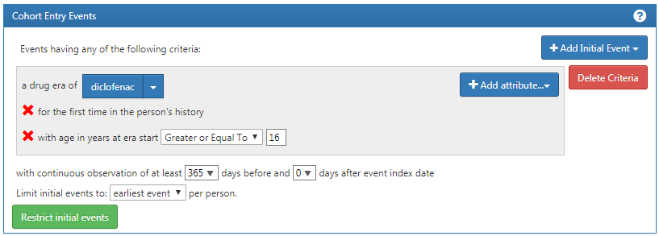
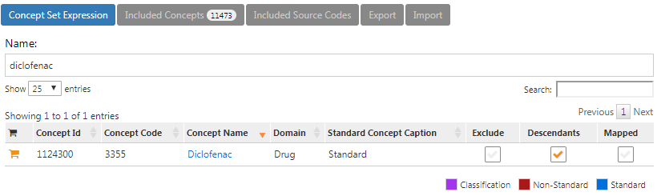
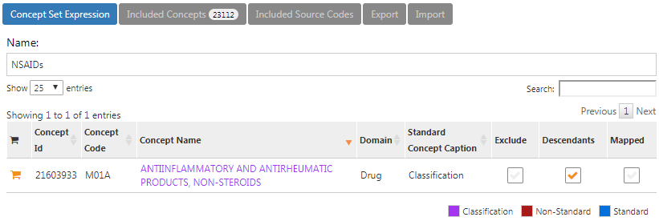
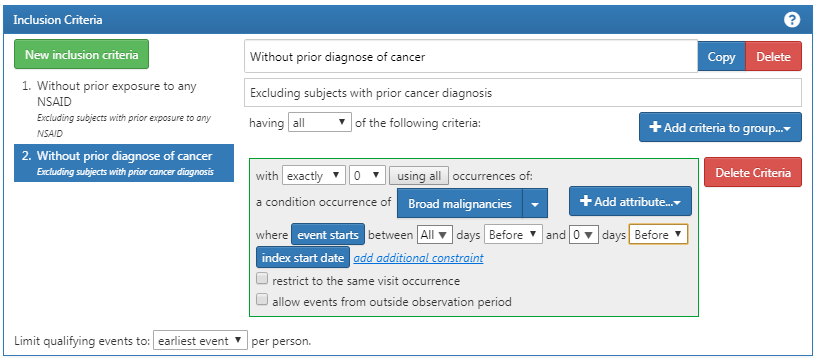
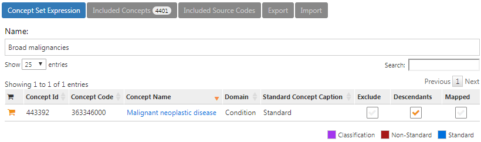
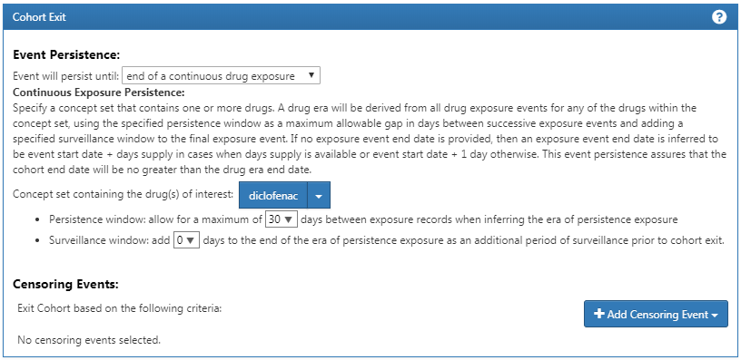

# Suggested Answers {#SuggestedAnswers}

This Appendix contains suggested answers for the exercises in the book.

## The Common Data Model {#Cdmanswers}

#### Exercise \@ref(exr:exerciseJohnPerson) {-}

Based on the description in the exercise, John's record should look like Table \@ref(tab:johnPerson).

Table: (\#tab:johnPerson) The PERSON table.

Column name|Value|Explanation
:---------------------|:-----------|:--------------------------------------
|PERSON_ID|2|A unique integer.|
|GENDER_CONCEPT_ID|8507|The concept ID for male gender is [8507](http://athena.ohdsi.org/search-terms/terms/8507).|
|YEAR_OF_BIRTH|1974||
|MONTH_OF_BIRTH|8||
|DAY_OF_BIRTH|4||
|BIRTH_DATETIME|1974-08-04 00:00:00|When the time is not known midnight is used.|
|DEATH_DATETIME|NULL||
|RACE_CONCEPT_ID|8516|The concept ID for black or African American is [8516](http://athena.ohdsi.org/search-terms/terms/8516).|
|ETHNICITY_CONCEPT_ID|38003564| [38003564](http://athena.ohdsi.org/search-terms/terms/38003564) refers to "Not hispanic".|
|LOCATION_ID||His address is not known.|
|PROVIDER_ID||His primary care Provider is not known.|
|CARE_SITE||His primary Care Site is not known.|
|PERSON_SOURCE_VALUE|NULL|Not provided.|
|GENDER_SOURCE_VALUE|Man|The text used in the description.|
|GENDER_SOURCE_ CONCEPT_ID|0||
|RACE_SOURCE_VALUE|African American|The text used in the description.|
|RACE_SOURCE_CONCEPT_ID|0||
|ETHNICITY_SOURCE_VALUE|NULL||
|ETHNICITY_SOURCE_ CONCEPT_ID|0||

#### Exercise \@ref(exr:exerciseJohnOp) {-}

Based on the description in the exercise, John's record should look like Table \@ref(tab:johnOp).

Table: (\#tab:johnOp) The OBSERVATION_PERIOD table.

Column name|Value|Explanation
:---------------------|:-----------|:--------------------------------------
|OBSERVATION_PERIOD_ID|2|A unique integer.|
|PERSON_ID|2|This is a foreign key to John's record in the PERSON table.|
|OBSERVATION_PERIOD_START_DATE|2015-01-01|The date of enrollment.|
|OBSERVATION_PERIOD_END_DATE|2019-07-01|No data can be expected after the data extraction date.|
|PERIOD_TYPE_CONCEPT_ID|44814722| [44814724](http://athena.ohdsi.org/search-terms/terms/44814722) refers to "Period while enrolled in insurance".|

#### Exercise \@ref(exr:exerciseJohnDrug) {-}

Based on the description in the exercise, John's record should look like Table \@ref(tab:johnDrug).

Table: (\#tab:johnDrug) The DRUG_EXPOSURE table.

Column name|Value|Explanation
:---------------------|:-----------|:--------------------------------------
|DRUG_EXPOSURE_ID|1001|Some unique integer|
|PERSON_ID|1|This is a foreign key to John's record in the PERSON table.|
|DRUG_CONCEPT_ID|19078461|The provided NDC code maps to Standard Concept [19078461](http://athena.ohdsi.org/search-terms/terms/19078461).|
|DRUG_EXPOSURE_START_DATE|2019-05-01|The start date of the exposure to the drug.|
|DRUG_EXPOSURE_ START_DATETIME|2019-05-01 00:00:00|Midnight is used as the time is not known.|
|DRUG_EXPOSURE_END_DATE|2019-05-31|Based on start date + days supply.|
|DRUG_EXPOSURE_ END_DATETIME|2019-05-31 00:00:00|Midnight is used as time is unknown.|
|VERBATIM_END_DATE|NULL|Not provided.|
|DRUG_TYPE_CONCEPT_ID|38000177| [38000177](http://athena.ohdsi.org/search-terms/terms/38000177) indicates "Prescription written".|
|STOP_REASON|NULL||
|REFILLS|NULL||
|QUANTITY|NULL|Not provided.|
|DAYS_SUPPLY|30|As descibed in the exercise.|
|SIG|NULL|Not provided.|
|ROUTE_CONCEPT_ID|4132161| [4132161](http://athena.ohdsi.org/search-terms/terms/4132161) indicates "Oral".|
|LOT_NUMBER|NULL|Not provided.|
|PROVIDER_ID|NULL|Not provided.|
|VISIT_OCCURRENCE_ID|NULL|No information on the visit was provided..|
|VISIT_DETAIL_ID|NULL||
|DRUG_SOURCE_VALUE|76168009520|This is provided NDC code.|
|DRUG_SOURCE_CONCEPT_ID|583945| [583945](http://athena.ohdsi.org/search-terms/terms/750264) represents the drug source value (NDC code "76168009520").|
|ROUTE_SOURCE_VALUE|NULL||

#### Exercise \@ref(exr:exerciseGiBleedRecords) {-}

To find the set of records, we can query the CONDITION_OCCURRENCE table:

```{r eval=FALSE}
library(DatabaseConnector)
connection <- connect(connectionDetails)
sql <- "SELECT *
FROM @cdm.condition_occurrence
WHERE condition_concept_id = 192671;"

result <- renderTranslateQuerySql(connection, sql, cdm = "main")
head(result)
```
```{r echo=FALSE,message=FALSE,eval=TRUE}
cat(" CONDITION_OCCURRENCE_ID PERSON_ID CONDITION_CONCEPT_ID ...
1                    4657       273               192671 ...
2                    1021        61               192671 ...
3                    5978       351               192671 ...
4                    9798       579               192671 ...
5                    9301       549               192671 ...
6                    1997       116               192671 ...
")
```

#### Exercise \@ref(exr:exercisePerson61Records) {-}

This information is stored in the OBSERVATION_PERIOD table:

```{r eval=FALSE}
library(DatabaseConnector)
connection <- connect(connectionDetails)
sql <- "SELECT *
FROM @cdm.observation_period
WHERE person_id = 61;"

renderTranslateQuerySql(connection, sql, cdm = "main")

```
```{r echo=FALSE,message=FALSE,eval=TRUE}
cat("  OBSERVATION_PERIOD_ID PERSON_ID OBSERVATION_PERIOD_START_DATE ...
1                    61        61                    1968-01-21 ...
")
```

## Data Analytics Use Cases {#UseCasesanswers}

#### Exercise \@ref(exr:exerciseUseCases1) {-}

1. Characterization

2. Patient-level prediction

3. Population-level estimation

#### Exercise \@ref(exr:exerciseUseCases2) {-}

Probably not. Defining a non-exposure cohort that is comparable to your diclofenac exposure cohort is often impossible, since people take diclofenac for a reason. This precludes a between-person comparison. It might possible to a within-person comparison, so for each patient in the diclofenac cohort identifying time when they are not exposed, but a similar problem occurs here: these times are likely incomparable, because there are reasons when at one time someone is exposed and at other times not.


## SQL and R {#SqlAndRanswers}

#### Exercise \@ref(exr:exercisePeopleCount) {-}

To compute the number of people we can simply query the PERSON table:

```{r eval=FALSE}
library(DatabaseConnector)
connection <- connect(connectionDetails)
sql <- "SELECT COUNT(*) AS person_count
FROM @cdm.person;"

renderTranslateQuerySql(connection, sql, cdm = "main")
```
```{r echo=FALSE,message=FALSE,eval=TRUE}
cat("  PERSON_COUNT
1         2694
")
```

#### Exercise \@ref(exr:exerciseCelecoxibUsers) {-}

To compute the number of people with at least one prescription of celecoxib, we can query the DRUG_EXPOSURE table. To find all drugs containing the ingredient celecoxib, we join to the CONCEPT_ANCESTOR and CONCEPT tables:

```{r eval=FALSE}
library(DatabaseConnector)
connection <- connect(connectionDetails)
sql <- "SELECT COUNT(DISTINCT(person_id)) AS person_count
FROM @cdm.drug_exposure
INNER JOIN @cdm.concept_ancestor
  ON drug_concept_id = descendant_concept_id
INNER JOIN @cdm.concept ingredient
  ON ancestor_concept_id = ingredient.concept_id
WHERE LOWER(ingredient.concept_name) = 'celecoxib'
  AND ingredient.concept_class_id = 'Ingredient'
  AND ingredient.standard_concept = 'S';"

renderTranslateQuerySql(connection, sql, cdm = "main")
```
```{r echo=FALSE,message=FALSE,eval=TRUE}
cat("  PERSON_COUNT
1         1844
")
```

Note that we use `COUNT(DISTINCT(person_id))` to find the number of distinct persons, considering that a person might have more than one prescription. Also note that we use the `LOWER` function to make our search for "celecoxib" case-insensitive.

Alternatively, we can use the DRUG_ERA table, which is already rolled up to the ingredient level:

```{r eval=FALSE}
library(DatabaseConnector)
connection <- connect(connectionDetails)

sql <- "SELECT COUNT(DISTINCT(person_id)) AS person_count
FROM @cdm.drug_era
INNER JOIN @cdm.concept ingredient
  ON drug_concept_id = ingredient.concept_id
WHERE LOWER(ingredient.concept_name) = 'celecoxib'
  AND ingredient.concept_class_id = 'Ingredient'
  AND ingredient.standard_concept = 'S';"

renderTranslateQuerySql(connection, sql, cdm = "main")
```
```{r echo=FALSE,message=FALSE,eval=TRUE}
cat("  PERSON_COUNT
1         1844
")
```

#### Exercise \@ref(exr:exerciseGiBleedsDuringCelecoxib) {-}

To compute the number of diagnoses during exposure we extend our previous query by joining to the CONDITION_OCCURRENCE table. We join to the CONCEPT_ANCESTOR table to find all condition concepts that imply a gastrointestinal haemorrhage:

```{r eval=FALSE}
library(DatabaseConnector)
connection <- connect(connectionDetails)
sql <- "SELECT COUNT(*) AS diagnose_count
FROM @cdm.drug_era
INNER JOIN @cdm.concept ingredient
  ON drug_concept_id = ingredient.concept_id
INNER JOIN @cdm.condition_occurrence
  ON condition_start_date >= drug_era_start_date
    AND condition_start_date <= drug_era_end_date
INNER JOIN @cdm.concept_ancestor 
  ON condition_concept_id =descendant_concept_id
WHERE LOWER(ingredient.concept_name) = 'celecoxib'
  AND ingredient.concept_class_id = 'Ingredient'
  AND ingredient.standard_concept = 'S'
  AND ancestor_concept_id = 192671;"

renderTranslateQuerySql(connection, sql, cdm = "main")
```
```{r echo=FALSE,message=FALSE,eval=TRUE}
cat("  DIAGNOSE_COUNT
1         41
")
```

Note that in this case it is essential to use the DRUG_ERA table instead of the DRUG_EXPOSURE table, because drug exposures with the same ingredient can overlap, but drug eras can. This could lead to double counting. For example, imagine a person received two drug drugs containing celecoxib at the same time. This would be recorded as two drug exposures, so any diagnoses occurring during the exposure would be counted twice. The two exposures will be merged into a single non-overlapping drug era.


## Defining Cohorts {#Cohortsanswers}

#### Exercise \@ref(exr:exerciseCohortsAtlas) {-}

We create initial event criteria encoding these requirements:

- New users of diclofenac
- Ages 16 or older
- With at least 365 days of continous observation prior to exposure

When done, the cohort entry event section should look like Figure \@ref(fig:cohortsAtlasInitialEvents).

```{r cohortsAtlasInitialEvents, fig.cap='Cohort entry event settings for new users of diclofenac',echo=FALSE, out.width='100%', fig.align='center'}

```

The concept set expression for diclofenac should look like Figure \@ref(fig:cohortsAtlasConceptSet1), including the ingredient 'Diclofenac' and all of its descendant, thus including all drugs containing the ingredient diclofenac.

```{r cohortsAtlasConceptSet1, fig.cap='Concept set expression for diclofenac.',echo=FALSE, out.width='100%', fig.align='center'}

```

Next, we require no prior exposure to any NSAID, as shown in Figure \@ref(fig:cohortsAtlasInclusion1). 

```{r cohortsAtlasInclusion1, fig.cap='Requiring no prior exposure to any NSAID.',echo=FALSE, out.width='100%', fig.align='center'}
knitr::include_graphics("images/SuggestedAnswers/cohortsAtlasInclusion1.png")
```

The concept set expression for NSAIDs should look like Figure \@ref(fig:cohortsAtlasConceptSet2), including the NSAIDs class and all of its descendant, thus including all drugs containing any NSAID.

```{r cohortsAtlasConceptSet2, fig.cap='Concept set expression for NSAIDs',echo=FALSE, out.width='100%', fig.align='center'}

```

Additionally, we require no prior diagnosis of cancer, as shown in Figure \@ref(fig:cohortsAtlasInclusion2). 

```{r cohortsAtlasInclusion2, fig.cap='Requiring no prior cancer diagnosis.',echo=FALSE, out.width='100%', fig.align='center'}

```

The concept set expression for "Broad malignancies" should look like Figure \@ref(fig:cohortsAtlasConceptSet3), including the high level concept "Malignant neoplastic disease" and all of its descendant.

```{r cohortsAtlasConceptSet3, fig.cap='Concept set expression for broad malignancies',echo=FALSE, out.width='100%', fig.align='center'}

```

Finally, we define the cohort exit criteria as discontinuation of exposure (allowing for a 30-day gap), as shown in Figure \@ref(fig:cohortsAtlasExit). 

```{r cohortsAtlasExit, fig.cap='Setting the cohort exit date.',echo=FALSE, out.width='100%', fig.align='center'}

```

#### Exercise \@ref(exr:exerciseCohortsSql) {-}

For readability we here split the SQL into two steps. We first find all condition occurrences of myocardial infarction, and store these in a temp table called "#diagnoses":

```{r eval=FALSE}
library(DatabaseConnector)
connection <- connect(connectionDetails)
sql <- "SELECT person_id AS subject_id,
  condition_start_date AS cohort_start_date
INTO #diagnoses
FROM @cdm.condition_occurrence
WHERE condition_concept_id IN (
    SELECT descendant_concept_id
    FROM @cdm.concept_ancestor
    WHERE ancestor_concept_id = 4329847 -- Myocardial infarction
)
  AND condition_concept_id NOT IN (
    SELECT descendant_concept_id
    FROM @cdm.concept_ancestor
    WHERE ancestor_concept_id = 314666 -- Old myocardial infarction
);"

renderTranslateExecuteSql(connection, sql, cdm = "main")
```

We then select only those that occur during an inpatient or ER visit, using some unique COHORT_DEFINITION_ID (we selected '1'):

```{r eval=FALSE}
sql <- "INSERT INTO @cdm.cohort (subject_id, cohort_start_date, cohort_definition_id)
SELECT subject_id,
  cohort_start_date,
  CAST (1 AS INT) AS cohort_definition_id
FROM #diagnoses
INNER JOIN @cdm.visit_occurrence
  ON subject_id = person_id
    AND cohort_start_date >= visit_start_date
    AND cohort_start_date <= visit_end_date
WHERE visit_concept_id IN (9201, 9203, 262); -- Inpatient or ER;"

renderTranslateExecuteSql(connection, sql, cdm = "main")
```

Note that an alternative approach would have been to join the conditions to the visits based on the VISIT_OCCURRENCE_ID, instead of requiring the condition date to fall within the visit start and end date. This would likely be more accurate, as it would guarantee that the condition was recorded in relation to the inpatient or ER visit. However, many observational databases do not record the link between visit and diagnose, and we therefore chose to use the dates instead, likely giving us a higher sensitivity but perhaps lower specificity.

Note also that we ignored the cohort end date. Often, when a cohort is used to define an outcome we are only interested in the cohort start date, and there is no point in creating an (ill-defined) cohort end date.

It is recommended to clean up any temp tables when no longer needed:

```{r eval=FALSE}
sql <- "TRUNCATE TABLE #diagnoses;
DROP TABLE #diagnoses;"

renderTranslateExecuteSql(connection, sql)
```


## Data Quality {#DataQualityanswers}

#### Exercise \@ref(exr:exerciseRunAchilles) {-}

To run ACHILLES:

```{r eval=FALSE}
library(ACHILLES)
result <- achilles(connectionDetails,
                   cdmDatabaseSchema = "main",
                   resultsDatabaseSchema = "main",
                   sourceName = "Eunomia",
                   cdmVersion = "5.3.0")

```

#### Exercise \@ref(exr:exerciseViewHeel) {-}

To run extract the ACHILLES Heel issue list:

```{r eval=FALSE}
heel <- fetchAchillesHeelResults(connectionDetails,
                                 resultsDatabaseSchema = "main")
View(heel)
```
