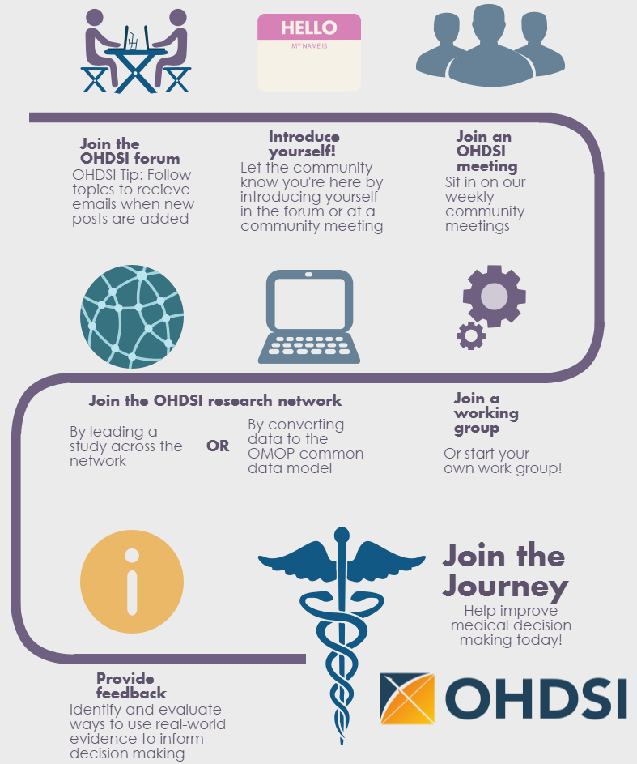

# Where to Begin {#WhereToBegin}

*Chapter leads: Hamed Abedtash & Kristin Kostka*

> “A journey of a thousand miles begins with a single step.” - Lao Tzu

The OHDSI community represents a mosaic of stakeholders across academia, industry and government-entities. Our work benefits a range of individuals and organizations, including patients, providers, and researchers, as well as health care systems, industry, and government agencies. This benefit is achieved by improving both the quality of healthcare data analytics as well as the usefulness of healthcare data to these stakeholders. We believe observational research is a field which benefits greatly from disruptive thinking. We actively seek and encourage fresh methodological approaches in our work. \index{community}

## Join the Journey
Everyone is welcome to actively participate in OHDSI, whether you are a patient, a health professional, a researcher, or someone who simply believes in our cause. OHDSI maintains an inclusive membership model. To become an OHDSI collaborator requires no membership fee. Collaboration is as simple as raising a hand to be included in the yearly OHDSI membership count. Involvement is entirely at-will. A collaborator can have any level of contribution within the community, ranging from someone who attends weekly community calls to leading network studies or OHDSI working groups. Collaborators do not have to be data holders to be considered active members of the community. The OHDSI community aims to serve data holders, researchers, health care providers and patients & consumers alike. A record of collaborator profiles are maintained and periodically updated on the OHDSI website. Membership is fostered via OHDSI community calls, workgroups and regional chapters.\index{join the journey} \index{workgroups} \index{chapters}

```{r jointhejourney, fig.cap='Join the journey - How to become an OHDSI collaborator.', echo=FALSE, out.width='90%', fig.align='center'}

```


### OHDSI Forums
The OHDSI Forums[^forumUrl] is an online discussion site where OHDSI Community Collaborators can hold conversations in the form of posted messages. The forums consist of a tree-like directory structure. The top end is "Categories". The forums can be divided into categories for the relevant discussions. Under the categories are sub-forums and these sub-forums can further have more sub-forums. The topics (commonly called threads) come under the lowest level of sub-forums and these are the places under which forums members can start their discussions or posts.

[^forumUrl]: https://forums.ohdsi.org

In the OHDSI forums, you can find categories of content including:

- **General:** for general discussion about the OHDSI community and how to get involved
- **Implementers:** for discussion about how to implement the Common Data Model and OHDSI analytics framework in your local environment
- **Developers:** for discussion around open-sourced development of OHDSI applications and other tools that leverage the OMOP CDM
- **Researchers:** for discussion around CDM-based research, including evidence generation, collaborative research, statistical methods and other topics of interest to the OHDSI Research Network
- **CDM Builders:** for discussion of ongoing CDM development, including requirements, vocabulary, and technical aspects
- **Vocabulary Users:** for discussion around vocabulary content
- **Regional Chapters (e.g. Korea, China, Europe):** for regional discussions in their native languages related to local OMOP implementations and OHDSI community activities


To begin posting your own topics, you will need to sign up for an account. Once you have a forums account, you are encouraged to introduce yourself on the General Topic under the thread called "Welcome to OHDSI! - Please introduce yourself". You are invited to reply and 1) Introduce yourself and tell us a bit about what you do and 2) Let us know how you’d like to help out in the community (ex. software development, run studies, write research papers, etc). Now you are on your OHDSI Journey! From here, you are encouraged to join in the discussion. The OHDSI Community encourages using the Forums as your way to ask questions, discuss new ideas and collaborate. \index{forum}

```{block2, type='rmdimportant'}
You can select topics to "watch." What this means is whenever a new post is added in a topic you’re watching, you will receive an email and be able to reply to the post directly through your email. Watch the general thread to recieve details about upcoming meeting agendas, collaboration opportunities and have the weekly OHDSI digest delivered directly to your inbox!

```

### OHDSI Events
OHDSI regularly holds in-person events to provide opportunities for collaborators to learn from each other and connect to foster future collaborations.  These events are communicated on the OHDSI website, and are free for anyone interested in attending.

OHDSI Symposia are scientific conferences, held annually in US, Europe, and Asia, where collaborators can present their latest research through plenary talks, poster presentations, and software demonstrations.  OHDSI Symposia provide a great venue for networking and to learn about the most recent progress across the community.  OHDSI Symposia are generally accompanied by OHDSI tutorials, taught by fellow OHDSI collaborators as the course faculty, which provide community newcomers the opportunity for hands-on engagement on topics around data standards and analysis best practices.  These tutorials are generally video-recorded and made available on the OHDSI website after the events for those who can't make it in person.

OHDSI Collaborator face-to-face events are smaller fora which are typically centered on a problem of shared interest to focus on during the time together.  Past events have included a phenotype hack-a-thon, and data quality hack-a-thon, and open-source software documentation-a-thon.  OHDSI has hosted multiple Study-a-thon events, where the goal of the multi-day session is to collaborate as a team on a particular research question by designing and implementing an appropriate observational analysis, executing the study across the OHDSI network, and synthesizing the evidence for public dissemination. In all of these events, there is a shared desire to solve a common problem but also a shared interest in providing a welcoming environment that encourages learning and continuous improvement on the process of collaborative problem-solving.

Learn more about the power of the OHDSI Community. Explore past symposiums, face-to-face meetings and watch OHDSI tutorials by visiting the [OHDSI Past Events section](https://www.ohdsi.org/past-events/) on the OHDSI website. Past Events is updated regularly to archive community events.

### OHDSI Community Calls
OHDSI Community Calls are a weekly opportunity to spotlight ongoing activity within the OHDSI community. Held every Tuesday from 11am-12pm ET, these teleconferences are a time for the OHDSI community to come together to share recent developments and recognize the accomplishments of individual collaborators, working groups and the community as a whole. Each week’s meeting is recorded, and presentations are archived in the OHDSI website resources.

All OHDSI Collaborators are welcome to participate in this weekly teleconference and encouraged to propose topics for community discussion. OHDSI Community Calls can be a forum to share research findings, present and seek feedback for active works-in-progress, demonstrate open-source software tools under development, debate community best practices for data modeling and analytics, and brainstorm future collaborative opportunities for grants/publications/conference workshops. If you are a Collaborator with a topic for an upcoming OHDSI Collaborator meeting, you are invited to post your thoughts on the OHDSI Forums.

As a newcomer to the OHDSI community, it is encouraged to add this call series to your calendar to get acquainted with what is happening across the OHDSI network. If you would like to join an OHDSI call, please consult the [OHDSI Forums](https://forums.ohdsi.org/) for announcements. Community call topics vary from week-to-week. You can also consult the OHDSI Weekly Digest on the OHDSI forum for more information on weekly presentation topics. Newcomers are invited to introduce themselves on their first call and tell the community about themselves, their background and what brought them to OHDSI. \index{community!community calls}

### OHDSI Workgroups
OHDSI has a variety of ongoing projects lead by workgroup teams. Each workgroup has its own leadership team which determine the project’s objectives, goals and artifacts to be contributed to the community. Workgroup participation is open to all who have an interest in contributing to the project objectives and goals. Workgroups may be long-standing, strategic objectives or short-term projects to accomplish a specific need in the community. Workgroup meeting cadence is determined by the project leadership and will vary from group to group. A list of the active workgroups is maintained on the [OHDSI Wiki](https://www.ohdsi.org/web/wiki/doku.php?id=projects:overview). \index{workgroups}

Table \@ref(tab:OHDSIworkgroups) provides a quick reference to active OHDSI workgroups. You are encouraged to join a call and learn more.

Table: (\#tab:OHDSIworkgroups) Notable OHDSI Workgroups

|Workgroup Name|Objective|Target Audience|
|:---- |:------------------ |:--------- |
|Atlas & WebAPI|Atlas and WebAPI are part of the OHDSI open-source software architecture that aim to provide standardized analytic capabilities built on the foundation of the OMOP Common Data Model.|Java & JavaScript software developers aiming to improve and contribute to the open-source Atlas/WebAPI platform|
|CDM & Vocabulary|To continue to develop the OMOP Common Data Model for the purpose of systematic, standardized and large-scale analytics applied to clinical patient data. To improve the quality of the Standardized Vocabularies by increasing their coverage of international coding systems and clinical aspects of patient care in order to support the standardized analytics developed by other working groups.| Any who has an interest in improving the OMOP Common Data Model and Standardized Vocabularies to meet all needs and use cases|
|Genomics|Expand the OMOP CDM to incorporate genomic data from patients. The group will define a CDM-compatible schema that can store information for genetic variants from various sequencing process.|Open to all|
|Population-Level Estimation|Develop scientific methods for observational research leading to population level estimates of effects that are accurate, reliable, and reproducible, and facilitate the use of these methods by the community.|Open to all|
|Natural Language Processing|To promote the use of textual information from Electronic Health Records (EHRs) for observational studies under the OHDSI umbrella. To facilitate this objective, the group will develop methods and software that can be implemented to utilize clinical text for studies by the OHDSI community.|Open to all|
|Patient-Level Prediction|establish a standardized process for developing accurate and well-calibrated patient-centered predictive models that can be utilized for multiple outcomes of interest and can be applied to observational healthcare data from any patient subpopulation of interest|Open to all|
|Gold Standard Phenotype Library|To enable members of the OHDSI community to find, evaluate, and utilize community-validated cohort definitions for research and other activities|Open to all with an interest in curation and validation of phenotypes|
|FHIR Workgroup|To establish the roadmap for the OHDSI FHIR integration and to make recommendations to the broader community for leveraging the FHIR implementation and data in EHR community for the OHDSI-based observation studies and for disseminating the OHDSI data and research results through the FHIR-based tools and APIs.|Open to all with an interest in interoperability|
|GIS|Expand the OMOP CDM and leverage OHDSI tools so that patients’ environmental exposure histories can be related to their clinical phenotypes|Open to all with an interest in health-related geographic attributes|
|Clinical Trials|Understand clinical trial use cases where the OHDSI platform & ecosystem can aid trials in any aspect, and assist in driving updates in OHDSI tools to support.|Open to all with an interest in clinical trials|
|THEMIS|The objective of THEMIS is to develop standard conventions, above and beyond the OMOP CDM conventions, to ensure ETL protocols designed at each OMOP site are of highest quality, reproducible and efficient.||Open to all with an interest in ETL standardization|
|Metadata & Annotations|Our goal is to define a standard process for storing human- and machine-authored metadata and annotations in the Common Data Model to ensure researchers can consume and create useful data artifacts about observational data sets.|Open to all|
|Patient Generated Health Data (PGHD)|The goal of this WG would be developing ETL conventions, integration process with clinical data, and analytic process for PGHD, which is generated through Smart Phone/App/Wearable devices.|Open to all|
|Women of OHDSI|To provide a forum for women within the OHDSI community to come together and discuss challenges they face as women working in science, technology, engineering and mathematics (STEM). We aim to facilitate discusses where women can share their perspectives, raise concerns, propose ideas on how the OHDSI community can support women in STEM, and ultimately inspire women to become leaders within the community and their respective fields.|Open to all who identify with this mission|
|Steering Committee|To uphold OHDSI's mission vision and values by ensuring all OHDSI activities and events are aligned with the needs of our growing community. In addition, the group serves as an advisory group for the OHDSI coordinating center based at Columbia by providing guidance for OHDSI's future direction.|Leaders within the community|

### OHDSI Regional Chapters
An OHDSI regional chapter represents a group of OHDSI collaborators located in a geographic area who wish to hold local networking events and meetings to address problems specific to their geographic location. Today, OHDSI regional chapters include OHDSI in Europe[^europeUrl], OHDSI in South Korea[^koreaUrl] and OHDSI in China.[^chinaUrl] If you would like to set-up an OHDSI regional chapter in your region, you may do so by following the OHDSI regional chapter process outlined on the [OHDSI website](https://www.ohdsi.org/who-we-are/regional-chapters). \index{chapters}

[^europeUrl]: https://www.ohdsi-europe.org/
[^koreaUrl]: https://forums.ohdsi.org/c/For-collaborators-wishing-to-communicate-in-Korean
[^chinaUrl]: https://ohdsichina.org/

### OHDSI Research Network
Many OHDSI collaborators are interested in converting their data into the OMOP Common Data Model. The OHDSI research network represents a diverse, global community of observational databases that have undergone Extract-Transform-Load (ETL) processes to become OMOP compliant. If your journey in the OHDSI community includes transforming data, there are numerous community resources available to aid you in your journey including tutorials on the OMOP CDM and Vocabularies, freely available tools to assist with conversion, and workgroups targeting specific domains or types of data conversions. The OHDSI collaborators are encouraged to utilize the OHDSI forum to discuss and troubleshoot challenges that arise during CDM conversions.

## Where You Fit In
By now, you may be wondering: *where do I fit into the OHDSI Community?*

**I am a clinical researcher looking to start a study.** If you are a clinical researcher interesting in using the OHDSI Research Network to answer a specific question -- maybe even publish a paper -- you're in the right place. You can start by posting your idea to the [OHDSI Researchers Topic](https://forums.ohdsi.org/c/researchers) on the OHDSI Forum. This will help you connect with researchers of similar interest. OHDSI loves to publish and has many resources available to expedite turning your research question into an analysis and a paper. You can find more information in Chapters \@ref(Characterization), \@ref(PopulationLevelEstimation), and \@ref(PatientLevelPrediction).

**I want to read and consume the information the OHDSI community produces.** Whether you're a patient, a practicing clinician or subject matter expertise in healthcare, OHDSI wants to provide you with high quality evidence to help you better understand health outcomes. Maybe it's been a while since you have written code. Maybe you never program. You have a place in this community.  We call you an *evidence consumer* -- you are the individuals who are turning OHDSI research into action. You are sifting through to know what evidence OHDSI has generated and is generating, possibly also wanting to suggest questions relevant for you. We welcome you to join the discussion. Start asking questions on the [OHDSI Forum](http://forums.ohdsi.org). Attend Community Calls and hear about the latest research. Attend the OHDSI Symposiums and Face-to-Face Meetings to engage directly with the community. Your questions are an important part of the OHDSI community. Speak up and help us learn more about what evidence you are searching for!

**I work in a healthcare leadership role. I may be a data owner and/or represent one. I am evaluating the utility of the OMOP CDM and OHDSI analytical tools for my organization.** As an administrator/leader of an organization, you may have heard about OHDSI and are curious to know the OMOP CDM could work for your use cases. You may start by looking through [OHDSI Past Events](https://www.ohdsi.org/past-events/) materials to see the body of research. You may join a Community Call and simply listen in. You may also find that Chapter \@ref(DataAnalyticsUseCases) (Data Analytics Use Cases) helps you understand the kind of research the OMOP CDM and OHDSI analytics tools can enable. The OHDSI Community is here for you in your journey. Don't be afraid to speak up and ask for examples if you have specific areas you're interested in. More than 200 organizations around the world are collaborating in OHDSI, there's plenty of success stories to help showcase the value of this community.

**I am a database administrator looking to ETL/convert my institution's data to the OMOP CDM.** Choosing to "OMOP" your data is a novel and worthwhile undertaking. If you're just starting out on your ETL process, consult the [OHDSI Community ETL Tutorial Slides](https://www.ohdsi-europe.org/images/symposium-2019/tutorials/OHDSI_Vocabulary_CDM_Tutorial.pdf)  or sign-up for the next offering at an upcoming OHDSI Symposium. Consider dialing into the THEMIS workgroup calls and engaging the OHDSI Forum with your questions. You will find a wealth of knowledge in the community who are interested in helping your successful implementation of the OMOP CDM. Don't be shy!

**I am a biostatistician and/or methods developer interested in contributing to the OHDSI tool stack.** You're savvy in R. You know how to commit to Git. Most of all, you're eager to bring your expertise to the OHDSI Methods Library and further develop these methodologies. You'll want to start by joining either the Population-Level Estimation or Patient Level Prediction workgroup calls to hear more about current community priorities. As you're using the OHDSI tools, you can also file Issues under the respective GitHub repo (e.g. if it is a SQL Render package problem, you would file under the GitHub Repo for OHDSI/SqlRender). We welcome your contributions!

**I am a software developer interested in building a tool that complements the OHDSI tool stack.** Welcome to the community! As part of the OHDSI mission, our tools are open source and governed under Apache licenses. You are welcome to develop solutions that complement the OHDSI tool stack. Feel free to join a workgroup and pitch your ideas. Please be mindful that OHDSI is heavily invested in open-science and open collaboration. Proprietary algorithms and software solutions are welcome but are not the main focus of our software development efforts.

**I am a consultant looking to advise the OHDSI Community.** Welcome to the community! Your expertise is valuable and appreciated. You are welcome to promote your services on the OHDSI Forum, as appropriate. You're invited to join us at OHDSI Tutorials and consider giving back by contributing your expertise in the Symposium proceedings and OHDSI face-to-face meetings throughout the year.

**I am a student looking to learn more about OHDSI.** You're in the right place! Consider joining an OHDSI Community Call and introducing yourself. You are encouraged to delve into the OHDSI tutorials, attend OHDSI Symposiums and face-to-face meetings to learn more about the methods and tools the OHDSI community offers. If you have a specific research interest, let us know by posting in the Researcher topic on the OHDSI Forum. Many organizations offer OHDSI sponsored research opportunities (e.g. post-Doc, research fellowships). The OHDSI Forum will give you the latest information on these opportunities and more.

## Summary

```{block2, type='rmdsummary'}
- Getting started in the OHDSI Community is as easy as saying hello! Post on the **OHDSI Forum** and join a Community Call.
- Post your research or ETL questions to the OHDSI Forum.

```
